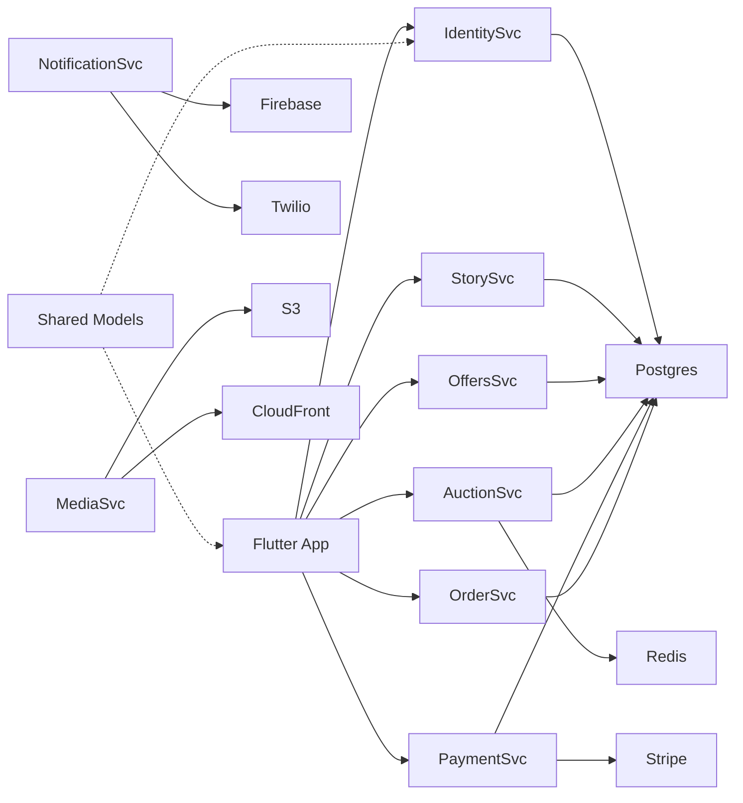
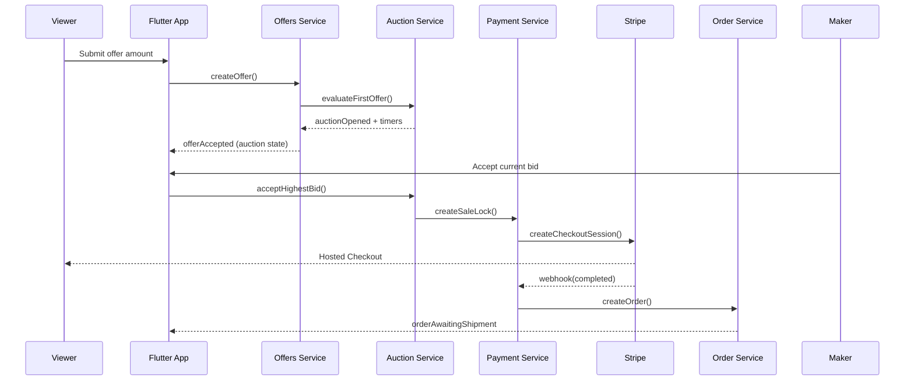
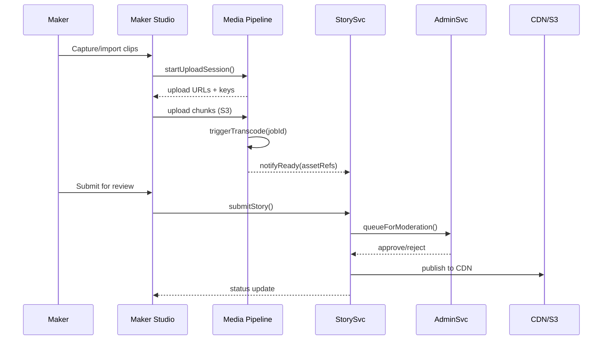

# Craft Video Marketplace Architecture Document

## Introduction
This document outlines the end-to-end architecture for the Craft Video Marketplace MVP, aligning the Flutter client, Serverpod backend, infrastructure, and external integrations that enable the offer → auction → payment → fulfillment lifecycle.

### Starter Template or Existing Project
Greenfield build. The repo starts from custom scaffolding: Flutter app (`video_window/`) plus Serverpod backend packages. No external starter template—manual setup ensures alignment with BMAD guardrails.

### Change Log
| Date       | Version | Description                           | Author |
| ---------- | ------- | ------------------------------------- | ------ |
| 2025-09-30 | v0.1    | Initial architecture blueprint        | Arch   |
| 2025-09-30 | v0.2    | Added front-end outline reference and updated UX/Dev handoff | Arch   |

## High Level Architecture

### Technical Summary
The platform ships as a Flutter mobile client backed by a Serverpod 2.9 modular monolith deployed on managed infrastructure (e.g., AWS). Shared domain packages keep client and server types aligned. Stripe Connect Express powers payments/payouts, while media flows through a secure HLS pipeline protected by signed URLs and watermarking. Observability (logging, metrics, tracing) and compliance controls (RBAC, secrets management) satisfy PRD NFRs.

### High Level Overview
- **Architecture Style:** Modular monolith (Serverpod) with domain-driven service modules; client-side modular Flutter app.
- **Repository Structure:** Monorepo combining Flutter app, Serverpod backend, shared model packages, IaC, and docs.
- **Service Architecture:** Serverpod handles identity, story, offers, auctions, payments, orders, notifications, security, analytics, and admin modules; Redis (or Serverpod tasks) for timers/queues; Postgres 15 data store.
- **Primary Flow:** Viewer discovers artifact in feed → opens Story → submits offer → auction transitions → maker accepts → Stripe Checkout completes payment → maker ships item → order closes or enters dispute flow.
- **Key Decisions:** Stripe Connect Express for PCI scope reduction (SAQ A). Signed HLS with watermarking for content protection. Feature flags and remote config to stage risky features. Observability baked in from foundation (Epic F3). Secrets managed via vault/Parameter Store + git hooks to prevent leakage. CI gates mirror PRD instructions to maintain FR/NFR compliance.

### High Level Project Diagram
```mermaid
graph TD
  subgraph Mobile App (Flutter)
    Feed[Feed Module]
    Story[Story Module]
    Offer[Offer/Bid Module]
    Checkout[Checkout Module]
    MakerStudio[Maker Studio]
    Orders[Orders Module]
    Notifications[Notifications UI]
  end

  subgraph Serverpod Backend
    Identity[Identity Service]
    MakerAccess[Maker Access]
    StorySvc[Story Service]
    Media[Media Pipeline]
    Offers[Offers Service]
    Auction[Auction Service]
    Payment[Payment Service]
    OrderSvc[Order Service]
    IssueSvc[Issue Service]
    NotificationSvc[Notification Service]
    AdminSvc[Admin Service]
    SecuritySvc[Security Service]
    AnalyticsSvc[Analytics Service]
    ConfigSvc[Config Service]
  end

  Stripe[Stripe Connect]
  CDN[HLS CDN + Object Storage]
  Twilio[Twilio/SendGrid]
  Firebase[Firebase/APNs]
  AnalyticsWarehouse[Analytics Warehouse]

  Feed --> StorySvc
  Story --> StorySvc
  Offer --> Offers
  Offer --> Auction
  Checkout --> Payment
  MakerStudio --> Media
  MakerStudio --> StorySvc
  Orders --> OrderSvc
  Notifications --> NotificationSvc

  Offers --> Auction
  Auction --> Payment
  Payment --> Stripe
  Payment --> OrderSvc
  OrderSvc --> IssueSvc
  NotificationSvc --> Firebase
  NotificationSvc --> Twilio
  Media --> CDN
  StorySvc --> CDN
  AnalyticsSvc --> AnalyticsWarehouse
```

### Architectural and Design Patterns
- **Domain-Partitioned Modular Monolith:** Serverpod modules per bounded context keep deployment single-unit while isolating code. _Rationale:_ Meets MVP velocity needs, simplifies ops, allows later extraction if required.
- **Repository + Service Layers:** Data access wrapped in repositories with service layer orchestrators. _Rationale:_ Enables testing, keeps business logic isolated from persistence.
- **Event-Driven Async Jobs:** Auction timers, payment expirations, notifications via internal event bus/queue (Redis/Serverpod task runner). _Rationale:_ Handles timer-driven flows reliably with retries and idempotency.
- **Feature Flag Configuration:** Config service provides typed flags consumed by Flutter and backend. _Rationale:_ Safe rollout of maker onboarding, auction rule tweaks, etc.
- **CQRS Lite for Analytics:** Command paths write to operational store; analytics service syncs events to warehouse asynchronously. _Rationale:_ Keeps OLTP responsive while satisfying KPI reporting.

## Tech Stack

### Cloud Infrastructure
- **Provider:** AWS (recommended; portable to GCP/Azure if needed).
- **Key Services:** ECS/Fargate for Serverpod, RDS Postgres 15, ElastiCache Redis, S3 for media, CloudFront CDN, Secrets Manager/Parameter Store, CloudWatch/Lambda for webhooks, SNS/SQS (optional) for async events.
- **Deployment Regions:** Global CDN distribution with primary region in us-east-1 and edge locations worldwide for low-latency video delivery.

### Technology Stack Table
| Category | Technology | Version | Purpose | Rationale |
| --- | --- | --- | --- | --- |
| Language (Client) | Dart | 3.8.x | Flutter application logic | Matches PRD + Flutter 3.19+ requirements |
| Framework (Client) | Flutter | 3.19+ | Cross-platform mobile UI | Single codebase, video-friendly, team alignment |
| Language (Backend) | Dart | 3.8.x | Serverpod modules shared with client | Keeps models/shared libs consistent |
| Backend Framework | Serverpod | 2.9.x | Modular monolith server | Native Dart, built-in RPC, scheduler |
| Database | PostgreSQL | 15.x | Primary relational store | Strong transactions, timer queries, JSONB support |
| Cache/Queues | Redis (ElastiCache) | 7.x | Timer queue, caching, pub/sub | Integrates with Serverpod task runner |
| Object Storage | Amazon S3 | Latest | Raw uploads + HLS renditions | Durable, integrates with CloudFront |
| CDN | CloudFront | Latest | Secure HLS delivery | Signed URL support, global distribution |
| Payment PSP | Stripe Connect Express | Latest API | Checkout, payouts, compliance | SAQ A scope, mature features |
| Notification Push | Firebase Cloud Messaging / APNs | Latest | Buyer/maker notifications | Platform standard |
| Notification Email | SendGrid / Postmark | Latest | Transactional email | Reliable deliverability, templating |
| Notification SMS | Twilio | Latest | OTP + auction alerts | Global reach, proven |
| Observability | OpenTelemetry + Prometheus/Grafana | Latest | Metrics/traces/logs | NFR compliance |
| State Management | Flutter BLoC | 8.1+ | Client state management | Centralized + feature BLoCs |
| Navigation | Go Router | 12.1+ | Client navigation | Type-safe routing |
| Local Security | Flutter Secure Storage | 9.2+ | Token storage | Secure local auth |
| Video Processing | Serverpod + FFmpeg | 2.9.x | HLS transcoding | Integrated with Serverpod |
| Code Generation | Serverpod CLI | 2.9.x | Client/Server types | Automatic synchronization |
| CI/CD | GitHub Actions | Latest | Format/analyze/test gates | Mirrors PRD flows |
| IaC | Terraform | 1.7.x | Provision AWS resources | Declarative, widely adopted |
| Secrets Management | AWS Secrets Manager | Latest | Secure credential storage | Rotation support, API access |
| Analytics Warehouse | BigQuery or Snowflake (pilot: BigQuery) | Latest | KPI aggregation | Supports SQL-based ETL |
| BI / Dashboards | Looker Studio | Latest | KPI visualization | Quick iteration, integrates with BigQuery |

## Data Models (Conceptual)

### User
**Purpose:** Represents both viewers and makers.

**Key Attributes:**
- `id`: UUID – global identifier.
- `email`: String – contact + login.
- `roles`: Enum[] – viewer, maker, admin.
- `authProvider`: Enum – email_otp, apple, google.

**Relationships:**
- 1–1 MakerProfile (optional).
- 1–N Orders (as buyer).
- 1–N Offers/Bids.

### MakerProfile
**Purpose:** Extends user with maker-specific info.

**Key Attributes:**
- `id`: UUID.
- `userId`: UUID – FK to User.
- `displayName`, `heroMediaUrl`, `city`.
- `offerPolicy`: JSON – minimum offer, currency, auto rules.

**Relationships:**
- 1–N ArtifactStories.

### ArtifactStory
**Purpose:** Listing/story metadata and content references.

**Key Attributes:**
- `id`: UUID.
- `makerId`: UUID.
- `title`, `sections` JSON (overview, process, etc.).
- `status`: Enum (Draft, Submitted, Listed, Scheduled, Live, Sold, Archived).

**Relationships:**
- 1–N Offers.
- 1–1 Auction (current).

### Offer
**Purpose:** Captures buyer intent prior to auction.

**Key Attributes:**
- `id`: UUID.
- `storyId`, `buyerId`.
- `amount`: Money.
- `status`: Enum (Pending, AutoRejected, Rejected, Accepted, Superseded, Withdrawn).

**Relationships:**
- Part of Auction (if accepted).

### Auction / Bid
Refer to `docs/architecture/offers-auction-orders-model.md` for detailed state machine.

### Payment / SaleLock
**Purpose:** Bind accepted offer to payment window.

**Key Attributes:**
- `id`, `saleLockId`, `status`, `pspTxnId`, `amount`, `expiresAt`.

**Relationships:**
- 1–1 Order on success.

### Order / Shipment / Issue
As defined in offers-auction-orders-model—captures fulfillment and dispute lifecycle.

## Components

### Identity Service
**Responsibility:** OTP/social login, token issuance, session refresh, logout.

**Key Interfaces:**
- `POST /auth/otp/request`.
- `POST /auth/social/callback`.

**Dependencies:** Profile service (for consents), Security service (for RBAC), Stripe (for account linking events).

**Technology Stack:** Serverpod module with Postgres tables (`users`, `sessions`), Twilio/SendGrid integration.

### Story Service
**Responsibility:** Manage maker stories across draft → publish lifecycle.

**Key Interfaces:**
- `POST /stories` (create/update).
- `POST /stories/{id}/submit` (for moderation).

**Dependencies:** Media pipeline (for assets), Admin service (for moderation decisions), Config service.

**Technology Stack:** Serverpod module, Postgres JSONB for sections, S3 references.

### Offers Service
**Responsibility:** Validate and persist offers; trigger auction transitions.

**Key Interfaces:**
- `POST /stories/{id}/offers`.
- `POST /offers/{id}/withdraw`.

**Dependencies:** Auction service, Payment service (eligibility checks), Notification service.

**Technology Stack:** Serverpod module with business rules, Redis task scheduling for expirations.

### Auction Service
**Responsibility:** Maintain auction state machine, timers, bid logic.

**Key Interfaces:**
- `POST /auctions/{id}/bids`.
- Internal event bus for timer ticks.

**Dependencies:** Offers service, Payment service, Analytics, Notification service.

**Technology Stack:** Serverpod plus Redis scheduler, structured event log stored in Postgres.

### Media Pipeline
**Responsibility:** Upload ingestion, transcoding, watermarking, signed URL issuance.

**Key Interfaces:**
- `POST /media/uploadSession`.
- `GET /media/{id}/playback` (signed URL issuance).

**Dependencies:** AWS Lambda/MediaConvert (transcoding), S3, CloudFront, Security service.

**Technology Stack:** Serverpod orchestrator invoking AWS services; watermark overlay handled via FFmpeg/MediaConvert templates.

... *(See `docs/architecture/story-component-mapping.md` for full component list with story alignment.)*

### Component Diagram


## External APIs

### Stripe Connect API
- **Purpose:** Checkout sessions, payouts, webhook reconciliation.
- **Documentation:** https://stripe.com/docs/connect
- **Base URLs:** `https://api.stripe.com/v1`
- **Authentication:** Bearer key via Secrets Manager; Connect onboarding via OAuth.
- **Rate Limits:** 100 requests/sec per account (Stripe-managed).
- **Key Endpoints:**
  - `POST /checkout/sessions` – Create payment session.
  - `POST /payment_intents/{id}/cancel` – Manage expirations.
  - Webhooks `checkout.session.completed`, `payment_intent.succeeded`, `payment_intent.payment_failed`.
- **Integration Notes:** Idempotency keys per offer; map Stripe customer/payment IDs to SaleLock/Order records.

### Twilio Verify / Programmable SMS
- **Purpose:** OTP delivery, SMS notifications for auctions.
- **Documentation:** https://www.twilio.com/docs
- **Base URL:** `https://verify.twilio.com/v2`
- **Authentication:** Basic (Account SID + Auth Token).
- **Rate Limits:** ~100 msgs/sec (account-based), enforce per-user rate limiting.
- **Endpoints:** `POST /Services/{ServiceSid}/Verifications` etc.
- **Notes:** Mask PII, log message SID only.

### SendGrid (Email)
- **Purpose:** Transactional emails (receipts, notifications, moderation).
- **Docs:** https://docs.sendgrid.com/
- **Auth:** API key.
- **Rate Limits:** 600 requests/min default.
- **Endpoints:** `POST /mail/send`.
- **Notes:** Template versioning, dynamic data for timers.

### Firebase Cloud Messaging / APNs
- **Purpose:** Push notifications.
- **Auth:** FCM server key; APNs token-based.
- **Notes:** Manage device tokens per user; respect preferences.

### AWS MediaConvert / Lambda (for media pipeline)
- **Purpose:** Transcoding, watermarking, job orchestration.
- **Auth:** IAM roles.
- **Notes:** Jobs triggered via Serverpod; status polled or event-driven.

## Core Workflows

### Offer → Auction → Payment


### Maker Upload → Publish


## REST API Spec (excerpt)
```yaml
openapi: 3.0.0
info:
  title: Craft Marketplace API
  version: v0.1
  description: Serverpod-generated RPC/REST endpoints backing the Craft Video Marketplace.
servers:
  - url: https://api.craft.marketplace
    description: Production
  - url: https://staging.api.craft.marketplace
    description: Staging
paths:
  /auth/otp/request:
    post:
      summary: Request OTP for email/SMS authentication
      requestBody:
        required: true
        content:
          application/json:
            schema:
              type: object
              required: [identifier, channel]
              properties:
                identifier:
                  type: string
                  description: Email or phone number
                channel:
                  type: string
                  enum: [email, sms]
      responses:
        '200':
          description: OTP dispatched
        '429':
          description: Rate limit exceeded
  /stories/{storyId}/offers:
    post:
      summary: Submit offer / initial bid
      parameters:
        - in: path
          name: storyId
          required: true
          schema:
            type: string
      requestBody:
        required: true
        content:
          application/json:
            schema:
              type: object
              required: [amount]
              properties:
                amount:
                  type: number
                currency:
                  type: string
                  default: USD
      responses:
        '201': { description: Offer accepted }
        '400': { description: Validation failure }
        '403': { description: Not eligible }
```

## Database Schema (excerpt)
```sql
CREATE TABLE users (
  id UUID PRIMARY KEY,
  email TEXT UNIQUE NOT NULL,
  phone TEXT,
  roles TEXT[] NOT NULL,
  auth_provider TEXT NOT NULL,
  created_at TIMESTAMP WITH TIME ZONE DEFAULT NOW()
);

CREATE TABLE maker_profiles (
  id UUID PRIMARY KEY,
  user_id UUID REFERENCES users(id) ON DELETE CASCADE,
  display_name TEXT,
  hero_media_url TEXT,
  city TEXT,
  offer_policy JSONB,
  created_at TIMESTAMPTZ DEFAULT NOW()
);

CREATE TABLE artifact_stories (
  id UUID PRIMARY KEY,
  maker_id UUID REFERENCES maker_profiles(id),
  title TEXT NOT NULL,
  sections JSONB NOT NULL,
  status TEXT NOT NULL,
  scheduled_at TIMESTAMPTZ,
  published_at TIMESTAMPTZ,
  created_at TIMESTAMPTZ DEFAULT NOW()
);

CREATE TABLE offers (
  id UUID PRIMARY KEY,
  story_id UUID REFERENCES artifact_stories(id) ON DELETE CASCADE,
  buyer_id UUID REFERENCES users(id),
  amount_cents BIGINT NOT NULL,
  currency TEXT NOT NULL,
  status TEXT NOT NULL,
  is_opening BOOLEAN DEFAULT FALSE,
  created_at TIMESTAMPTZ DEFAULT NOW()
);

CREATE TABLE auctions (
  id UUID PRIMARY KEY,
  story_id UUID UNIQUE REFERENCES artifact_stories(id),
  status TEXT NOT NULL,
  open_at TIMESTAMPTZ,
  close_at TIMESTAMPTZ,
  soft_close_tier INT,
  total_cap_at TIMESTAMPTZ,
  highest_bid_id UUID
);

CREATE TABLE bids (
  id UUID PRIMARY KEY,
  auction_id UUID REFERENCES auctions(id) ON DELETE CASCADE,
  buyer_id UUID REFERENCES users(id),
  amount_cents BIGINT NOT NULL,
  status TEXT NOT NULL,
  created_at TIMESTAMPTZ DEFAULT NOW()
);

CREATE TABLE sale_locks (
  id UUID PRIMARY KEY,
  story_id UUID REFERENCES artifact_stories(id),
  auction_id UUID REFERENCES auctions(id),
  buyer_id UUID REFERENCES users(id),
  amount_cents BIGINT,
  reason TEXT,
  locked_at TIMESTAMPTZ,
  expires_at TIMESTAMPTZ
);

CREATE TABLE payments (
  id UUID PRIMARY KEY,
  sale_lock_id UUID REFERENCES sale_locks(id),
  stripe_intent_id TEXT,
  status TEXT,
  amount_cents BIGINT,
  currency TEXT,
  created_at TIMESTAMPTZ DEFAULT NOW()
);

CREATE TABLE orders (
  id UUID PRIMARY KEY,
  story_id UUID REFERENCES artifact_stories(id),
  buyer_id UUID REFERENCES users(id),
  amount_cents BIGINT,
  currency TEXT,
  status TEXT,
  paid_at TIMESTAMPTZ,
  ship_by_at TIMESTAMPTZ,
  delivered_at TIMESTAMPTZ,
  completed_at TIMESTAMPTZ
);
```

## Source Tree
```text
video_window/
├── lib/                              # Flutter application
│   ├── main.dart                     # App initialization
│   ├── core/                         # Core data layer
│   │   ├── data/                     # Data sources
│   │   │   ├── datasources/          # Remote and local data sources
│   │   │   ├── models/               # Data models
│   │   │   ├── repositories/         # Repository implementations
│   │   │   └── services/             # External service integrations
│   │   └── domain/                   # Shared domain entities
│   │       ├── entities/             # Core domain entities
│   │       └── value_objects/        # Value objects
│   ├── features/                     # Feature modules
│   │   ├── auth/                     # Authentication & user management
│   │   │   ├── data/                 # Feature-specific data
│   │   │   ├── domain/               # Business logic, use cases
│   │   │   └── presentation/         # UI, pages, widgets, BLoCs
│   │   ├── feed/                     # Content discovery feed
│   │   ├── video/                    # Video player and content viewing
│   │   ├── auction/                  # Auction and bidding interface
│   │   ├── checkout/                 # Payment processing
│   │   ├── orders/                   # Order management and tracking
│   │   ├── maker_studio/             # Content creation tools
│   │   ├── profile/                  # User profile management
│   │   └── notifications/           # Push notifications management
│   └── shared/                       # Everything else
│       ├── widgets/                  # Reusable UI components
│       ├── themes/                   # App theming
│       ├── utils/                    # Utility functions
│       ├── constants/                # App-wide constants
│       ├── extensions/               # Dart extensions
│       └── errors/                   # Error handling
├── serverpod/                        # Serverpod backend (future)
│   ├── config/
│   ├── lib/
│   └── packages/
├── shared_models/                    # Shared models (future)
├── docs/                             # Documentation
│   ├── architecture/
│   │   ├── offers-auction-orders-model.md
│   │   ├── story-component-mapping.md
│   │   ├── front-end-architecture.md
│   │   ├── coding-standards.md
│   │   └── project-structure-implementation.md
│   └── prd.md
├── test/                             # Test files
├── android/                          # Android platform configuration
├── ios/                              # iOS platform configuration
├── macos/                            # macOS platform configuration
├── linux/                            # Linux platform configuration
├── windows/                          # Windows platform configuration
└── pubspec.yaml                      # Flutter dependencies
```

## Infrastructure and Deployment

### Infrastructure as Code
- **Tool:** Terraform 1.7.x
- **Location:** `infrastructure/terraform`
- **Approach:** Modular IaC (VPC, networking, compute, storage modules) with environment overlays.

### Deployment Strategy
- **Strategy:** GitHub Actions → Terraform plan/apply + Docker image builds to ECR + deployment to ECS Fargate.
- **CI/CD Platform:** GitHub Actions.
- **Pipeline Configuration:** `.github/workflows/terraform-ci.yml`, `.github/workflows/flutter-ci.yml`.

### Environments
- **Dev:** Per-developer sandbox with reduced capacity, seeded test data.
- **Staging:** Pre-prod mirror with feature flags staged; runs full test suite + manual QA.
- **Prod:** Production environment with autoscaling, stricter secrets, monitoring, paging.

### Promotion Flow
```
Dev branch → story/<id>-<slug> → PR to develop → Staging deploy on merge → Release PR to main → Prod deploy
```

### Rollback Strategy
- **Primary Method:** Blue/green ECS deployment with automatic revert if health checks fail.
- **Trigger Conditions:** Elevated error rates, failed health checks, payment incidents.
- **Recovery Time Objective:** < 15 minutes for deploy rollback; < 1 hour for data remediation.

## Error Handling Strategy

### General Approach
- **Error Model:** Typed exceptions with `Result<T>` wrappers for async flows.
- **Exception Hierarchy:** Domain-specific errors (e.g., `OfferValidationError`, `AuctionStateError`) extend Serverpod base.
- **Error Propagation:** Validate at boundary; translate to user-friendly codes; log with correlation IDs.

### Logging Standards
- **Library:** `package:logging` + OpenTelemetry exporters.
- **Format:** JSON (timestamp, level, service, correlationId, userId).
- **Levels:** TRACE, DEBUG, INFO, WARN, ERROR, FATAL.
- **Required Context:**
  - Correlation ID: UUID generated per request / event.
  - Service Context: Module name + version.
  - User Context: userId hashed; roles; sessionId (if present).

### Error Handling Patterns
- **External API Errors:**
  - Retry Policy: Exponential backoff (max 3) for Stripe/Twilio with jitter.
  - Circuit Breaker: Open after 5 consecutive failures; auto-close after cooldown.
  - Timeout: 5s Stripe, 3s Twilio; 30s MediaConvert.
  - Translation: Map to `ExternalServiceUnavailable` and provide fallback messaging.
- **Business Logic Errors:**
  - Custom Exceptions: `MinimumOfferNotMet`, `AuctionExpired`, `PaymentWindowExpired`.
  - User-Facing Format: Error code + localized message.
  - Error Codes: `OFFER_MIN_VIOLATION`, `AUCTION_LOCKED`, `PAYMENT_TIMEOUT`.
- **Data Consistency:**
  - Transaction Strategy: Postgres transactions for offer/auction updates; outbox pattern for events.
  - Compensation: When payment fails, revert sale lock and notify next bidder.
  - Idempotency: Idempotency keys for Stripe calls; ensure auction transitions handle retries safely.

## Testing Strategy
- **Unit Tests:**
  - Library: `package:test`, Mockito.
  - Location: `video_window/test/` and `serverpod/packages/*/test/`.
  - Coverage: ≥80% per module; critical flows 100%.
- **Integration Tests:**
  - Scope: Serverpod modules with Postgres Testcontainers + Redis.
  - External APIs: Stripe, Twilio stubbed via WireMock/localstack.
- **E2E Tests:**
  - Framework: Flutter integration tests + optional Maestro.
  - Environment: Staging with feature flags on.
  - Data: Synthetic fixtures + anonymized real flows.
- **Continuous Testing:**
  - CI runs format/analyze/test on PR.
  - Nightly integration suite; weekly load tests on auction timers.
  - Security scans (SAST/DAST) run weekly.

## Security
- **Input Validation:**
  - Library: `package:formz` (client) + Serverpod validators.
  - Location: API boundary (Serverpod endpoints) + UI forms.
  - Rules: Whitelist accepted formats; enforce amount ranges; sanitize strings.
- **Authentication & Authorization:**
  - Method: OAuth/OIDC for social, OTP for email/SMS; JWT/Session tokens.
  - Session Management: Refresh tokens; device list for maker sessions; revoke on logout.
  - Patterns: RBAC checks at endpoint + UI; maker-only feature gating.
- **Secrets Management:**
  - Dev: `.env` (ignored) + `--dart-define` for local.
  - Prod: AWS Secrets Manager (access via Config service).
  - Requirements: No secrets in code/logs; rotated ≤90 days.
- **API Security:**
  - Rate Limiting: API Gateway/Envoy per-IP + per-user.
  - CORS: Allow mobile origins + admin portal; deny wildcard.
  - Headers: HSTS, Content-Security-Policy for webviews, no sniff.
  - HTTPS: Enforced via ALB/CloudFront.
- **Data Protection:**
  - At Rest: Postgres AES-256, S3 SSE-KMS.
  - In Transit: TLS 1.2+ everywhere.
  - PII: Mask logs; restrict analytics to anonymized IDs.
- **Dependency Security:**
  - Scanner: GitHub Dependabot + Snyk (weekly).
  - Update Policy: Monthly patch window; critical CVEs within 48h.
  - Approval: Architecture review for new runtime deps.
- **Security Testing:**
  - SAST: Dart Code Metrics, Bandit equivalent.
  - DAST: OWASP ZAP automation against staging.
  - Pen Tests: Third-party quarterly; track in Security service.

## Coding Standards
- Follow the authoritative guidelines in `docs/architecture/coding-standards.md`.
- Key enforcement points:
  - Use Dart `lint` ruleset (`package:flutter_lints`) plus project-specific rules for null-safety and immutability.
  - Require dependency injection (BLoC/GetIt) for testable widgets and services; avoid global singletons.
  - Use feature-first folder structure shown in source tree; keep UI/presentation separated from domain/data providers.
  - Document public APIs with Dart doc comments; include rationale when deviating from standards.
  - Enforce BMAD branching/commit policies; story files must reflect status before PR merge.

See `docs/architecture/front-end-architecture.md` for Flutter-specific module guidance (state management, design tokens, navigation) derived from these standards.

## Checklist Results Report
- ✅ Architecture covers all PRD epics/stories and aligns with story-component mapping.
- ✅ Tech stack decisions pinned with versions and rationale.
- ✅ High-level and workflow diagrams present.
- ✅ Security, testing, error handling, and deployment strategies documented per NFRs.
- ✅ References to supporting docs (`offers-auction-orders-model`, `story-component-mapping`) included.
- ✅ Companion artifacts prepared: `docs/architecture/lead-review-notes.md` for leadership alignment and `docs/architecture/ux-dev-handoff.md` for persona kickoffs.

## Next Steps
1. Share architecture with PM/Dev/QA personas for sign-off.
2. Kick off front-end architecture (if deeper UI patterns needed) using this document.
3. Seed infrastructure repo with Terraform modules and bootstrap base environments.
4. Begin Epic F1 development using mapped components; keep architecture doc updated as systems evolve.
