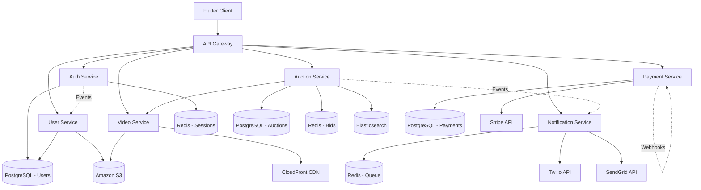
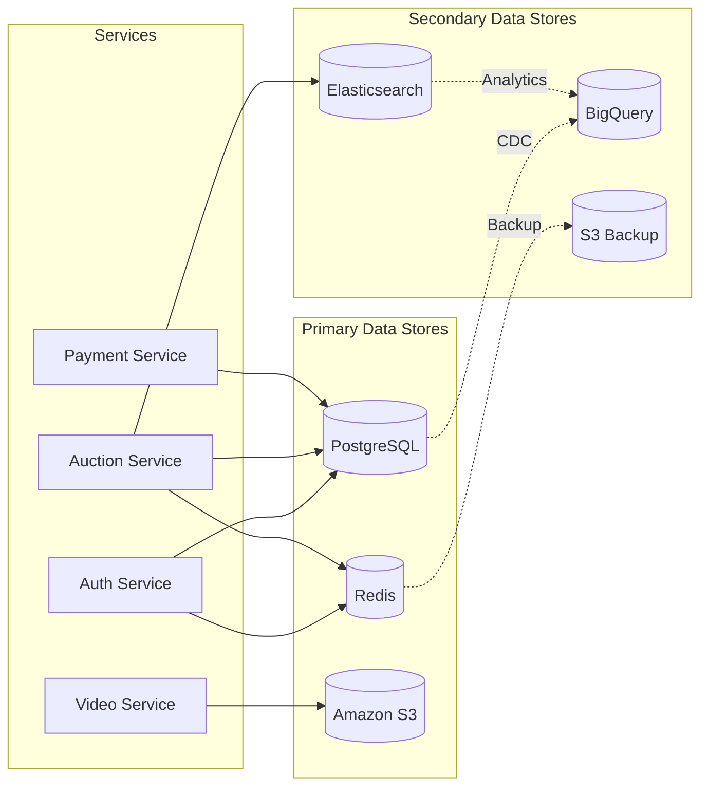
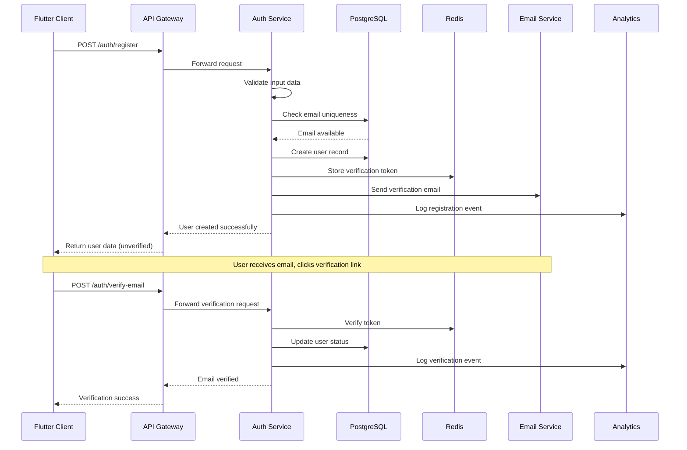
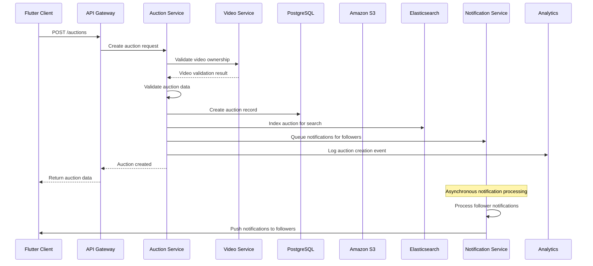
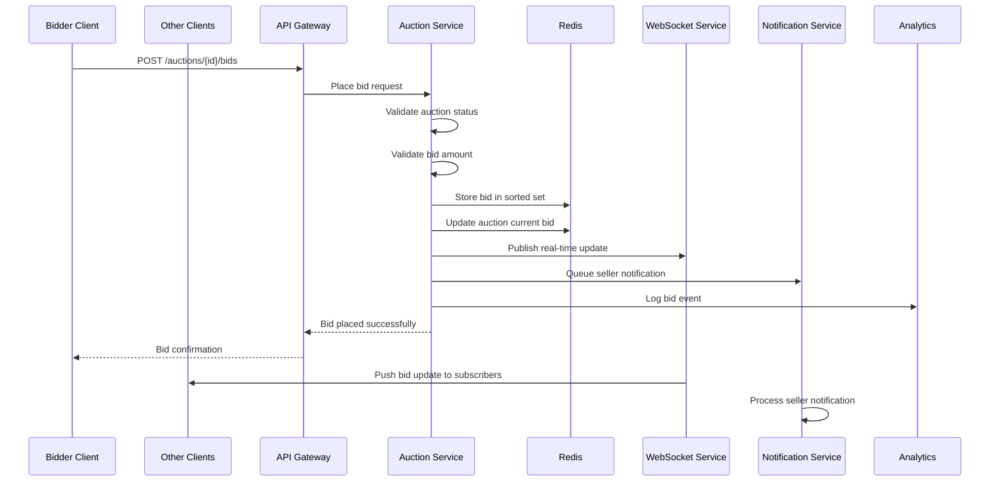
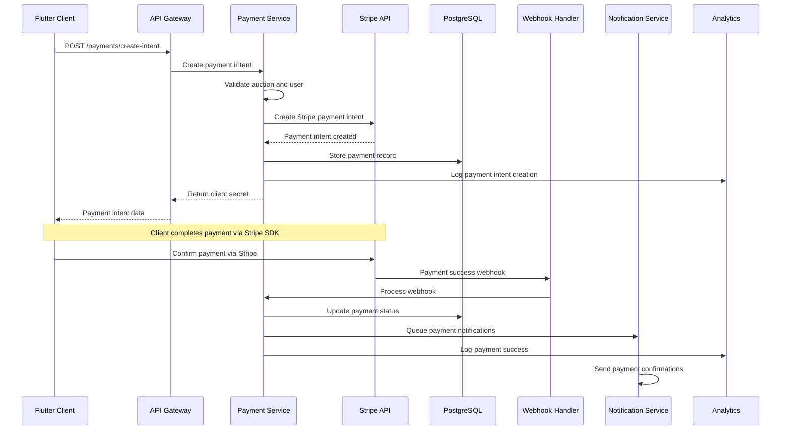
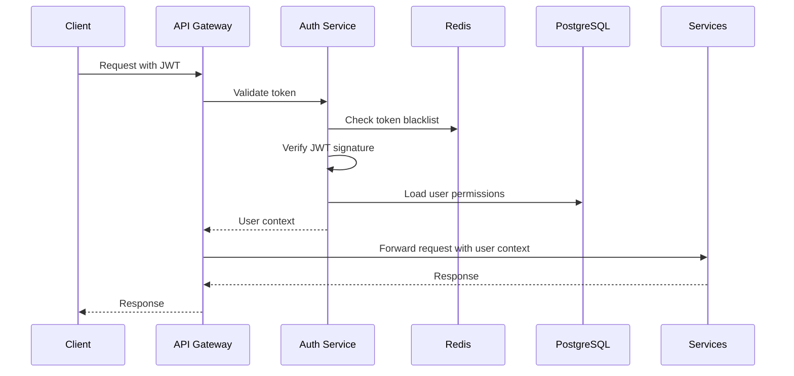

# System Integration Maps & Data Flow Specifications

This document provides comprehensive system integration diagrams and data flow specifications for the Video Marketplace platform. It details how all components interact, data transformation processes, and integration patterns used throughout the system.

## Table of Contents

1. [High-Level System Architecture](#high-level-system-architecture)
2. [Component Integration Map](#component-integration-map)
3. [Data Flow Specifications](#data-flow-specifications)
4. [Service Interaction Diagrams](#service-interaction-diagrams)
5. [External Integrations](#external-integrations)
6. [API Gateway Integration](#api-gateway-integration)
7. [Event-Driven Architecture](#event-driven-architecture)
8. [Security Integration](#security-integration)
9. [Monitoring & Observability Integration](#monitoring--observability-integration)
10. [Deployment Architecture](#deployment-architecture)

---

## High-Level System Architecture

```
┌─────────────────────────────────────────────────────────────────────────────────────┐
│                                    CLIENT LAYER                                       │
│  ┌─────────────────┐    ┌─────────────────┐    ┌─────────────────┐                    │
│  │   Flutter iOS   │    │  Flutter Android│    │   Web Client    │                    │
│  │      App        │    │      App        │    │   (Future)      │                    │
│  └─────────────────┘    └─────────────────┘    └─────────────────┘                    │
└─────────────────────────────────────────────────────────────────────────────────────┘
                                        │
                                        │ HTTPS/WSS
                                        │
┌─────────────────────────────────────────────────────────────────────────────────────┐
│                                  EDGE LAYER                                         │
│  ┌─────────────────────────────────────────────────────────────────────────────┐   │
│  │                           API GATEWAY                                       │   │
│  │  ┌─────────────┐ ┌─────────────┐ ┌─────────────┐ ┌─────────────────────┐    │   │
│  │  │   Auth      │ │ Rate Limit  │ │   Logging   │ │   Request Routing   │    │   │
│  │  │ Middleware  │ │ Middleware  │ │ Middleware  │ │     Middleware      │    │   │
│  │  └─────────────┘ └─────────────┘ └─────────────┘ └─────────────────────┘    │   │
│  └─────────────────────────────────────────────────────────────────────────────┘   │
└─────────────────────────────────────────────────────────────────────────────────────┘
                                        │
                                        │ Internal HTTP/gRPC
                                        │
┌─────────────────────────────────────────────────────────────────────────────────────┐
│                               APPLICATION LAYER                                     │
│  ┌─────────────────┐  ┌─────────────────┐  ┌─────────────────┐  ┌─────────────────┐   │
│  │  Auth Service   │  │ Auction Service │  │ Payment Service │  │  User Service   │   │
│  │                 │  │                 │  │                 │  │                 │   │
│  │ • JWT Auth      │  │ • Auction Mgmt  │  │ • Stripe API    │  │ • Profile Mgmt  │   │
│  │ • User Registry │  │ • Bid Processing│  │ • Webhook       │  │ • Search        │   │
│  │ • Session Mgmt  │  │ • Real-time     │  │ • Refunds       │  │ • Notifications │   │
│  └─────────────────┘  └─────────────────┘  └─────────────────┘  └─────────────────┘   │
└─────────────────────────────────────────────────────────────────────────────────────┘
                                        │
                                        │ Database Connections
                                        │ Message Queues
                                        │
┌─────────────────────────────────────────────────────────────────────────────────────┐
│                               DATA LAYER                                           │
│  ┌─────────────────┐  ┌─────────────────┐  ┌─────────────────┐  ┌─────────────────┐   │
│  │   PostgreSQL    │  │      Redis      │  │   Amazon S3     │  │   Elasticsearch │   │
│  │                 │  │                 │  │                 │  │                 │   │
│  │ • User Data     │  │ • Session Cache │  │ • Video Storage │  │ • Search Index  │   │
│  │ • Auction Data  │  │ • Bid Queue     │  │ • Images        │  │ • Analytics     │   │
│  │ • Transaction   │  │ • Real-time     │  │ • Thumbnails    │  │ • Logs          │   │
│  └─────────────────┘  └─────────────────┘  └─────────────────┘  └─────────────────┘   │
└─────────────────────────────────────────────────────────────────────────────────────┘
                                        │
                                        │ External API Calls
                                        │
┌─────────────────────────────────────────────────────────────────────────────────────┐
│                           EXTERNAL INTEGRATIONS                                     │
│  ┌─────────────────┐  ┌─────────────────┐  ┌─────────────────┐  ┌─────────────────┐   │
│  │     Stripe      │  │     Twilio      │  │   SendGrid      │  │   AWS Services  │   │
│  │                 │  │                 │  │                 │  │                 │   │
│  │ • Payments      │  │ • SMS           │  │ • Email         │  │ • CloudFront    │   │
│  │ • Connect       │  │ • Voice         │  │ • Templates     │  │ • S3 Storage    │   │
│  │ • Webhooks      │  │ • WhatsApp      │  │ • Marketing     │  │ • SES           │   │
│  └─────────────────┘  └─────────────────┘  └─────────────────┘  └─────────────────┘   │
└─────────────────────────────────────────────────────────────────────────────────────┘
```

---

## Component Integration Map

### Service Dependencies



### Data Store Integration



---

## Data Flow Specifications

### 1. User Registration Flow



**Data Transformation**:
- **Input**: `{email, password, username, fullName}`
- **Validation**: Email format, password strength, username uniqueness
- **Storage**: Encrypted password, hashed email for search
- **Output**: `{id, email, username, fullName, isVerified: false, createdAt}`

### 2. Auction Creation Flow



**Data Transformation**:
- **Input**: `{title, description, videoId, startingPrice, duration, shippingInfo, tags}`
- **Validation**: Video ownership, pricing rules, duration limits
- **Storage**: Structured auction data, full-text search index
- **Output**: `{id, title, description, currentBid, status, startTime, endTime, seller}`

### 3. Real-time Bidding Flow



**Data Transformation**:
- **Input**: `{auctionId, amount, message?}`
- **Validation**: Auction active, amount > current bid, user not seller
- **Storage**: Redis sorted set for bids, PostgreSQL for audit
- **Real-time**: WebSocket broadcast to auction subscribers
- **Output**: `{id, auctionId, bidderId, amount, placedAt, isWinning}`

### 4. Payment Processing Flow



**Data Transformation**:
- **Input**: `{auctionId, amount, currency, shippingInfo}`
- **Validation**: Auction won, payment amount matches, user authorized
- **Integration**: Stripe payment intent creation, webhook processing
- **Storage**: Payment records, transaction audit trail
- **Output**: `{paymentId, clientSecret, amount, currency, status}`

---

## Service Interaction Diagrams

### Microservices Communication Patterns

#### 1. Synchronous Communication (HTTP/gRPC)

```yaml
# Auth Service → User Service
GET /internal/users/{userId}
Headers: {X-Internal-Auth: true}
Response: {id, username, avatarUrl, sellerRating}

# Auction Service → Payment Service
POST /internal/payments/validate
Headers: {X-Internal-Auth: true}
Body: {auctionId, userId, amount}
Response: {valid: true, paymentMethods: [...]}

# Video Service → S3
PUT /videos/{videoId}
Headers: {Content-Type: video/mp4, Authorization: AWS4-HMAC-SHA256}
Body: Video file data
Response: {ETag, VersionId}
```

#### 2. Asynchronous Communication (Events)

```yaml
# Auction Service publishes events
Event: AuctionEnded
{
  "eventId": "uuid",
  "eventType": "AuctionEnded",
  "timestamp": "2025-10-09T10:30:00Z",
  "data": {
    "auctionId": "uuid",
    "winnerId": "uuid",
    "finalPrice": 150.00,
    "sellerId": "uuid"
  }
}

# Payment Service subscribes to events
Subscription: AuctionEnded → CreateOrder
Handler: PaymentService.handleAuctionEnded
Actions: Create order, send payment request
```

#### 3. Database Integration Patterns

```sql
-- Auth Service Schema
CREATE TABLE users (
    id UUID PRIMARY KEY DEFAULT gen_random_uuid(),
    email VARCHAR(255) UNIQUE NOT NULL,
    username VARCHAR(50) UNIQUE NOT NULL,
    password_hash VARCHAR(255) NOT NULL,
    full_name VARCHAR(100),
    avatar_url TEXT,
    email_verified BOOLEAN DEFAULT false,
    created_at TIMESTAMP DEFAULT NOW(),
    updated_at TIMESTAMP DEFAULT NOW()
);

-- Auction Service Schema
CREATE TABLE auctions (
    id UUID PRIMARY KEY DEFAULT gen_random_uuid(),
    title VARCHAR(200) NOT NULL,
    description TEXT,
    video_id UUID NOT NULL,
    seller_id UUID NOT NULL,
    starting_price DECIMAL(10,2) NOT NULL,
    current_bid DECIMAL(10,2) DEFAULT 0,
    status VARCHAR(20) DEFAULT 'draft',
    start_time TIMESTAMP NOT NULL,
    end_time TIMESTAMP NOT NULL,
    created_at TIMESTAMP DEFAULT NOW(),
    updated_at TIMESTAMP DEFAULT NOW(),

    FOREIGN KEY (seller_id) REFERENCES users(id),
    INDEX idx_seller_id (seller_id),
    INDEX idx_status_time (status, end_time),
    INDEX idx_created_at (created_at)
);

-- Payment Service Schema
CREATE TABLE payments (
    id UUID PRIMARY KEY DEFAULT gen_random_uuid(),
    order_id UUID NOT NULL,
    user_id UUID NOT NULL,
    stripe_payment_intent_id VARCHAR(255) NOT NULL,
    amount DECIMAL(10,2) NOT NULL,
    currency VARCHAR(3) DEFAULT 'USD',
    status VARCHAR(20) DEFAULT 'pending',
    created_at TIMESTAMP DEFAULT NOW(),
    updated_at TIMESTAMP DEFAULT NOW(),

    FOREIGN KEY (order_id) REFERENCES orders(id),
    FOREIGN KEY (user_id) REFERENCES users(id),
    INDEX idx_status (status),
    INDEX idx_user_id (user_id)
);
```

---

## External Integrations

### 1. Stripe Integration

```yaml
# Configuration
stripe:
  apiVersion: "2023-10-16"
  webhookSecret: "${STRIPE_WEBHOOK_SECRET}"
  connect:
    clientId: "${STRIPE_CONNECT_CLIENT_ID}"
    secretKey: "${STRIPE_SECRET_KEY}"
    publishableKey: "${STRIPE_PUBLISHABLE_KEY}"

# Payment Intent Creation
POST https://api.stripe.com/v1/payment_intents
Headers:
  Authorization: Bearer ${STRIPE_SECRET_KEY}
  Content-Type: application/x-www-form-urlencoded
Body:
  amount: 15000
  currency: usd
  metadata:
    auction_id: "uuid"
    user_id: "uuid"
  automatic_payment_methods:
    enabled: true

# Webhook Processing
Event: payment_intent.succeeded
Handler: StripeWebhookService.handlePaymentSuccess
Validation: Verify signature using webhook secret
Processing:
  1. Verify event authenticity
  2. Update payment status in database
  3. Create order record
  4. Send notifications
  5. Update analytics
```

### 2. AWS S3 Integration

```yaml
# S3 Configuration
s3:
  region: "us-east-1"
  bucket: "videomarketplace-assets"
  cdnDomain: "cdn.videomarketplace.com"

# Video Upload Flow
POST /videos/upload
1. Generate presigned URL
   AWS SDK → S3.generatePresignedPost
   Response: {url, fields}

2. Client uploads directly to S3
   PUT {presigned_url}
   Headers: {Content-Type, Content-Length}
   Body: Video file

3. Process uploaded video
   Lambda function triggers on S3:PutObject
   - Generate thumbnails
   - Create HLS renditions
   - Update database records
   - Invalidate CDN cache

# Signed URL Generation for Streaming
GET /videos/{id}/stream
Parameters: {quality, expires}
Process:
  1. Verify user access to video
  2. Generate CloudFront signed URL
  3. Apply user watermark overlay
  4. Return secure streaming URL
```

### 3. Twilio Integration

```yaml
# Twilio Configuration
twilio:
  accountSid: "${TWILIO_ACCOUNT_SID}"
  authToken: "${TWILIO_AUTH_TOKEN}"
  messagingServiceSid: "${TWILIO_MESSAGING_SERVICE_SID}"
  verifyServiceSid: "${TWILIO_VERIFY_SERVICE_SID}"

# SMS Notifications
Service: NotificationService
Method: sendSMS
Parameters:
  to: "+1234567890"
  body: "New bid placed on your auction: $150.00"
  metadata: {auctionId, bidAmount}

# Phone Verification
Method: sendVerificationCode
Flow:
  1. Twilio Verify API → Send SMS code
  2. User enters code in app
  3. Verify code via Twilio API
  4. Update user verification status

# WhatsApp Notifications (Premium)
Method: sendWhatsApp
Template: "auction_bid_received"
Language: "en"
Parameters:
  1: auction_title
  2: bid_amount
  3: bidder_username
```

---

## API Gateway Integration

### Request Routing Configuration

```yaml
# Gateway Routes
routes:
  - path: "/api/v1/auth/*"
    service: "auth-service"
    methods: ["GET", "POST", "PUT", "DELETE"]
    middleware: ["rate-limit", "logging"]
    timeout: 10s
    retries: 2

  - path: "/api/v1/auctions/*"
    service: "auction-service"
    methods: ["GET", "POST", "PUT", "DELETE"]
    middleware: ["auth", "rate-limit", "logging"]
    timeout: 30s
    retries: 3

  - path: "/api/v1/payments/*"
    service: "payment-service"
    methods: ["GET", "POST", "PUT"]
    middleware: ["auth", "rate-limit", "encryption", "logging"]
    timeout: 45s
    retries: 3

  - path: "/api/v1/videos/*"
    service: "video-service"
    methods: ["GET", "POST", "PUT"]
    middleware: ["auth", "rate-limit", "logging"]
    timeout: 60s
    retries: 2

# Service Discovery
services:
  auth-service:
    instances:
      - host: "auth-service-1"
        port: 8080
        weight: 1
      - host: "auth-service-2"
        port: 8080
        weight: 1
    healthCheck:
      path: "/health"
      interval: 30s
      timeout: 5s

  auction-service:
    instances:
      - host: "auction-service-1"
        port: 8080
        weight: 1
      - host: "auction-service-2"
        port: 8080
        weight: 1
    healthCheck:
      path: "/health"
      interval: 30s
      timeout: 5s
```

### Middleware Chain Configuration

```yaml
# Global Middleware
globalMiddleware:
  - name: "cors"
    config:
      origins: ["https://app.videomarketplace.com"]
      methods: ["GET", "POST", "PUT", "DELETE", "OPTIONS"]
      headers: ["Content-Type", "Authorization"]

  - name: "request-id"
    config:
      headerName: "X-Request-ID"

  - name: "logging"
    config:
      level: "info"
      includeBody: false

# Route-Specific Middleware
routeMiddleware:
  auth:
    - name: "jwt-auth"
      config:
        secretKey: "${JWT_SECRET}"
        algorithms: ["HS256"]

  rate-limit:
    - name: "redis-rate-limit"
      config:
        redisUrl: "${REDIS_URL}"
        windowMs: 60000
        maxRequests: 100

  encryption:
    - name: "request-encryption"
      config:
        algorithm: "AES-256-GCM"
        keyRotationInterval: 86400
```

---

## Event-Driven Architecture

### Event Bus Configuration

```yaml
# Event Bus Setup
eventBus:
  type: "redis-streams"
  connection:
    host: "${REDIS_HOST}"
    port: 6379
    password: "${REDIS_PASSWORD}"

# Event Streams
streams:
  - name: "auction-events"
    consumerGroup: "auction-processors"
    maxLength: 1000000

  - name: "payment-events"
    consumerGroup: "payment-processors"
    maxLength: 500000

  - name: "user-events"
    consumerGroup: "user-processors"
    maxLength: 500000
```

### Event Definitions

```yaml
# Auction Events
events:
  - name: "AuctionCreated"
    schema:
      type: "object"
      properties:
        eventId: {type: "string", format: "uuid"}
        eventType: {type: "string", enum: ["AuctionCreated"]}
        timestamp: {type: "string", format: "date-time"}
        data:
          type: "object"
          properties:
            auctionId: {type: "string", format: "uuid"}
            sellerId: {type: "string", format: "uuid"}
            title: {type: "string"}
            startingPrice: {type: "number", format: "double"}
            category: {type: "string"}
            startTime: {type: "string", format: "date-time"}
            endTime: {type: "string", format: "date-time"}

  - name: "BidPlaced"
    schema:
      type: "object"
      properties:
        eventId: {type: "string", format: "uuid"}
        eventType: {type: "string", enum: ["BidPlaced"]}
        timestamp: {type: "string", format: "date-time"}
        data:
          type: "object"
          properties:
            auctionId: {type: "string", format: "uuid"}
            bidId: {type: "string", format: "uuid"}
            bidderId: {type: "string", format: "uuid"}
            amount: {type: "number", format: "double"}
            previousAmount: {type: "number", format: "double"}
            isWinning: {type: "boolean"}
            placedAt: {type: "string", format: "date-time"}

  - name: "AuctionEnded"
    schema:
      type: "object"
      properties:
        eventId: {type: "string", format: "uuid"}
        eventType: {type: "string", enum: ["AuctionEnded"]}
        timestamp: {type: "string", format: "date-time"}
        data:
          type: "object"
          properties:
            auctionId: {type: "string", format: "uuid"}
            winnerId: {type: "string", format: "uuid"}
            sellerId: {type: "string", format: "uuid"}
            finalPrice: {type: "number", format: "double"}
            totalBids: {type: "integer"}
            endedAt: {type: "string", format: "date-time"}
```

### Event Handlers

```dart
// Event Handler Interface
abstract class EventHandler<T> {
  Future<void> handle(T event);
}

// Auction Event Handlers
class BidPlacedHandler implements EventHandler<BidPlacedEvent> {
  final NotificationService _notificationService;
  final AuctionRepository _repository;
  final WebSocketManager _webSocketManager;

  BidPlacedHandler(
    this._notificationService,
    this._repository,
    this._webSocketManager,
  );

  @override
  Future<void> handle(BidPlacedEvent event) async {
    // 1. Update auction statistics
    await _repository.incrementBidCount(event.auctionId);

    // 2. Notify seller
    await _notificationService.sendToUser(
      userId: event.data.sellerId,
      type: NotificationType.newBid,
      title: 'New bid received',
      message: 'Someone bid \$${event.data.amount} on your auction',
      data: {
        'auctionId': event.auctionId,
        'bidAmount': event.data.amount,
        'bidderId': event.data.bidderId,
      },
    );

    // 3. Notify previous bidders
    await _notifyPreviousBidders(event);

    // 4. Send real-time updates
    await _webSocketManager.broadcastToAuction(
      auctionId: event.auctionId,
      event: 'bid_placed',
      data: {
        'bidId': event.bidId,
        'amount': event.data.amount,
        'bidderId': event.data.bidderId,
        'isWinning': event.data.isWinning,
      },
    );

    // 5. Update search index
    await _updateSearchIndex(event.auctionId);

    // 6. Log analytics event
    await _logAnalyticsEvent(event);
  }

  Future<void> _notifyPreviousBidders(BidPlacedEvent event) async {
    final previousBids = await _repository.getPreviousBidders(
      event.auctionId,
      event.data.bidderId,
    );

    for (final bidderId in previousBids) {
      await _notificationService.sendToUser(
        userId: bidderId,
        type: NotificationType.outbid,
        title: 'You\'ve been outbid',
        message: 'A new bid of \$${event.data.amount} has been placed',
        data: {
          'auctionId': event.auctionId,
          'newAmount': event.data.amount,
        },
      );
    }
  }

  Future<void> _updateSearchIndex(String auctionId) async {
    final auction = await _repository.findById(auctionId);
    if (auction != null) {
      // Update Elasticsearch with new bid information
      await _searchService.updateAuction(auction);
    }
  }

  Future<void> _logAnalyticsEvent(BidPlacedEvent event) async {
    await _analyticsService.trackEvent('bid_placed', {
      'auction_id': event.auctionId,
      'bidder_id': event.data.bidderId,
      'amount': event.data.amount,
      'timestamp': event.timestamp.toIso8601String(),
    });
  }
}

class AuctionEndedHandler implements EventHandler<AuctionEndedEvent> {
  final PaymentService _paymentService;
  final NotificationService _notificationService;
  final OrderService _orderService;

  AuctionEndedHandler(
    this._paymentService,
    this._notificationService,
    this._orderService,
  );

  @override
  Future<void> handle(AuctionEndedEvent event) async {
    // 1. Create order for winner
    final order = await _orderService.createOrderFromAuction(
      auctionId: event.auctionId,
      winnerId: event.data.winnerId,
      sellerId: event.data.sellerId,
      finalPrice: event.data.finalPrice,
    );

    // 2. Send payment request to winner
    await _paymentService.requestPayment(
      userId: event.data.winnerId,
      orderId: order.id,
      amount: event.data.finalPrice,
    );

    // 3. Notify both parties
    await _notificationService.sendToUser(
      userId: event.data.winnerId,
      type: NotificationType.auctionWon,
      title: 'Congratulations! You won!',
      message: 'You won the auction for \$${event.data.finalPrice}',
      data: {
        'auctionId': event.auctionId,
        'orderId': order.id,
        'amount': event.data.finalPrice,
      },
    );

    await _notificationService.sendToUser(
      userId: event.data.sellerId,
      type: NotificationType.auctionSold,
      title: 'Your auction sold!',
      message: 'Your auction sold for \$${event.data.finalPrice}',
      data: {
        'auctionId': event.auctionId,
        'orderId': order.id,
        'amount': event.data.finalPrice,
      },
    );

    // 4. Update auction status
    await _auctionRepository.updateStatus(
      event.auctionId,
      AuctionStatus.ended,
    );

    // 5. Log analytics
    await _analyticsService.trackEvent('auction_ended', {
      'auction_id': event.auctionId,
      'winner_id': event.data.winnerId,
      'seller_id': event.data.sellerId,
      'final_price': event.data.finalPrice,
      'total_bids': event.data.totalBids,
    });
  }
}
```

---

## Security Integration

### Authentication Flow



### Security Middleware Stack

```yaml
# Security Configuration
security:
  authentication:
    jwt:
      secretKey: "${JWT_SECRET}"
      algorithm: "HS256"
      expiration: 24h
      refreshExpiration: 7d

  authorization:
    rbac:
      roles:
        - name: "buyer"
          permissions: ["view_auctions", "place_bids", "view_profile"]
        - name: "seller"
          permissions: ["view_auctions", "create_auctions", "place_bids", "view_profile"]
        - name: "admin"
          permissions: ["*"]

  rateLimiting:
    global:
      requests: 1000
      window: 1h
    perUser:
      requests: 100
      window: 1m
    perEndpoint:
      /api/v1/payments/*:
        requests: 20
        window: 1m
      /api/v1/auth/login:
        requests: 10
        window: 1m

  encryption:
    atRest:
      algorithm: "AES-256-GCM"
      keyRotation: 90d
    inTransit:
      tlsVersion: "1.3"
      cipherSuites: ["TLS_AES_256_GCM_SHA384"]
```

---

## Monitoring & Observability Integration

### Monitoring Stack Configuration

```yaml
# OpenTelemetry Configuration
otel:
  service:
    name: "video-marketplace"
    version: "1.0.0"
    environment: "${ENVIRONMENT}"

  exporters:
    otlp:
      endpoint: "${OTEL_EXPORTER_OTLP_ENDPOINT}"
      headers:
        "api-key": "${HONEYCOMB_API_KEY"

  traces:
    sampler:
      type: "traceidratio"
      argument: 0.1

  metrics:
    exporters:
      - prometheus
      - otlp

  logs:
    processors:
      - batch
      - resource
    exporters:
      - otlp

# Prometheus Configuration
prometheus:
  global:
    scrape_interval: 15s
    evaluation_interval: 15s

  scrape_configs:
    - job_name: "video-marketplace"
      static_configs:
        - targets: ["app:8080"]
      metrics_path: "/metrics"
      scrape_interval: 10s

    - job_name: "postgres"
      static_configs:
        - targets: ["postgres-exporter:9187"]

    - job_name: "redis"
      static_configs:
        - targets: ["redis-exporter:9121"]

# Grafana Dashboards
dashboards:
  - name: "Application Performance"
    panels:
      - title: "Request Rate"
        metrics: ["rate(http_requests_total[5m])"]

      - title: "Error Rate"
        metrics: ["rate(http_requests_total{status=~\"5..\"}[5m])"]

      - title: "Response Time"
        metrics: ["histogram_quantile(0.95, rate(http_request_duration_seconds_bucket[5m]))"]

  - name: "Business Metrics"
    panels:
      - title: "Active Auctions"
        metrics: ["active_auctions_count"]

      - title: "Bids per Minute"
        metrics: ["rate(bids_placed_total[1m])"]

      - title: "Payment Success Rate"
        metrics: ["rate(payments_successful_total[5m]) / rate(payments_total[5m])"]
```

---

## Deployment Architecture

### Kubernetes Deployment

```yaml
# Namespace
apiVersion: v1
kind: Namespace
metadata:
  name: video-marketplace

---
# Auth Service Deployment
apiVersion: apps/v1
kind: Deployment
metadata:
  name: auth-service
  namespace: video-marketplace
spec:
  replicas: 3
  selector:
    matchLabels:
      app: auth-service
  template:
    metadata:
      labels:
        app: auth-service
    spec:
      containers:
      - name: auth-service
        image: videomarketplace/auth-service:1.0.0
        ports:
        - containerPort: 8080
        env:
        - name: DATABASE_URL
          valueFrom:
            secretKeyRef:
              name: database-secret
              key: url
        - name: REDIS_URL
          valueFrom:
            secretKeyRef:
              name: redis-secret
              key: url
        resources:
          requests:
            memory: "256Mi"
            cpu: "250m"
          limits:
            memory: "512Mi"
            cpu: "500m"
        livenessProbe:
          httpGet:
            path: /health
            port: 8080
          initialDelaySeconds: 30
          periodSeconds: 10
        readinessProbe:
          httpGet:
            path: /ready
            port: 8080
          initialDelaySeconds: 5
          periodSeconds: 5

---
# Service
apiVersion: v1
kind: Service
metadata:
  name: auth-service
  namespace: video-marketplace
spec:
  selector:
    app: auth-service
  ports:
  - protocol: TCP
    port: 80
    targetPort: 8080
  type: ClusterIP

---
# HorizontalPodAutoscaler
apiVersion: autoscaling/v2
kind: HorizontalPodAutoscaler
metadata:
  name: auth-service-hpa
  namespace: video-marketplace
spec:
  scaleTargetRef:
    apiVersion: apps/v1
    kind: Deployment
    name: auth-service
  minReplicas: 3
  maxReplicas: 10
  metrics:
  - type: Resource
    resource:
      name: cpu
      target:
        type: Utilization
        averageUtilization: 70
  - type: Resource
    resource:
      name: memory
      target:
        type: Utilization
        averageUtilization: 80
```

### Infrastructure as Code (Terraform)

```hcl
# VPC Configuration
resource "aws_vpc" "main" {
  cidr_block           = "10.0.0.0/16"
  enable_dns_hostnames = true
  enable_dns_support   = true

  tags = {
    Name = "video-marketplace-vpc"
    Environment = var.environment
  }
}

# EKS Cluster
resource "aws_eks_cluster" "main" {
  name     = "video-marketplace-cluster"
  role_arn = aws_iam_role.eks_cluster.arn
  version  = "1.28"

  vpc_config {
    subnet_ids = aws_subnet.private[*].id
  }

  depends_on = [
    aws_iam_role_policy_attachment.eks_cluster_policy,
  ]

  tags = {
    Name = "video-marketplace-cluster"
    Environment = var.environment
  }
}

# RDS PostgreSQL
resource "aws_db_instance" "postgres" {
  identifier = "video-marketplace-db"

  engine         = "postgres"
  engine_version = "15.4"
  instance_class = "db.m5.large"

  allocated_storage     = 100
  max_allocated_storage = 1000
  storage_type          = "gp2"
  storage_encrypted     = true

  db_name  = "videomarketplace"
  username = var.db_username
  password = var.db_password

  vpc_security_group_ids = [aws_security_group.rds.id]
  db_subnet_group_name   = aws_db_subnet_group.main.name

  backup_retention_period = 7
  backup_window          = "03:00-04:00"
  maintenance_window     = "sun:04:00-sun:05:00"

  skip_final_snapshot = false
  final_snapshot_identifier = "video-marketplace-final-snapshot"

  tags = {
    Name = "video-marketplace-db"
    Environment = var.environment
  }
}

# ElastiCache Redis
resource "aws_elasticache_subnet_group" "main" {
  name       = "video-marketplace-cache-subnet"
  subnet_ids = aws_subnet.private[*].id
}

resource "aws_elasticache_cluster" "redis" {
  cluster_id           = "video-marketplace-redis"
  engine               = "redis"
  node_type            = "cache.m5.large"
  num_cache_nodes      = 3
  parameter_group_name = "default.redis7"
  port                 = 6379
  subnet_group_name    = aws_elasticache_subnet_group.main.name
  security_group_ids   = [aws_security_group.redis.id]

  tags = {
    Name = "video-marketplace-redis"
    Environment = var.environment
  }
}

# S3 Buckets
resource "aws_s3_bucket" "videos" {
  bucket = "videomarketplace-videos-${var.environment}"

  tags = {
    Name = "video-marketplace-videos"
    Environment = var.environment
  }
}

resource "aws_s3_bucket_versioning" "videos" {
  bucket = aws_s3_bucket.videos.id
  versioning_configuration {
    status = "Enabled"
  }
}

resource "aws_s3_bucket_encryption" "videos" {
  bucket = aws_s3_bucket.videos.id

  server_side_encryption_configuration {
    rule {
      apply_server_side_encryption_by_default {
        sse_algorithm = "AES256"
      }
    }
  }
}

# CloudFront Distribution
resource "aws_cloudfront_distribution" "videos" {
  origin {
    domain_name = aws_s3_bucket.videos.bucket_regional_domain_name
    origin_id   = "S3-${aws_s3_bucket.videos.bucket}"

    s3_origin_config {
      origin_access_identity = aws_cloudfront_origin_access_identity.main.cloudfront_access_identity_path
    }
  }

  enabled             = true
  is_ipv6_enabled     = true
  default_root_object = "index.html"

  default_cache_behavior {
    allowed_methods        = ["DELETE", "GET", "HEAD", "OPTIONS", "PATCH", "POST", "PUT"]
    cached_methods         = ["GET", "HEAD"]
    target_origin_id       = "S3-${aws_s3_bucket.videos.bucket}"
    compress               = true
    viewer_protocol_policy = "redirect-to-https"

    forwarded_values {
      query_string = false
      cookies {
        forward = "none"
      }
    }
  }

  restrictions {
    geo_restriction {
      restriction_type = "none"
    }
  }

  viewer_certificate {
    cloudfront_default_certificate = true
  }

  tags = {
    Name = "video-marketplace-cdn"
    Environment = var.environment
  }
}
```

This comprehensive System Integration Maps document provides detailed specifications for how all components of the Video Marketplace platform interact, including data flows, service integrations, security patterns, and deployment architecture. The diagrams and specifications serve as a reference for developers, DevOps engineers, and architects working on the system.