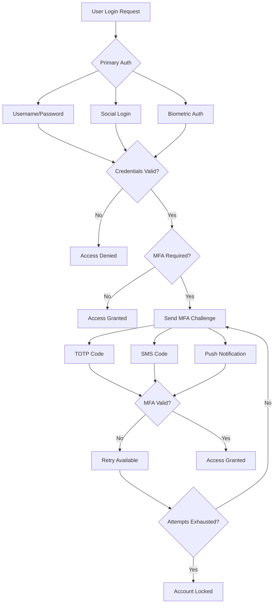
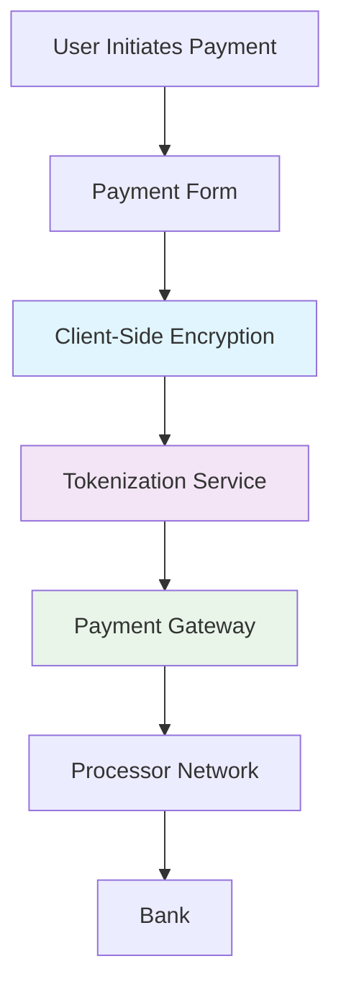

# Compliance and Security Guide

## Overview

This guide outlines the compliance requirements and security measures for the Video Window platform, ensuring adherence to industry standards, regulatory requirements, and best practices for security and data protection.

## Table of Contents

1. [Regulatory Compliance](#regulatory-compliance)
2. [Data Protection and Privacy](#data-protection-and-privacy)
3. [Security Architecture](#security-architecture)
4. [Authentication and Authorization](#authentication-and-authorization)
5. [Payment Security](#payment-security)
6. **Audit and Compliance Monitoring** (#audit-and-compliance-monitoring)
7. **Incident Response and Recovery** (#incident-response-and-recovery)
8. **Security Testing and Validation** (#security-testing-and-validation)

## Regulatory Compliance

### GDPR Compliance (General Data Protection Regulation)

#### Requirements
- **Data Processing Legal Basis**: Obtain explicit consent for data processing
- **Data Subject Rights**: Implement rights to access, rectification, erasure, and portability
- **Data Protection by Design**: Embed privacy measures into system architecture
- **Breach Notification**: Report data breaches to authorities within 72 hours
- **Privacy by Default**: Configure systems to collect only necessary data

#### Implementation Checklist
- [ ] Privacy Policy and Data Processing Notices
- [ ] Cookie Consent Management
- [ ] Data Subject Access Request (DSAR) procedures
- [ ] Data Protection Impact Assessments (DPIA)
- [ ] Data Processing Agreements (DPA) with third parties
- [ ] Record of Processing Activities (ROPA)

### CCPA/CPRA Compliance (California Consumer Privacy Act)

#### Requirements
- **Consumer Rights**: Right to know, delete, and opt-out of sale of personal information
- **Do Not Sell Registry**: Maintain consumer opt-out preferences
- **Data Minimization**: Collect only necessary business purposes
- **Non-Discrimination**: Cannot discriminate against consumers exercising privacy rights

#### Implementation Checklist
- [ ] Privacy Policy with CCPA/CPRA disclosures
- [ ] Consumer privacy request forms
- [ ] Do Not Sell/Share implementation
- [ ] Data inventory and mapping
- [ ] Employee training on CCPA/CPRA requirements

### PCI DSS Compliance (Payment Card Industry Data Security Standard)

#### Requirements
- **Network Security**: Firewall configuration and network segmentation
- **Data Protection**: Encryption of cardholder data and sensitive information
- **Access Control**: Restrict access to cardholder data by business need-to-know
- **Network Monitoring**: Regular testing of security systems and processes
- **Information Security**: Maintain information security policy

#### Implementation Checklist
- [ ] PCI DSS Self-Assessment Questionnaire (SAQ)
- [ ] Network segmentation implementation
- [ ] Encryption key management
- [ ] Access control mechanisms
- [ ] Security awareness training
- [ ] Quarterly vulnerability scanning

### COPPA Compliance (Children's Online Privacy Protection Act)

#### Requirements
- **Age Verification**: Obtain parental consent for users under 13
- **Data Collection Limits**: Collect only information necessary for participation
- **Parental Control**: Provide parents with control over child's information
- **Data Retention**: Delete child's personal information upon request

#### Implementation Checklist
- [ ] Age verification system
- [ ] Parental consent mechanisms
- [ ] Data minimization procedures
- [ ] Parental dashboard and controls
- [ ] Safe harbor certification consideration

## Data Protection and Privacy

### Data Classification

#### Sensitive Personal Data
```yaml
sensitive_data:
  - Payment information (PCI scope)
  - Biometric data
  - Health information
  - Government identification numbers
  - Precise geolocation data

personal_data:
  - User profiles and preferences
  - Contact information
  - Device identifiers
  - Usage analytics
  - Social media connections

anonymized_data:
  - Aggregated analytics
  - Behavioral patterns
  - Market research data
  - Performance metrics
```

### Data Protection Measures

#### Encryption Standards
```yaml
encryption:
  transit:
    - TLS 1.3 for all external communications
    - TLS 1.2+ for internal services
    - Certificate pinning for mobile apps

  at_rest:
    - AES-256 for database encryption
    - AES-256 for file storage
    - Key Management Service (KMS) for key rotation

  application:
    - End-to-end encryption for sensitive operations
    - EncryptedSharedPreferences for mobile
    - Secure Enclave for biometric data
```

#### Data Retention Policy
```yaml
retention_periods:
  user_profiles: "2 years after last activity"
  transaction_records: "7 years (legal requirement)"
  analytics_data: "13 months"
  support_tickets: "3 years"
  audit_logs: "6 years"

auto_deletion:
  - Automated deletion workflows
  - Soft delete with periodic cleanup
  - User-initiated deletion capabilities
  - Compliance data retention holds
```

## Security Architecture

### Zero Trust Security Model

#### Core Principles
- **Never Trust, Always Verify**: Every request must be authenticated and authorized
- **Least Privilege Access**: Users and services have minimum necessary access
- **Micro-segmentation**: Network boundaries around individual services
- **Continuous Monitoring**: Real-time threat detection and response

#### Implementation Components
```yaml
zero_trust_components:
  identity_verification:
    - Multi-factor authentication
    - Device posture assessment
    - Behavioral biometrics
    - Risk-based authentication

  network_security:
    - Service mesh with mTLS
    - API gateway with rate limiting
    - Web Application Firewall (WAF)
    - DDoS protection

  application_security:
    - Runtime Application Self-Protection (RASP)
    - Container security scanning
    - Secret management
    - Dependency vulnerability scanning
```

### Cloud Security Configuration

#### AWS Security Implementation
```yaml
aws_security:
  iam:
    - Role-based access control (RBAC)
    - Least privilege policies
    - Regular access reviews
    - MFA enforcement for all users

  network:
    - VPC with private subnets
    - Security groups with minimal ports
    - Network ACLs for additional filtering
    - VPN/Direct Connect for secure access

  storage:
    - S3 with encryption at rest
    - IAM policies for bucket access
    - S3 Block Public Access
    - Cross-Region Replication for disaster recovery

  monitoring:
    - CloudTrail for API auditing
    - GuardDuty for threat detection
    - Security Hub for compliance monitoring
    - Config for resource tracking
```

#### Mobile App Security

#### iOS Security Measures
```swift
// App Transport Security
<key>NSAppTransportSecurity</key>
<dict>
    <key>NSAllowsArbitraryLoads</key>
    <false/>
    <key>NSExceptionDomains</key>
    <dict/>
</dict>

// Keychain Integration
import Security

class SecureStorage {
    private let keychain = Keychain(service: "com.videowindow.app")

    func store(token: String, key: String) {
        keychain[token] = token
    }
}
```

#### Android Security Measures
```kotlin
// Network Security Configuration
<application
    android:networkSecurityConfig="@xml/network_security_config">

// Encrypted SharedPreferences
class SecureStorage(context: Context) {
    private val masterKey = MasterKey.Builder(context)
        .setKeyScheme(MasterKey.KeyScheme.AES256_GCM)
        .build()

    private val sharedPreferences = EncryptedSharedPreferences.create(
        context,
        "secure_prefs",
        masterKey,
        EncryptedSharedPreferences.PrefKeyEncryptionScheme.AES256_SIV,
        EncryptedSharedPreferences.PrefValueEncryptionScheme.AES256_GCM
    )
}
```

## Authentication and Authorization

### Multi-Factor Authentication (MFA)

#### Supported MFA Methods
```yaml
mfa_methods:
  totp:
    - Google Authenticator
    - Authy
    - Microsoft Authenticator
    - Built-in authenticator apps

  sms:
    - SMS verification codes
    - Voice call verification
    - Backup phone numbers

  biometric:
    - Touch ID / Face ID (iOS)
    - Fingerprint / Face Unlock (Android)
    - Hardware security keys

  push:
    - Duo Security
    - Custom push notifications
    - Email verification codes
```

#### MFA Implementation Flow


### Session Management

#### Session Security Policies
```yaml
session_policies:
  lifetime:
    - Standard sessions: 24 hours
    - Remember me: 30 days
    - Admin sessions: 8 hours
    - High-risk actions: 1 hour

  rotation:
    - Session ID rotation on privilege changes
    - Refresh token rotation on use
    - Revoke all sessions on password change

  concurrent:
    - Maximum 5 concurrent sessions
    - Device fingerprinting for tracking
    - Admin override for suspicious sessions
```

## Payment Security

### PCI DSS Implementation

#### Payment Processing Flow


#### Tokenization Implementation
```yaml
payment_tokenization:
  client_side:
    - Payment form never touches raw card data
    - JavaScript library encrypts data in browser
    - Tokens sent to backend for processing

  server_side:
    - Token storage separate from application database
    - PCI-compliant token vault
    - Limited token access and logging

  integration:
    - Stripe Elements or similar
    - Apple Pay / Google Pay support
    - 3D Secure 2.0 implementation
```

### Fraud Detection

#### Machine Learning Fraud Prevention
```python
class FraudDetectionService:
    def assess_risk(self, transaction: Transaction) -> RiskScore:
        features = self.extract_features(transaction)
        risk_score = self.ml_model.predict(features)

        # Additional rule-based checks
        if self.is_high_value_transaction(transaction):
            risk_score += 0.2

        if self.is_new_device(transaction):
            risk_score += 0.3

        return risk_score

    def extract_features(self, transaction: Transaction) -> dict:
        return {
            'transaction_amount': transaction.amount,
            'user_age_days': (datetime.now() - transaction.user.created_at).days,
            'device_trust_score': transaction.device.trust_score,
            'location_consistency': self.check_location_consistency(transaction),
            'velocity_checks': self.get_velocity_features(transaction)
        }
```

## Audit and Compliance Monitoring

### Logging and Monitoring

#### Security Event Logging
```yaml
security_logging:
  authentication_events:
    - Login attempts (success/failure)
    - MFA challenges
    - Password changes
    - Account lockouts
    - Privilege escalations

  access_events:
    - Resource access
    - Permission modifications
    - Data exports
    - Configuration changes

  payment_events:
    - Transaction attempts
    - Payment processing
    - Refund requests
    - Fraud alerts

  system_events:
    - Service failures
    - Security alerts
    - Vulnerability scans
    - Configuration drift
```

#### Compliance Dashboard
```python
class ComplianceMonitor:
    def get_compliance_status(self) -> ComplianceReport:
        return ComplianceReport(
            pci_dss=self.check_pci_compliance(),
            gdpr=self.check_gdpr_compliance(),
            ccpa=self.check_ccpa_compliance(),
            coppa=self.check_coppa_compliance(),
            security_posture=self.assess_security_posture()
        )

    def check_pci_compliance(self) -> PCIStatus:
        return PCIStatus(
            saq_completed=self.is_saq_completed(),
            vulnerability_scans=self.get_latest_scan_results(),
            access_reviews=self.check_access_reviews(),
            encryption_validated=self.verify_encryption_standards()
        )
```

### Automated Compliance Checks

#### Continuous Compliance Monitoring
```yaml
compliance_automation:
  daily_checks:
    - Access control violations
    - Security policy adherence
    - Data retention compliance
    - Certificate expiration monitoring

  weekly_checks:
    - Vulnerability scan results
    - Security configuration drift
    - User access review requirements
    - Backup verification

  monthly_checks:
    - Risk assessment updates
    - Security awareness training completion
    - Third-party compliance validation
    - Documentation updates
```

## Incident Response and Recovery

### Incident Response Plan

#### Incident Classification
```yaml
incident_severity:
  critical:
    description: "System compromise, data breach, service outage"
    response_time: "15 minutes"
    escalation: "Immediate executive notification"

  high:
    description: "Security incident, significant service degradation"
    response_time: "1 hour"
    escalation: "Management notification within 4 hours"

  medium:
    description: "Minor security issue, limited service impact"
    response_time: "4 hours"
    escalation: "Team lead notification"

  low:
    description: "Informational, no immediate impact"
    response_time: "24 hours"
    escalation: "Documentation only"
```

#### Response Procedures
```python
class IncidentResponse:
    def __init__(self):
        self.communication_manager = CommunicationManager()
        self.legal_team = LegalTeam()
        self.security_team = SecurityTeam()

    def handle_data_breach(self, incident: DataBreachIncident):
        # Immediate containment
        self.contain_incident(incident)

        # Assessment within 1 hour
        impact_assessment = self.assess_impact(incident)

        # Legal review within 2 hours
        legal_review = self.legal_team.review_breach(incident)

        # Notification decisions
        if legal_review.requires_notification:
            self.prepare_regulatory_notifications(incident, impact_assessment)

        # Customer communication
        self.communication_manager.send_breach_notification(incident)

        # Post-incident review
        self.schedule_post_incident_review(incident)
```

### Disaster Recovery

#### Backup and Recovery Strategy
```yaml
backup_strategy:
  databases:
    frequency: "Continuous streaming + Daily snapshots"
    retention: "30 days daily, 12 months weekly"
    storage: "Multi-region with cross-region replication"
    testing: "Weekly restore testing"

  application_data:
    frequency: "Every 6 hours"
    retention: "90 days"
    storage: "Encrypted cloud storage with versioning"
    testing: "Monthly restore testing"

  configuration:
    frequency: "On change + Daily"
    retention: "1 year"
    storage: "Git repository with encrypted secrets"
    testing: "Configuration validation"
```

#### Recovery Time Objectives (RTO/RPO)
```yaml
recovery_objectives:
  critical_services:
    rto: "15 minutes"
    rpo: "5 minutes"
    availability_target: "99.99%"

  user_facing_services:
    rto: "1 hour"
    rpo: "15 minutes"
    availability_target: "99.9%"

  internal_tools:
    rto: "4 hours"
    rpo: "1 hour"
    availability_target: "99%"

  analytics:
    rto: "24 hours"
    rpo: "4 hours"
    availability_target: "95%"
```

## Security Testing and Validation

### Security Testing Framework

#### Automated Security Testing
```yaml
security_testing:
  static_analysis:
    tools: ["SonarQube", "CodeQL", "Bandit", "Semgrep"]
    frequency: "Every PR + Daily scans"
    coverage: "100% of codebase"

  dynamic_analysis:
    tools: ["OWASP ZAP", "Burp Suite", "Nessus"]
    frequency: "Weekly + Pre-deployment"
    targets: "All external endpoints"

  dependency_scanning:
    tools: ["Snyk", "Trivy", "Dependabot"]
    frequency: "Daily + On dependency update"
    scope: "All production dependencies"

  container_scanning:
    tools: ["Trivy", "Clair", "Twistlock"]
    frequency: "Every build + Daily"
    scope: "All container images"
```

#### Penetration Testing
```python
class PenetrationTesting:
    def __init__(self):
        self.scoping = self.define_test_scope()
        self.rules_of_engagement = self.establish_rules()

    def define_test_scope(self) -> TestScope:
        return TestScope(
            in_scope=[
                "Public API endpoints",
                "Mobile applications",
                "Web application",
                "Network infrastructure perimeter"
            ],
            out_of_scope=[
                "Third-party services",
                "Physical security",
                "Denial of service attacks",
                "Social engineering"
            ]
        )

    def conduct_penetration_test(self) -> PentestReport:
        findings = []

        # Network layer testing
        network_findings = self.test_network_security()
        findings.extend(network_findings)

        # Application layer testing
        app_findings = self.test_application_security()
        findings.extend(app_findings)

        # Mobile application testing
        mobile_findings = self.test_mobile_security()
        findings.extend(mobile_findings)

        return PentestReport(
            findings=findings,
            risk_assessment=self.assess_risks(findings),
            remediation_plan=self.create_remediation_plan(findings)
        )
```

### Security Validation Metrics

#### Key Performance Indicators
```yaml
security_metrics:
  vulnerability_management:
    - Mean time to detect (MTTD): < 24 hours
    - Mean time to remediate (MTTR): < 7 days
    - Critical vulnerability SLA: < 24 hours
    - Vulnerability coverage: 100%

  compliance_metrics:
    - Policy adherence: > 95%
    - Audit finding closure: < 30 days
    - Training completion: 100%
    - Assessment pass rate: > 90%

  security_operations:
    - Incident response time: < 1 hour
    - False positive rate: < 5%
    - Monitoring coverage: 100%
    - Alert response time: < 15 minutes
```

## Conclusion

This compliance and security guide provides the foundation for maintaining a secure and compliant Video Window platform. Regular reviews, updates, and audits are essential to ensure ongoing adherence to evolving security requirements and regulatory obligations.

Key success factors:
- **Continuous Monitoring**: Real-time threat detection and response
- **Regular Assessments**: Periodic security audits and penetration testing
- **Training and Awareness**: Ongoing security education for all team members
- **Incident Preparedness**: Well-defined response procedures and regular drills
- **Documentation Updates**: Keeping policies and procedures current with changing requirements

## Quick Reference

### Emergency Contacts
- **Security Team Lead**: [Contact Information]
- **Legal Counsel**: [Contact Information]
- **Compliance Officer**: [Contact Information]
- **Incident Response Team**: [Contact Information]

### Critical Checklists
- **Data Breach Response**: 15-minute initial response checklist
- **Security Incident**: 1-hour assessment and containment checklist
- **Compliance Violation**: Documentation and reporting checklist
- **Service Outage**: Communication and recovery checklist