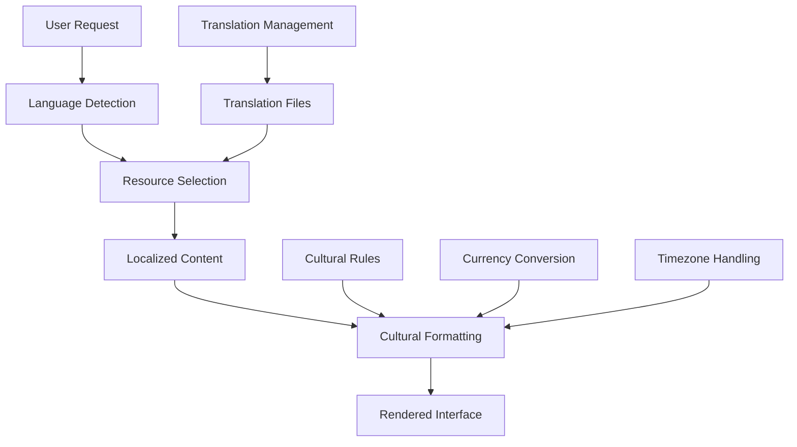
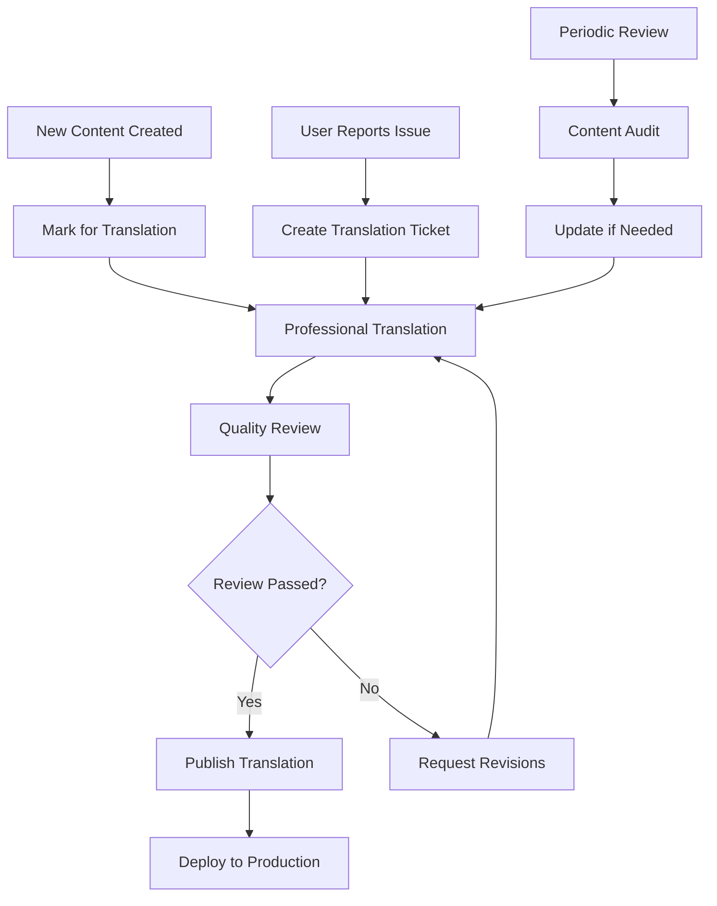

# Internationalization (i18n) Guide

## Overview

This guide outlines Video Window's internationalization strategy for creating a global platform that supports multiple languages, regions, and cultural contexts. We implement comprehensive localization to ensure users worldwide can participate in video auctions in their preferred language and cultural format.

## Table of Contents

1. [Internationalization Strategy](#internationalization-strategy)
2. [Flutter i18n Implementation](#flutter-i18n-implementation)
3. [Web Platform Internationalization](#web-platform-internationalization)
4. [Backend Localization](#backend-localization)
5. [Content Translation Management](#content-translation-management)
6. [Currency and Payment Localization](#currency-and-payment-localization)
7. [Cultural Adaptation](#cultural-adaptation)
8. [Testing and Quality Assurance](#testing-and-quality-assurance)
9. [Deployment and Maintenance](#deployment-and-maintenance)

## Internationalization Strategy

### Supported Languages and Regions

#### Primary Markets
```yaml
supported_languages:
  tier_1: # Full support with dedicated resources
    - en-US    # English (United States) - Primary market
    - en-GB    # English (United Kingdom)
    - es-ES    # Spanish (Spain)
    - es-MX    # Spanish (Mexico)
    - fr-FR    # French (France)
    - de-DE    # German (Germany)
    - ja-JP    # Japanese (Japan)
    - zh-CN    # Chinese (Simplified, China)

  tier_2: # Core features supported
    - pt-BR    # Portuguese (Brazil)
    - it-IT    # Italian (Italy)
    - ko-KR    # Korean (South Korea)
    - ru-RU    # Russian (Russia)
    - ar-SA    # Arabic (Saudi Arabia)

  tier_3: # Basic support
    - hi-IN    # Hindi (India)
    - th-TH    # Thai (Thailand)
    - vi-VN    # Vietnamese (Vietnam)
    - id-ID    # Indonesian (Indonesia)
```

#### Localization Priority Matrix
```yaml
localization_matrix:
  features:
    user_interface:
      priority: "High"
      languages: "All tier 1 & 2"
      timeline: "Launch"

    auction_content:
      priority: "High"
      languages: "en, es, fr, de, ja, zh"
      timeline: "Launch + 3 months"

    payment_processing:
      priority: "Critical"
      languages: "All tier 1"
      timeline: "Launch"

    customer_support:
      priority: "Medium"
      languages: "en, es, fr, de"
      timeline: "Launch + 6 months"

    legal_documents:
      priority: "High"
      languages: "All tier 1 + local legal languages"
      timeline: "Market-specific"
```

### Technical Architecture

#### Localization Architecture Overview


## Flutter i18n Implementation

### Package Setup and Configuration

#### Dependencies
```yaml
# pubspec.yaml
dependencies:
  flutter:
    sdk: flutter

  # Internationalization packages
  flutter_localizations:
    sdk: flutter
  intl: ^0.19.0
  intl_translation: ^0.1.1

  # Advanced i18n features
  easy_localization: ^3.0.7
  flutter_translate: ^4.0.1
  shared_preferences: ^2.2.3

dev_dependencies:
  flutter_test:
    sdk: flutter
  intl_utils: ^2.2.1
```

#### Flutter Localization Configuration
```dart
// lib/main.dart
import 'package:flutter/material.dart';
import 'package:flutter_localizations/flutter_localizations.dart';
import 'package:easy_localization/easy_localization.dart';

class VideoWindowApp extends StatelessWidget {
  @override
  Widget build(BuildContext context) {
    return MaterialApp(
      localizationsDelegates: [
        // App-specific localizations
        AppLocalizations.delegate,
        EasyLocalization.of(context).delegate,

        // Built-in localizations
        GlobalMaterialLocalizations.delegate,
        GlobalWidgetsLocalizations.delegate,
        GlobalCupertinoLocalizations.delegate,

        // Custom delegates
        AuctionLocalizations.delegate,
        PaymentLocalizations.delegate,
      ],

      supportedLocales: [
        const Locale('en', 'US'), // English (United States)
        const Locale('es', 'ES'), // Spanish (Spain)
        const Locale('es', 'MX'), // Spanish (Mexico)
        const Locale('fr', 'FR'), // French (France)
        const Locale('de', 'DE'), // German (Germany)
        const Locale('ja', 'JP'), // Japanese (Japan)
        const Locale('zh', 'CN'), // Chinese (Simplified, China)
        const Locale('pt', 'BR'), // Portuguese (Brazil)
        const Locale('ko', 'KR'), // Korean (South Korea)
        const Locale('ru', 'RU'), // Russian (Russia)
        const Locale('ar', 'SA'), // Arabic (Saudi Arabia)
      ],

      locale: Locale('en', 'US'), // Default locale

      // Handle locale changes
      onGenerateTitle: (BuildContext context) {
        return AppLocalizations.of(context)!.appTitle;
      },

      theme: ThemeData(
        // Support RTL languages
        textDirection: Localizations.localeOf(context).languageCode == 'ar'
            ? TextDirection.rtl
            : TextDirection.ltr,
      ),

      home: EasyLocalization(
        child: VideoWindowHomePage(),
        supportedLocales: supportedLocales,
        path: 'assets/translations',
        fallbackLocale: Locale('en', 'US'),
        useOnlyLangCode: true,
      ),
    );
  }
}
```

### Translation Files Structure

#### Translation File Organization
```
assets/
├── translations/
│   ├── en-US/
│   │   ├── common.json
│   │   ├── auction.json
│   │   ├── payment.json
│   │   └── errors.json
│   ├── es-ES/
│   │   ├── common.json
│   │   ├── auction.json
│   │   ├── payment.json
│   │   └── errors.json
│   ├── ar-SA/
│   │   ├── common.json
│   │   ├── auction.json
│   │   ├── payment.json
│   │   └── errors.json
│   └── ...
```

#### Translation File Examples
```json
// assets/translations/en-US/auction.json
{
  "auction": {
    "title": "Live Auction",
    "current_bid": "Current Bid",
    "place_bid": "Place Bid",
    "time_remaining": "Time Remaining",
    "bid_history": "Bid History",
    "item_details": "Item Details",
    "shipping_info": "Shipping Information",
    "payment_methods": "Payment Methods",
    "winner": "Winner",
    "starting_bid": "Starting Bid",
    "bid_increment": "Bid Increment",
    "buy_now": "Buy Now",
    "watch_item": "Watch Item",
    "share_item": "Share Item",
    "report_item": "Report Item",
    "auction_ending_soon": "Auction Ending Soon",
    "congratulations_won": "Congratulations! You won this auction.",
    "outbid_notice": "You've been outbid.",
    "payment_required": "Payment required within 24 hours"
  },
  "forms": {
    "bid_amount": "Bid Amount",
    "min_bid": "Minimum bid: ${amount}",
    "place_bid_button": "Place Bid for ${amount}",
    "confirm_bid": "Confirm your bid of ${amount}",
    "bid_placed": "Your bid has been placed!",
    "bid_error": "Error placing bid: ${error}"
  }
}
```

```json
// assets/translations/es-ES/auction.json
{
  "auction": {
    "title": "Subasta en Vivo",
    "current_bid": "Puja Actual",
    "place_bid": "Hacer Puja",
    "time_remaining": "Tiempo Restante",
    "bid_history": "Historial de Pujas",
    "item_details": "Detalles del Artículo",
    "shipping_info": "Información de Envío",
    "payment_methods": "Métodos de Pago",
    "winner": "Ganador",
    "starting_bid": "Puja Inicial",
    "bid_increment": "Incremento de Puja",
    "buy_now": "Comprar Ahora",
    "watch_item": "Vigilar Artículo",
    "share_item": "Compartir Artículo",
    "report_item": "Reportar Artículo",
    "auction_ending_soon": "Subasta Terminando Pronto",
    "congratulations_won": "¡Felicidades! Ganaste esta subasta.",
    "outbid_notice": "Te han superado en la puja.",
    "payment_required": "Pago requerido dentro de 24 horas"
  },
  "forms": {
    "bid_amount": "Cantidad de Puja",
    "min_bid": "Puja mínima: ${amount}",
    "place_bid_button": "Hacer Puja por ${amount}",
    "confirm_bid": "Confirma tu puja de ${amount}",
    "bid_placed": "¡Tu puja ha sido colocada!",
    "bid_error": "Error al hacer puja: ${error}"
  }
}
```

### Advanced Localization Features

#### Pluralization and Context
```dart
// lib/localizations/app_localizations.dart
import 'package:flutter/material.dart';
import 'package:intl/intl.dart';

class AppLocalizations {
  static const List<Locale> supportedLocales = [
    Locale('en', 'US'),
    Locale('es', 'ES'),
    Locale('fr', 'FR'),
    // ... other locales
  ];

  static AppLocalizations? of(BuildContext context) {
    return Localizations.of<AppLocalizations>(context, AppLocalizations);
  }

  static const LocalizationsDelegate<AppLocalizations> delegate =
      _AppLocalizationsDelegate();

  // Bid count with pluralization
  String bidCount(int count) {
    final locale = Localizations.localeOf(context);
    return Intl.plural(
      count,
      locale: locale.toString(),
      zero: 'No bids',
      one: '1 bid',
      other: '$count bids',
    );
  }

  // Time remaining with context
  String timeRemaining(Duration duration) {
    final locale = Localizations.localeOf(context);
    if (duration.inDays > 0) {
      return Intl.message(
        '${duration.inDays} day${duration.inDays == 1 ? '' : 's'} remaining',
        name: 'timeRemaining',
        args: [duration],
        locale: locale.toString(),
      );
    } else if (duration.inHours > 0) {
      return Intl.message(
        '${duration.inHours} hour${duration.inHours == 1 ? '' : 's'} remaining',
        name: 'timeRemaining',
        args: [duration],
        locale: locale.toString(),
      );
    } else {
      return Intl.message(
        '${duration.inMinutes} minute${duration.inMinutes == 1 ? '' : 's'} remaining',
        name: 'timeRemaining',
        args: [duration],
        locale: locale.toString(),
      );
    }
  }

  // Currency formatting
  String formatCurrency(double amount, String currencyCode) {
    final locale = Localizations.localeOf(context);
    final format = NumberFormat.currency(
      locale: locale.toString(),
      name: currencyCode,
    );
    return format.format(amount);
  }

  // Date formatting
  String formatDate(DateTime date) {
    final locale = Localizations.localeOf(context);
    return DateFormat.yMd(locale.toString()).format(date);
  }

  // Gender-aware messages
  String userAction(String gender, String action) {
    final locale = Localizations.localeOf(context);
    if (locale.languageCode == 'es') {
      switch (gender) {
        case 'male':
          return 'Él $action';
        case 'female':
          return 'Ella $action';
        default:
          return '$action';
      }
    }
    return action;
  }
}

class _AppLocalizationsDelegate
    extends LocalizationsDelegate<AppLocalizations> {
  const _AppLocalizationsDelegate();

  @override
  bool isSupported(Locale locale) {
    return AppLocalizations.supportedLocales
        .any((supportedLocale) => supportedLocale.languageCode == locale.languageCode);
  }

  @override
  Future<AppLocalizations> load(Locale locale) async {
    AppLocalizations localizations = AppLocalizations();
    await localizations.load(locale);
    return localizations;
  }

  @override
  bool shouldReload(LocalizationsDelegate<AppLocalizations> old) => false;
}
```

## Web Platform Internationalization

### Browser Language Detection

#### Automatic Language Detection
```javascript
// lib/services/language-detection.js
class LanguageDetector {
    constructor() {
        this.supportedLanguages = [
            'en-US', 'es-ES', 'es-MX', 'fr-FR', 'de-DE',
            'ja-JP', 'zh-CN', 'pt-BR', 'ko-KR', 'ru-RU', 'ar-SA'
        ];
    }

    detectPreferredLanguage() {
        // Get browser languages
        const browserLanguages = navigator.languages || [navigator.language];

        // Check localStorage for saved preference
        const savedLanguage = localStorage.getItem('preferred-language');
        if (savedLanguage && this.isSupported(savedLanguage)) {
            return savedLanguage;
        }

        // Match against supported languages
        for (const browserLang of browserLanguages) {
            const exactMatch = this.findExactMatch(browserLang);
            if (exactMatch) return exactMatch;

            const langMatch = this.findLanguageMatch(browserLang);
            if (langMatch) return langMatch;
        }

        // Default to English
        return 'en-US';
    }

    findExactMatch(browserLang) {
        return this.supportedLanguages.find(supported =>
            supported.toLowerCase() === browserLang.toLowerCase()
        );
    }

    findLanguageMatch(browserLang) {
        const langCode = browserLang.split('-')[0];
        return this.supportedLanguages.find(supported =>
            supported.startsWith(langCode)
        );
    }

    isSupported(language) {
        return this.supportedLanguages.includes(language);
    }

    saveLanguagePreference(language) {
        localStorage.setItem('preferred-language', language);
    }
}
```

### Dynamic Content Translation

#### Client-Side Translation Service
```javascript
// lib/services/translation-service.js
class TranslationService {
    constructor() {
        this.currentLocale = 'en-US';
        this.translations = new Map();
        this.loadTranslations();
    }

    async loadTranslations() {
        const language = this.detectLanguage();
        await this.setLanguage(language);
    }

    async setLanguage(locale) {
        if (this.currentLocale === locale) return;

        try {
            // Load translation files
            const translations = await this.fetchTranslations(locale);
            this.translations.set(locale, translations);
            this.currentLocale = locale;

            // Update page content
            this.updatePageContent();

            // Update document language
            document.documentElement.lang = locale;
            document.documentElement.dir = this.getDirection(locale);

            // Save preference
            localStorage.setItem('preferred-language', locale);
        } catch (error) {
            console.error('Failed to load translations:', error);
            // Fallback to English
            if (locale !== 'en-US') {
                await this.setLanguage('en-US');
            }
        }
    }

    async fetchTranslations(locale) {
        const response = await fetch(`/api/translations/${locale}`);
        if (!response.ok) {
            throw new Error(`Failed to fetch translations for ${locale}`);
        }
        return response.json();
    }

    translate(key, params = {}) {
        const translations = this.translations.get(this.currentLocale);
        if (!translations) return key;

        // Navigate nested keys (e.g., 'auction.place_bid')
        const keys = key.split('.');
        let value = translations;

        for (const k of keys) {
            if (value && typeof value === 'object' && k in value) {
                value = value[k];
            } else {
                return key; // Return key if translation not found
            }
        }

        // Handle parameter substitution
        if (typeof value === 'string' && Object.keys(params).length > 0) {
            return this.substituteParams(value, params);
        }

        return value || key;
    }

    substituteParams(text, params) {
        return text.replace(/\$\{(\w+)\}/g, (match, param) => {
            return params[param] || match;
        });
    }

    updatePageContent() {
        // Update all elements with data-translate attribute
        document.querySelectorAll('[data-translate]').forEach(element => {
            const key = element.getAttribute('data-translate');
            const translation = this.translate(key);

            if (element.tagName === 'INPUT' || element.tagName === 'TEXTAREA') {
                element.placeholder = translation;
            } else {
                element.textContent = translation;
            }
        });

        // Update aria-labels for accessibility
        document.querySelectorAll('[data-translate-aria]').forEach(element => {
            const key = element.getAttribute('data-translate-aria');
            element.setAttribute('aria-label', this.translate(key));
        });
    }

    getDirection(locale) {
        const rtlLanguages = ['ar-SA', 'he-IL', 'fa-IR'];
        return rtlLanguages.includes(locale) ? 'rtl' : 'ltr';
    }

    formatCurrency(amount, currencyCode) {
        return new Intl.NumberFormat(this.currentLocale, {
            style: 'currency',
            currency: currencyCode
        }).format(amount);
    }

    formatDate(date) {
        return new Intl.DateTimeFormat(this.currentLocale).format(date);
    }

    formatRelativeTime(date) {
        const rtf = new Intl.RelativeTimeFormat(this.currentLocale, {
            numeric: 'auto'
        });

        const diff = date - new Date();
        const seconds = Math.round(diff / 1000);
        const minutes = Math.round(seconds / 60);
        const hours = Math.round(minutes / 60);
        const days = Math.round(hours / 24);

        if (days > 0) return rtf.format(days, 'day');
        if (hours > 0) return rtf.format(hours, 'hour');
        if (minutes > 0) return rtf.format(minutes, 'minute');
        return rtf.format(seconds, 'second');
    }
}
```

## Backend Localization

### Database Schema for Internationalization

#### Multilingual Content Structure
```sql
-- Auction items with multilingual support
CREATE TABLE auction_items (
    id UUID PRIMARY KEY DEFAULT gen_random_uuid(),
    seller_id UUID NOT NULL REFERENCES users(id),
    created_at TIMESTAMP WITH TIME ZONE DEFAULT NOW(),
    updated_at TIMESTAMP WITH TIME ZONE DEFAULT NOW(),
    start_price DECIMAL(10,2) NOT NULL,
    current_bid DECIMAL(10,2),
    end_time TIMESTAMP WITH TIME ZONE NOT NULL,
    status auction_status NOT NULL DEFAULT 'draft',
    -- Media and metadata
    image_urls TEXT[],
    category_id UUID REFERENCES categories(id),
    condition item_condition NOT NULL,
    shipping_info JSONB
);

-- Multilingual content for auction items
CREATE TABLE auction_item_translations (
    id UUID PRIMARY KEY DEFAULT gen_random_uuid(),
    item_id UUID NOT NULL REFERENCES auction_items(id) ON DELETE CASCADE,
    language_code VARCHAR(5) NOT NULL,
    title TEXT NOT NULL,
    description TEXT NOT NULL,
    short_description TEXT,
    tags TEXT[],
    created_at TIMESTAMP WITH TIME ZONE DEFAULT NOW(),
    updated_at TIMESTAMP WITH TIME ZONE DEFAULT NOW(),
    UNIQUE(item_id, language_code)
);

-- Categories with translations
CREATE TABLE categories (
    id UUID PRIMARY KEY DEFAULT gen_random_uuid(),
    parent_id UUID REFERENCES categories(id),
    slug VARCHAR(100) UNIQUE NOT NULL,
    sort_order INTEGER DEFAULT 0,
    is_active BOOLEAN DEFAULT true,
    created_at TIMESTAMP WITH TIME ZONE DEFAULT NOW()
);

CREATE TABLE category_translations (
    id UUID PRIMARY KEY DEFAULT gen_random_uuid(),
    category_id UUID NOT NULL REFERENCES categories(id) ON DELETE CASCADE,
    language_code VARCHAR(5) NOT NULL,
    name VARCHAR(200) NOT NULL,
    description TEXT,
    created_at TIMESTAMP WITH TIME ZONE DEFAULT NOW(),
    UNIQUE(category_id, language_code)
);

-- User profiles with language preferences
ALTER TABLE users ADD COLUMN preferred_language VARCHAR(5) DEFAULT 'en-US';
ALTER TABLE users ADD COLUMN preferred_currency VARCHAR(3) DEFAULT 'USD';
ALTER TABLE users ADD COLUMN timezone VARCHAR(50) DEFAULT 'UTC';

-- Create indexes for performance
CREATE INDEX idx_auction_item_translations_item_lang ON auction_item_translations(item_id, language_code);
CREATE INDEX idx_category_translations_category_lang ON category_translations(category_id, language_code);
CREATE INDEX idx_users_language ON users(preferred_language);
```

#### API Endpoint for Translations
```dart
// lib/endpoints/translations_endpoint.dart
import 'package:serverpod/serverpod.dart';

class TranslationsEndpoint extends Endpoint {
  // Get translations for a specific language
  Future<Map<String, dynamic>> getTranslations(
    Session session,
    String languageCode, {
    String? namespace,
  }) async {
    final cacheKey = 'translations:$languageCode:${namespace ?? 'default'}';

    // Check cache first
    final cached = await session.cache.get(cacheKey);
    if (cached != null) {
      return Map<String, dynamic>.from(cached);
    }

    // Load from database
    final translations = await Translation.find(
      session,
      where: (t) => t.languageCode.equals(languageCode) &
               (namespace == null ? t.namespace.isNull() : t.namespace.equals(namespace)),
    );

    final result = <String, dynamic>{};
    for (final translation in translations) {
      result[translation.key] = translation.value;
    }

    // Cache for 1 hour
    await session.cache.put(cacheKey, result, ttl: Duration(hours: 1));

    return result;
  }

  // Get localized auction item
  Future<AuctionItemWithTranslation?> getLocalizedAuctionItem(
    Session session,
    String itemId,
    String languageCode,
  ) async {
    final item = await AuctionItem.findById(session, itemId);
    if (item == null) return null;

    final translation = await AuctionItemTranslation.findFirst(
      session,
      where: (t) => t.itemId.equals(item.id) &
               t.languageCode.equals(languageCode),
    );

    return AuctionItemWithTranslation(
      item: item,
      translation: translation,
    );
  }

  // Update or create translation
  Future<bool> updateTranslation(
    Session session,
    TranslationUpdateRequest request,
  ) async {
    try {
      final existing = await Translation.findFirst(
        session,
        where: (t) => t.languageCode.equals(request.languageCode) &
                 t.key.equals(request.key) &
                 (request.namespace == null
                   ? t.namespace.isNull()
                   : t.namespace.equals(request.namespace)),
      );

      if (existing != null) {
        // Update existing translation
        existing.value = request.value;
        existing.updatedAt = DateTime.now();
        await existing.update(session);
      } else {
        // Create new translation
        await Translation.insert(session, Translation(
          languageCode: request.languageCode,
          key: request.key,
          value: request.value,
          namespace: request.namespace,
        ));
      }

      // Clear cache
      final cacheKey = 'translations:${request.languageCode}:${request.namespace ?? 'default'}';
      await session.cache.remove(cacheKey);

      return true;
    } catch (e) {
      print('Error updating translation: $e');
      return false;
    }
  }
}

// Data models
class TranslationUpdateRequest {
  final String languageCode;
  final String key;
  final String value;
  final String? namespace;

  TranslationUpdateRequest({
    required this.languageCode,
    required this.key,
    required this.value,
    this.namespace,
  });
}

class AuctionItemWithTranslation {
  final AuctionItem item;
  final AuctionItemTranslation? translation;

  AuctionItemWithTranslation({
    required this.item,
    this.translation,
  });

  String get title => translation?.title ?? 'Title not available';
  String get description => translation?.description ?? 'Description not available';
  String get shortDescription => translation?.shortDescription ?? '';
  List<String> get tags => translation?.tags ?? [];
}
```

## Content Translation Management

### Translation Management System

#### Translation Workflow


#### Translation Database Models
```dart
// lib/models/translation.dart
class Translation extends TableRow {
  @override
  int? id;

  String languageCode;
  String key;
  String value;
  String? namespace;
  String? context; // Translation context for ambiguous terms
  bool isMachineTranslated = false;
  bool isReviewed = false;
  int? reviewerId;
  DateTime? reviewedAt;
  DateTime createdAt = DateTime.now();
  DateTime updatedAt = DateTime.now();
}

class TranslationRequest extends TableRow {
  @override
  int? id;

  String sourceLanguageCode;
  String targetLanguageCode;
  String sourceText;
  String? context;
  String status; // pending, in_progress, completed, rejected
  int? translatorId;
  int? reviewerId;
  DateTime? completedAt;
  DateTime createdAt = DateTime.now();
  DateTime updatedAt = DateTime.now();
}

class TranslationMemory extends TableRow {
  @override
  int? id;

  String sourceText;
  String targetText;
  String sourceLanguageCode;
  String targetLanguageCode;
  String domain; // auction, payment, general, etc.
  int usageCount = 0;
  double qualityScore = 1.0; // User feedback score
  DateTime createdAt = DateTime.now();
  DateTime lastUsedAt = DateTime.now();
}
```

#### Automated Translation Services Integration
```dart
// lib/services/translation_service.dart
import 'package:google_cloud_translate/google_cloud_translate.dart';

class AutomatedTranslationService {
  late final Translate _translate;
  late final TranslationMemoryService _memoryService;

  Future<String> translateText(
    String text,
    String sourceLanguage,
    String targetLanguage, {
    String? domain,
  }) async {
    // Check translation memory first
    final cachedTranslation = await _memoryService.findTranslation(
      text,
      sourceLanguage,
      targetLanguage,
      domain: domain,
    );

    if (cachedTranslation != null) {
      await _memoryService.incrementUsage(cachedTranslation.id!);
      return cachedTranslation.targetText;
    }

    // Use Google Translate API
    final translation = await _translate.translate(
      text,
      from: sourceLanguage,
      to: targetLanguage,
    );

    // Store in translation memory
    await _memoryService.storeTranslation(
      sourceText: text,
      targetText: translation,
      sourceLanguage: sourceLanguage,
      targetLanguage: targetLanguage,
      domain: domain,
    );

    return translation;
  }

  Future<List<String>> detectLanguage(String text) async {
    final detection = await _translate.detect(text);
    return detection.map((d) => d.language).toList();
  }

  Future<Map<String, String>> batchTranslate(
    Map<String, String> texts,
    String sourceLanguage,
    String targetLanguage,
  ) async {
    final results = <String, String>{};

    for (final entry in texts.entries) {
      try {
        final translation = await translateText(
          entry.value,
          sourceLanguage,
          targetLanguage,
        );
        results[entry.key] = translation;
      } catch (e) {
        print('Translation failed for ${entry.key}: $e');
        results[entry.key] = entry.value; // Fallback to original
      }
    }

    return results;
  }
}

class TranslationMemoryService {
  Future<TranslationMemory?> findTranslation(
    String sourceText,
    String sourceLanguage,
    String targetLanguage, {
    String? domain,
    double minQualityScore = 0.8,
  }) async {
    // Implementation for finding translations in memory
    // This would query the database for exact or fuzzy matches
    return null; // Placeholder
  }

  Future<void> storeTranslation({
    required String sourceText,
    required String targetText,
    required String sourceLanguage,
    required String targetLanguage,
    String? domain,
  }) async {
    // Implementation for storing translations in memory
  }

  Future<void> incrementUsage(int translationId) async {
    // Implementation for updating usage statistics
  }
}
```

## Currency and Payment Localization

#### Currency Configuration
```yaml
# config/currencies.yaml
currencies:
  USD:
    name: "US Dollar"
    symbol: "$"
    symbol_position: "before"
    decimal_places: 2
    thousands_separator: ","
    decimal_separator: "."

  EUR:
    name: "Euro"
    symbol: "€"
    symbol_position: "before"
    decimal_places: 2
    thousands_separator: "."
    decimal_separator: ","

  JPY:
    name: "Japanese Yen"
    symbol: "¥"
    symbol_position: "before"
    decimal_places: 0
    thousands_separator: ","
    decimal_separator: "."

  GBP:
    name: "British Pound"
    symbol: "£"
    symbol_position: "before"
    decimal_places: 2
    thousands_separator: ","
    decimal_separator: "."

  CNY:
    name: "Chinese Yuan"
    symbol: "¥"
    symbol_position: "before"
    decimal_places: 2
    thousands_separator: ","
    decimal_separator: "."

  KRW:
    name: "Korean Won"
    symbol: "₩"
    symbol_position: "before"
    decimal_places: 0
    thousands_separator: ","
    decimal_separator: "."

# Regional currency mapping
regional_defaults:
  en-US: USD
  en-GB: GBP
  es-ES: EUR
  es-MX: MXN
  fr-FR: EUR
  de-DE: EUR
  ja-JP: JPY
  zh-CN: CNY
  pt-BR: BRL
  ko-KR: KRW
  ru-RU: RUB
  ar-SA: SAR
```

#### Currency Formatting Service
```dart
// lib/services/currency_service.dart
class CurrencyService {
  static final Map<String, CurrencyConfig> _currencies = {
    'USD': CurrencyConfig(
      name: 'US Dollar',
      symbol: '\$',
      symbolPosition: SymbolPosition.before,
      decimalPlaces: 2,
      thousandsSeparator: ',',
      decimalSeparator: '.',
    ),
    'EUR': CurrencyConfig(
      name: 'Euro',
      symbol: '€',
      symbolPosition: SymbolPosition.before,
      decimalPlaces: 2,
      thousandsSeparator: '.',
      decimalSeparator: ',',
    ),
    'JPY': CurrencyConfig(
      name: 'Japanese Yen',
      symbol: '¥',
      symbolPosition: SymbolPosition.before,
      decimalPlaces: 0,
      thousandsSeparator: ',',
      decimalSeparator: '.',
    ),
    // ... other currencies
  };

  static final Map<String, String> _regionalDefaults = {
    'en-US': 'USD',
    'en-GB': 'GBP',
    'es-ES': 'EUR',
    'es-MX': 'MXN',
    'fr-FR': 'EUR',
    'de-DE': 'EUR',
    'ja-JP': 'JPY',
    'zh-CN': 'CNY',
    // ... other regional defaults
  };

  static String getCurrencyForLocale(String locale) {
    return _regionalDefaults[locale] ?? 'USD';
  }

  static String formatCurrency(double amount, String currencyCode, {String? locale}) {
    final config = _currencies[currencyCode];
    if (config == null) {
      return amount.toStringAsFixed(2);
    }

    // Format number with appropriate separators
    final formattedNumber = _formatNumber(amount, config);

    // Add currency symbol
    switch (config.symbolPosition) {
      case SymbolPosition.before:
        return '${config.symbol}$formattedNumber';
      case SymbolPosition.after:
        return '$formattedNumber${config.symbol}';
      case SymbolPosition.before_with_space:
        return '${config.symbol} $formattedNumber';
      case SymbolPosition.after_with_space:
        return '$formattedNumber ${config.symbol}';
    }
  }

  static String _formatNumber(double amount, CurrencyConfig config) {
    final numberStr = amount.toStringAsFixed(config.decimalPlaces);
    final parts = numberStr.split('.');

    var integerPart = parts[0];
    final decimalPart = parts.length > 1 ? parts[1] : '';

    // Add thousands separator
    if (config.thousandsSeparator.isNotEmpty) {
      final reversed = integerPart.split('').reversed.join('');
      final withSeparators = RegExp(r'.{3}').allMatches(reversed).map((m) => m.group(0)!).join(config.thousandsSeparator);
      integerPart = withSeparators.split('').reversed.join('');
    }

    // Combine integer and decimal parts
    if (config.decimalPlaces > 0) {
      return '$integerPart${config.decimalSeparator}$decimalPart';
    }
    return integerPart;
  }

  static Future<double> convertCurrency(
    double amount,
    String fromCurrency,
    String toCurrency,
  ) async {
    if (fromCurrency == toCurrency) return amount;

    // Get exchange rate from currency API
    final rate = await _getExchangeRate(fromCurrency, toCurrency);
    return amount * rate;
  }

  static Future<double> _getExchangeRate(String from, String to) async {
    // Implementation for fetching exchange rates
    // This would call an external API like fixer.io or Open Exchange Rates
    return 1.0; // Placeholder
  }
}

class CurrencyConfig {
  final String name;
  final String symbol;
  final SymbolPosition symbolPosition;
  final int decimalPlaces;
  final String thousandsSeparator;
  final String decimalSeparator;

  CurrencyConfig({
    required this.name,
    required this.symbol,
    required this.symbolPosition,
    required this.decimalPlaces,
    required this.thousandsSeparator,
    required this.decimalSeparator,
  });
}

enum SymbolPosition {
  before,
  after,
  before_with_space,
  after_with_space,
}
```

## Cultural Adaptation

#### Regional Settings Configuration
```yaml
# config/regions.yaml
regional_settings:
  en-US:
    date_format: "MM/dd/yyyy"
    time_format: "h:mm a"
    first_day_of_week: 0  # Sunday
    measurement_system: "imperial"
    number_format:
      decimal_separator: "."
      thousands_separator: ","
    address_format: "street, city, state zip"
    phone_format: "+1 (xxx) xxx-xxxx"

  en-GB:
    date_format: "dd/MM/yyyy"
    time_format: "HH:mm"
    first_day_of_week: 1  # Monday
    measurement_system: "metric"
    number_format:
      decimal_separator: "."
      thousands_separator: ","
    address_format: "street, city, postcode"
    phone_format: "+44 xxxx xxxxxx"

  es-ES:
    date_format: "dd/MM/yyyy"
    time_format: "HH:mm"
    first_day_of_week: 1  # Monday
    measurement_system: "metric"
    number_format:
      decimal_separator: ","
      thousands_separator: "."
    address_format: "street, city, postcode"
    phone_format: "+34 xxx xxx xxx"

  ja-JP:
    date_format: "yyyy/MM/dd"
    time_format: "HH:mm"
    first_day_of_week: 0  # Sunday
    measurement_system: "metric"
    number_format:
      decimal_separator: "."
      thousands_separator: ","
    address_format: "postcode, city, street"
    phone_format: "+81-xx-xxxx-xxxx"

  ar-SA:
    date_format: "dd/MM/yyyy"
    time_format: "HH:mm"
    first_day_of_week: 6  # Saturday
    measurement_system: "metric"
    number_format:
      decimal_separator: "."
      thousands_separator: ","
    address_format: "street, city, postcode"
    phone_format: "+966 xx xxx xxxx"
    text_direction: "rtl"
```

#### Cultural Adaptation Service
```dart
// lib/services/cultural_service.dart
class CulturalService {
  static final Map<String, RegionalSettings> _settings = {
    'en-US': RegionalSettings(
      dateFormat: 'MM/dd/yyyy',
      timeFormat: 'h:mm a',
      firstDayOfWeek: 0, // Sunday
      measurementSystem: 'imperial',
      textDirection: 'ltr',
    ),
    'es-ES': RegionalSettings(
      dateFormat: 'dd/MM/yyyy',
      timeFormat: 'HH:mm',
      firstDayOfWeek: 1, // Monday
      measurementSystem: 'metric',
      textDirection: 'ltr',
    ),
    'ar-SA': RegionalSettings(
      dateFormat: 'dd/MM/yyyy',
      timeFormat: 'HH:mm',
      firstDayOfWeek: 6, // Saturday
      measurementSystem: 'metric',
      textDirection: 'rtl',
    ),
    // ... other regions
  };

  static RegionalSettings getSettings(String locale) {
    return _settings[locale] ?? _settings['en-US']!;
  }

  static String formatDate(DateTime date, String locale) {
    final settings = getSettings(locale);
    final format = DateFormat('${settings.dateFormat} ${settings.timeFormat}', locale);
    return format.format(date);
  }

  static String formatAddress(Address address, String locale) {
    final settings = getSettings(locale);

    switch (locale) {
      case 'ja-JP':
        return '${address.postalCode}, ${address.city}, ${address.street}';
      case 'ar-SA':
        return '${address.street}, ${address.city}, ${address.postalCode}';
      default:
        return '${address.street}, ${address.city}, ${address.state} ${address.postalCode}';
    }
  }

  static String formatPhoneNumber(String phone, String locale) {
    // Implementation for locale-specific phone formatting
    return phone;
  }

  static bool isRightToLeft(String locale) {
    final settings = getSettings(locale);
    return settings.textDirection == 'rtl';
  }

  // Cultural content adaptation
  static String adaptContent(String content, String locale) {
    switch (locale) {
      case 'ja-JP':
        return _adaptForJapanese(content);
      case 'ar-SA':
        return _adaptForArabic(content);
      default:
        return content;
    }
  }

  static String _adaptForJapanese(String content) {
    // Japanese-specific adaptations
    // - Formal language adjustments
    // - Cultural references
    // - Business etiquette
    return content; // Placeholder
  }

  static String _adaptForArabic(String content) {
    // Arabic-specific adaptations
    // - RTL text handling
    // - Cultural references
    // - Religious considerations
    return content; // Placeholder
  }
}

class RegionalSettings {
  final String dateFormat;
  final String timeFormat;
  final int firstDayOfWeek;
  final String measurementSystem;
  final String textDirection;

  RegionalSettings({
    required this.dateFormat,
    required this.timeFormat,
    required this.firstDayOfWeek,
    required this.measurementSystem,
    required this.textDirection,
  });
}
```

## Testing and Quality Assurance

### Internationalization Testing Strategy

#### Automated i18n Testing
```dart
// test/internationalization_test.dart
import 'package:flutter_test/flutter_test.dart';
import 'package:intl/intl.dart';

void main() {
  group('Internationalization Tests', () {
    testWidgets('All UI elements have translations', (WidgetTester tester) async {
      await tester.pumpWidget(VideoWindowApp());

      // Test English translations
      await tester.binding.setLocale('en', 'US');
      await tester.pumpAndSettle();

      // Check that all translatable elements have text
      final translatableWidgets = tester.widgetList(find.byKey(Key('translatable')));
      for (final widget in translatableWidgets) {
        expect(widget.toString(), isNot(contains('missing_translation')));
      }
    });

    testWidgets('Arabic RTL layout works correctly', (WidgetTester tester) async {
      await tester.pumpWidget(VideoWindowApp());

      // Set Arabic locale
      await tester.binding.setLocale('ar', 'SA');
      await tester.pumpAndSettle();

      // Check that text direction is RTL
      expect(find.byType(MaterialApp), isNotNull);
      // Add more specific RTL checks
    });

    testWidgets('Currency formatting works for all locales', (WidgetTester tester) async {
      final testAmount = 1234.56;
      final locales = ['en-US', 'ja-JP', 'de-DE', 'ar-SA'];

      for (final locale in locales) {
        await tester.binding.setLocale(locale.split('-')[0], locale.split('-')[1]);
        await tester.pumpAndSettle();

        final formatted = CurrencyService.formatCurrency(testAmount, 'USD', locale: locale);
        expect(formatted, isNotEmpty);
        expect(formatted, contains('1234')); // Should contain the number
      }
    });

    test('Date formatting works correctly', () {
      final testDate = DateTime(2025, 10, 9, 14, 30);

      final usFormat = DateFormat('MM/dd/yyyy h:mm a', 'en_US').format(testDate);
      expect(usFormat, equals('10/09/2025 2:30 PM'));

      final ukFormat = DateFormat('dd/MM/yyyy HH:mm', 'en_GB').format(testDate);
      expect(ukFormat, equals('09/10/2025 14:30'));

      final jpFormat = DateFormat('yyyy/MM/dd HH:mm', 'ja_JP').format(testDate);
      expect(jpFormat, equals('2025/10/09 14:30'));
    });
  });

  group('Translation Quality Tests', () {
    test('All translation keys are present in all languages', () async {
      final translationService = TranslationService();
      final languages = ['en-US', 'es-ES', 'fr-FR', 'ja-JP'];
      final baseTranslations = await translationService.getTranslations('en-US');

      for (final language in languages) {
        final translations = await translationService.getTranslations(language);

        // Check that all keys from base translations exist in other languages
        for (final key in baseTranslations.keys) {
          expect(translations, contains(key));
          expect(translations[key], isNotEmpty);
        }
      }
    });

    test('No placeholder values remain in translations', () async {
      final translationService = TranslationService();
      final languages = ['en-US', 'es-ES', 'fr-FR', 'ja-JP'];

      for (final language in languages) {
        final translations = await translationService.getTranslations(language);

        for (final entry in translations.entries) {
          expect(entry.value, isNot(contains('\${')));
          expect(entry.value, isNot(contains('{{')));
          expect(entry.value, isNot(contains('missing_translation')));
        }
      }
    });
  });
}
```

### Visual Regression Testing

#### Screenshot Testing for Different Locales
```dart
// test/screenshots/localization_screenshots.dart
import 'package:flutter_test/flutter_test.dart';
import 'package:screenshot/screenshot.dart';

void main() {
  group('Localization Screenshot Tests', () {
    final locales = [
      'en-US',
      'es-ES',
      'fr-FR',
      'de-DE',
      'ja-JP',
      'ar-SA',
    ];

    for (final locale in locales) {
      testWidgets('$locale - Auction screen screenshot', (WidgetTester tester) async {
        await tester.pumpWidget(VideoWindowApp());
        await tester.binding.setLocale(locale.split('-')[0], locale.split('-')[1]);
        await tester.pumpAndSettle();

        final screenshot = await tester.takeScreenshot();
        expect(screenshot, matchesGoldenFile('goldens/auction_screen_$locale.png'));
      });

      testWidgets('$locale - Payment screen screenshot', (WidgetTester tester) async {
        await tester.pumpWidget(VideoWindowApp());
        await tester.binding.setLocale(locale.split('-')[0], locale.split('-')[1]);
        await tester.pumpAndSettle();

        // Navigate to payment screen
        await tester.tap(find.byKey(Key('navigate_to_payment')));
        await tester.pumpAndSettle();

        final screenshot = await tester.takeScreenshot();
        expect(screenshot, matchesGoldenFile('goldens/payment_screen_$locale.png'));
      });
    }
  });
}
```

## Deployment and Maintenance

### Continuous Integration for i18n

#### GitHub Actions for Translation Management
```yaml
# .github/workflows/i18n.yml
name: Internationalization CI

on:
  push:
    branches: [main, develop]
    paths:
      - 'assets/translations/**'
      - 'lib/localizations/**'
  pull_request:
    paths:
      - 'assets/translations/**'
      - 'lib/localizations/**'

jobs:
  extract-translations:
    runs-on: ubuntu-latest
    steps:
      - uses: actions/checkout@v3

      - name: Setup Flutter
        uses: subosito/flutter-action@v2
        with:
          flutter-version: '3.19.6'

      - name: Install dependencies
        run: flutter pub get

      - name: Extract translations
        run: |
          flutter packages pub run intl_translation:extract_to_arb --output-dir=lib/l10n \
            lib/localizations/*.dart

      - name: Check for missing translations
        run: |
          dart tool/check_translations.dart

      - name: Generate translation files
        run: |
          flutter packages pub run intl_translation:generate_from_arb \
            --output-dir=lib/l10n \
            lib/l10n/*.dart lib/l10n/*.arb

  validate-translations:
    runs-on: ubuntu-latest
    needs: extract-translations
    steps:
      - uses: actions/checkout@v3

      - name: Setup Node.js
        uses: actions/setup-node@v3
        with:
          node-version: '18'

      - name: Install i18n tools
        run: npm install -g i18next-conv

      - name: Validate JSON format
        run: |
          find assets/translations -name "*.json" -exec node -e "
            const fs = require('fs');
            const path = process.argv[1];
            try {
              JSON.parse(fs.readFileSync(path, 'utf8'));
              console.log('✓ Valid JSON: ' + path);
            } catch (e) {
              console.error('✗ Invalid JSON: ' + path);
              console.error(e.message);
              process.exit(1);
            }
          " {} \;

      - name: Check for placeholder values
        run: |
          # Check for common placeholder patterns
          grep -r "\${.*}" assets/translations/ && exit 1 || echo "No placeholder values found"
          grep -r "{{.*}}" assets/translations/ && exit 1 || echo "No template values found"

  deploy-translations:
    runs-on: ubuntu-latest
    needs: [extract-translations, validate-translations]
    if: github.ref == 'refs/heads/main'
    steps:
      - uses: actions/checkout@v3

      - name: Deploy to production
        run: |
          echo "Deploying updated translations to production..."
          # Add deployment logic here
```

#### Translation Update Automation
```dart
// tool/update_translations.dart
import 'dart:convert';
import 'dart:io';
import 'package:http/http.dart' as http;

class TranslationUpdater {
  static const String _googleTranslateApiKey = 'YOUR_API_KEY';
  static const String _crowdinApiKey = 'YOUR_CROWDIN_API_KEY';

  Future<void> updateTranslations() async {
    print('Starting translation update process...');

    // 1. Extract new translation keys
    await _extractNewKeys();

    // 2. Send to translation service
    await _sendToTranslationService();

    // 3. Download updated translations
    await _downloadUpdatedTranslations();

    // 4. Validate translations
    await _validateTranslations();

    print('Translation update completed!');
  }

  Future<void> _extractNewKeys() async {
    print('Extracting new translation keys...');

    // Run intl extraction
    final result = await Process.run('flutter', [
      'packages', 'pub', 'run', 'intl_translation:extract_to_arb',
      '--output-dir=lib/l10n',
      'lib/localizations/*.dart'
    ]);

    if (result.exitCode != 0) {
      throw Exception('Failed to extract translations: ${result.stderr}');
    }

    print('✓ Translation keys extracted');
  }

  Future<void> _sendToTranslationService() async {
    print('Sending new keys to translation service...');

    // Read master translation file (English)
    final masterFile = File('lib/l10n/app_en.arb');
    final masterContent = await masterFile.readAsString();
    final masterJson = jsonDecode(masterContent);

    // Extract new keys
    final existingKeys = await _getExistingKeys();
    final newKeys = masterJson.keys.where((key) => !existingKeys.contains(key));

    if (newKeys.isEmpty) {
      print('No new keys found');
      return;
    }

    print('Found ${newKeys.length} new keys to translate');

    // Send to Crowdin or other translation service
    for (final key in newKeys) {
      await _sendKeyToCrowdin(key, masterJson[key]);
    }

    print('✓ Keys sent to translation service');
  }

  Future<void> _sendKeyToCrowdin(String key, String value) async {
    // Implementation for sending keys to Crowdin API
    final url = Uri.parse('https://api.crowdin.com/api/project/your-project/add-file');
    final response = await http.post(url, body: {
      'key': _crowdinApiKey,
      'file': 'base64-encoded-content',
    });

    if (response.statusCode != 200) {
      throw Exception('Failed to send key to Crowdin: ${response.body}');
    }
  }

  Future<void> _downloadUpdatedTranslations() async {
    print('Downloading updated translations...');

    final languages = ['es-ES', 'fr-FR', 'de-DE', 'ja-JP'];

    for (final language in languages) {
      final translations = await _downloadLanguageTranslations(language);
      await _saveTranslationFile(language, translations);
      print('✓ Downloaded translations for $language');
    }
  }

  Future<Map<String, String>> _downloadLanguageTranslations(String language) async {
    // Implementation for downloading translations from service
    // This would call the Crowdin API or other translation service
    return {}; // Placeholder
  }

  Future<void> _saveTranslationFile(String language, Map<String, String> translations) async {
    final file = File('assets/translations/$language/common.json');
    await file.writeAsString(jsonEncode(translations));
  }

  Future<Set<String>> _getExistingKeys() async {
    // Get existing translation keys from database or files
    return {}; // Placeholder
  }

  Future<void> _validateTranslations() async {
    print('Validating downloaded translations...');

    final translationFiles = Directory('assets/translations')
        .listSync()
        .whereType<File>()
        .where((file) => file.path.endsWith('.json'));

    for (final file in translationFiles) {
      final content = await file.readAsString();
      final json = jsonDecode(content);

      // Validate JSON structure
      if (json is! Map<String, dynamic>) {
        throw Exception('Invalid translation file format: ${file.path}');
      }

      // Check for placeholder values
      for (final entry in json.entries) {
        if (entry.value is String) {
          final value = entry.value as String;
          if (value.contains('\${') || value.contains('{{')) {
            print('Warning: Placeholder value found in ${file.path}: ${entry.key}');
          }
        }
      }
    }

    print('✓ All translations validated');
  }
}

void main() async {
  final updater = TranslationUpdater();
  await updater.updateTranslations();
}
```

## Conclusion

This internationalization guide provides a comprehensive framework for making Video Window truly global. By implementing robust i18n practices, we ensure that users worldwide can participate in our platform in their preferred language and cultural context.

### Key Success Factors
- **Scalable Architecture**: Support for adding new languages and regions easily
- **Quality Assurance**: Comprehensive testing and validation processes
- **Automation**: Continuous integration and automated translation workflows
- **Cultural Sensitivity**: Deep understanding of local markets and preferences
- **Performance**: Efficient translation loading and caching strategies

### Future Enhancements
- AI-powered translation quality improvement
- Real-time translation for live auctions
- Advanced cultural personalization
- Voice interface localization
- Sign language support integration

For questions about internationalization or to request support for a new language, contact our i18n team at i18n@videowindow.com.