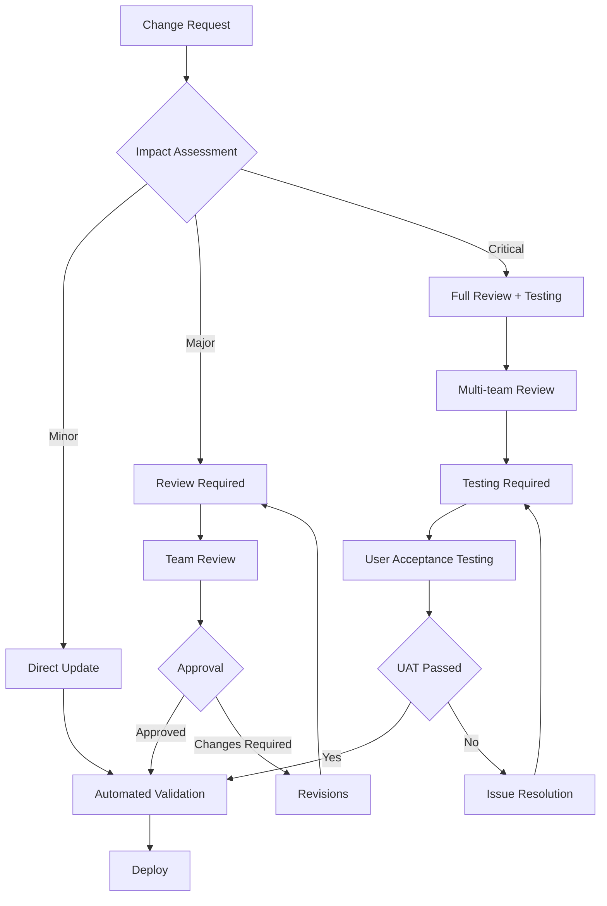
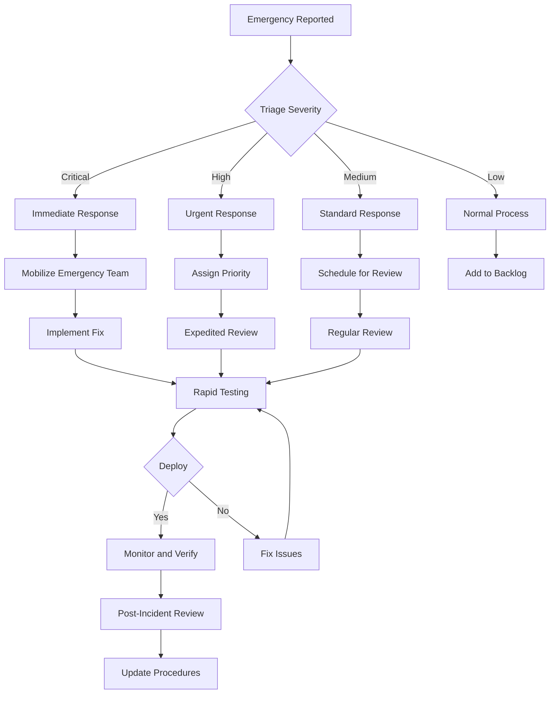

# Documentation Maintenance Guide

## Overview

This guide establishes processes and standards for maintaining high-quality, up-to-date documentation throughout the Video Window project lifecycle. Proper documentation maintenance ensures accuracy, relevance, and usefulness for all stakeholders.

## Table of Contents

1. [Documentation Governance](#documentation-governance)
2. [Maintenance Processes](#maintenance-processes)
3. [Quality Assurance](#quality-assurance)
4. [Automation and Tools](#automation-and-tools)
5. [Review and Approval Workflows](#review-and-approval-workflows)
6. [Metrics and Monitoring](#metrics-and-monitoring)
7. [Team Responsibilities](#team-responsibilities)
8. [Emergency Procedures](#emergency-procedures)

## Documentation Governance

### Documentation Categories

#### Tier 1 Documentation (Critical)
- **Architecture Decisions** (ADR)
- **API Specifications**
- **Security Policies**
- **Compliance Documentation**
- **Installation and Setup Guides**
- **Emergency Procedures**

#### Tier 2 Documentation (Important)
- **Developer Guides**
- **User Guides**
- **Testing Strategies**
- **Deployment Guides**
- **Troubleshooting Guides**

#### Tier 3 Documentation (Supporting)
- **Best Practices**
- **Tutorials and Examples**
- **FAQ Sections**
- **Glossaries**
- **Historical Information`

### Ownership Structure

```yaml
documentation_owners:
  architecture_docs:
    primary: "Chief Architect"
    secondary: "Senior Engineers"
    approvers: "Technical Leadership Team"

  api_docs:
    primary: "API Team Lead"
    secondary: "Backend Engineers"
    approvers: "Technical Leadership Team"

  security_docs:
    primary: "Security Lead"
    secondary: "DevOps Engineers"
    approvers: "CTO, Legal Team"

  user_docs:
    primary: "Product Manager"
    secondary: "UX Writer"
    approvers: "Product Leadership"

  developer_docs:
    primary: "Engineering Manager"
    secondary: "Senior Developers"
    approvers: "Engineering Leadership"
```

## Maintenance Processes

### Regular Maintenance Schedule

#### Daily Tasks
```yaml
daily_maintenance:
  automated_checks:
    - Run link validation on all documentation
    - Check for broken references and links
    - Validate code examples against current codebase
    - Monitor documentation build processes

  monitoring:
    - Review documentation access analytics
    - Check for user-reported issues
    - Monitor automated test failures
    - Review documentation-related support tickets
```

#### Weekly Tasks
```yaml
weekly_maintenance:
  content_reviews:
    - Review recently modified documentation
    - Check for outdated information
    - Update version numbers and compatibility info
    - Review user feedback and suggestions

  technical_validation:
    - Test code examples and tutorials
    - Verify installation procedures
    - Update screenshots and diagrams
    - Check API endpoint accuracy

  team_coordination:
    - Documentation sync meetings
    - Review pending documentation updates
    - Plan upcoming documentation needs
    - Coordinate with feature releases
```

#### Monthly Tasks
```yaml
monthly_maintenance:
  comprehensive_reviews:
    - Full documentation audit
    - Accuracy validation across all docs
    - User experience assessment
    - Accessibility compliance check

  strategic_updates:
    - Documentation roadmap review
    - Template and standard updates
    - Tool and process improvements
    - Team training and knowledge sharing

  reporting:
    - Documentation quality metrics
    - User satisfaction surveys
    - Maintenance cost analysis
    - Improvement recommendations
```

#### Quarterly Tasks
```yaml
quarterly_maintenance:
  major_reviews:
    - Documentation strategy assessment
    - Governance structure evaluation
    - Tool stack review and updates
    - Cross-team coordination improvements

  planning:
    - Documentation roadmap updates
    - Resource allocation planning
    - Training and development needs
    - Budget and tool requirements
```

### Change Management Process

#### Documentation Update Workflow


#### Change Categories and Requirements
```yaml
change_categories:
  minor_changes:
    description: "Typos, grammar, formatting, minor clarifications"
    approval: "Documentation owner"
    testing: "Automated validation only"
    deployment: "Direct deploy"
    examples:
      - Fixing typos
      - Improving sentence structure
      - Updating formatting
      - Adding minor clarifications

  major_changes:
    description: "Content updates, procedure changes, new sections"
    approval: "Documentation owner + team lead"
    testing: "Content validation + automated tests"
    deployment: "Scheduled deploy with notification"
    examples:
      - Adding new procedures
      - Updating existing workflows
      - Adding new sections
      - Significant content updates

  critical_changes:
    description: "Architecture changes, security updates, compliance updates"
    approval: "Full team + stakeholders"
    testing: "Comprehensive testing + user validation"
    deployment: "Coordinated deploy with rollback plan"
    examples:
      - Security procedure updates
      - Architecture documentation changes
      - Compliance requirement updates
      - Critical bug fixes in documentation
```

## Quality Assurance

### Quality Standards

#### Documentation Quality Criteria
```yaml
quality_standards:
  accuracy:
    - All technical information is correct
    - Code examples compile and run
    - Commands and procedures work as documented
    - Links and references are valid
    - Version information is current

  completeness:
    - All necessary information is included
    - Prerequisites are clearly stated
    - Edge cases and limitations are covered
    - Troubleshooting information is provided
    - Related topics are referenced

  clarity:
    - Language is clear and concise
    - Technical jargon is explained
    - Structure is logical and easy to follow
    - Examples are relevant and helpful
    - Visual aids support understanding

  accessibility:
    - Content is accessible to users with disabilities
    - Proper heading structure is maintained
    - Images have alt text
    - Code is properly formatted
    - Color contrast meets standards

  maintainability:
    - Content is modular and organized
    - Version control best practices are followed
    - Templates and standards are used consistently
    - Content is easily searchable
    - Updates can be made efficiently
```

#### Review Checklist
```yaml
review_checklist:
  content_accuracy:
    - [ ] All technical information verified
    - [ ] Code examples tested and working
    - [ ] Commands and procedures validated
    - [ ] Links checked and working
    - [ ] Version numbers current

  structure_and_formatting:
    - [ ] Document follows template
    - [ ] Heading structure is correct
    - [ ] Table of contents is accurate
    - [ ] Code blocks are properly formatted
    - [ ] Images are properly sized and placed

  user_experience:
    - [ ] Information is easy to find
    - [ ] Content flows logically
    - [ ] Examples are clear and helpful
    - [ ] Language is appropriate for audience
    - [ ] Prerequisites are clearly stated

  technical_validation:
    - [ ] Commands work as documented
    - [ ] Code compiles without errors
    - [ ] APIs match current implementation
    - [ ] Configuration examples are valid
    - [ ] Environment requirements are accurate

  compliance_and_security:
    - [ ] Security best practices are followed
    - [ ] Compliance requirements are met
    - [ ] Sensitive information is not exposed
    - [ ] Legal requirements are satisfied
    - [ ] Company policies are followed
```

### Validation Tools

#### Automated Testing Scripts
```python
#!/usr/bin/env python3
# tools/docs_validator.py

import os
import re
import requests
import json
from pathlib import Path
from typing import List, Dict, Any
import argparse
import subprocess

class DocumentationValidator:
    def __init__(self, docs_path: str):
        self.docs_path = Path(docs_path)
        self.errors = []
        self.warnings = []

    def validate_all(self) -> Dict[str, Any]:
        """Run all validation checks"""
        results = {
            'link_validation': self.validate_links(),
            'code_validation': self.validate_code_blocks(),
            'structure_validation': self.validate_structure(),
            'consistency_validation': self.validate_consistency(),
            'accessibility_validation': self.validate_accessibility(),
        }

        results['total_errors'] = len(self.errors)
        results['total_warnings'] = len(self.warnings)
        results['errors'] = self.errors
        results['warnings'] = self.warnings

        return results

    def validate_links(self) -> bool:
        """Validate all internal and external links"""
        print("Validating links...")
        valid = True

        # Find all markdown files
        md_files = list(self.docs_path.rglob("*.md"))

        for md_file in md_files:
            with open(md_file, 'r', encoding='utf-8') as f:
                content = f.read()

            # Find markdown links
            links = re.findall(r'\[([^\]]+)\]\(([^)]+)\)', content)

            for text, url in links:
                if url.startswith('http'):
                    # External link validation
                    if not self.validate_external_link(url):
                        self.errors.append(f"Broken external link in {md_file}: {url}")
                        valid = False
                elif url.startswith('#'):
                    # Internal anchor validation
                    if not self.validate_internal_anchor(md_file, url[1:]):
                        self.errors.append(f"Broken internal anchor in {md_file}: {url}")
                        valid = False
                else:
                    # Internal file link validation
                    target_file = (md_file.parent / url).resolve()
                    if not target_file.exists():
                        self.errors.append(f"Broken internal link in {md_file}: {url}")
                        valid = False

        return valid

    def validate_external_link(self, url: str) -> bool:
        """Validate external link (HEAD request)"""
        try:
            response = requests.head(url, timeout=10, allow_redirects=True)
            return response.status_code < 400
        except requests.RequestException:
            return False

    def validate_internal_anchor(self, file_path: Path, anchor: str) -> bool:
        """Validate internal anchor within a file"""
        with open(file_path, 'r', encoding='utf-8') as f:
            content = f.read()

        # Convert anchor to match heading format
        anchor_text = anchor.replace('-', ' ').lower()
        headings = re.findall(r'^#+\s+(.+)$', content, re.MULTILINE)

        for heading in headings:
            heading_anchor = heading.lower().replace(' ', '-')
            if heading_anchor == anchor:
                return True

        return False

    def validate_code_blocks(self) -> bool:
        """Validate code blocks syntax and examples"""
        print("Validating code blocks...")
        valid = True

        md_files = list(self.docs_path.rglob("*.md"))

        for md_file in md_files:
            with open(md_file, 'r', encoding='utf-8') as f:
                content = f.read()

            # Find code blocks
            code_blocks = re.findall(r'```(\w+)?\n(.*?)\n```', content, re.DOTALL)

            for language, code in code_blocks:
                if language:
                    validation_result = self.validate_code_by_language(language, code, md_file)
                    if not validation_result:
                        valid = False

        return valid

    def validate_code_by_language(self, language: str, code: str, file_path: Path) -> bool:
        """Validate code block based on language"""
        if language in ['bash', 'sh']:
            return self.validate_bash_code(code, file_path)
        elif language in ['python', 'py']:
            return self.validate_python_code(code, file_path)
        elif language in ['javascript', 'js']:
            return self.validate_javascript_code(code, file_path)
        elif language in ['yaml', 'yml']:
            return self.validate_yaml_code(code, file_path)
        elif language in ['json']:
            return self.validate_json_code(code, file_path)
        elif language in ['dart']:
            return self.validate_dart_code(code, file_path)
        else:
            # Unknown language, add warning
            self.warnings.append(f"Unknown code language '{language}' in {file_path}")
            return True

    def validate_bash_code(self, code: str, file_path: Path) -> bool:
        """Validate bash commands"""
        lines = code.strip().split('\n')
        for line in lines:
            line = line.strip()
            if line and not line.startswith('#'):
                # Check for dangerous commands
                dangerous_commands = ['rm -rf /', 'sudo rm', 'chmod 777', '> /dev/sda']
                for dangerous in dangerous_commands:
                    if dangerous in line:
                        self.errors.append(f"Dangerous command in {file_path}: {line}")
                        return False

                # Basic syntax check
                if '`' in line and line.count('`') % 2 != 0:
                    self.errors.append(f"Unmatched backticks in {file_path}: {line}")
                    return False

        return True

    def validate_python_code(self, code: str, file_path: Path) -> bool:
        """Validate Python syntax"""
        try:
            compile(code, str(file_path), 'exec')
            return True
        except SyntaxError as e:
            self.errors.append(f"Python syntax error in {file_path}: {e}")
            return False

    def validate_yaml_code(self, code: str, file_path: Path) -> bool:
        """Validate YAML syntax"""
        try:
            import yaml
            yaml.safe_load(code)
            return True
        except yaml.YAMLError as e:
            self.errors.append(f"YAML syntax error in {file_path}: {e}")
            return False

    def validate_json_code(self, code: str, file_path: Path) -> bool:
        """Validate JSON syntax"""
        try:
            json.loads(code)
            return True
        except json.JSONDecodeError as e:
            self.errors.append(f"JSON syntax error in {file_path}: {e}")
            return False

    def validate_structure(self) -> bool:
        """Validate document structure and organization"""
        print("Validating document structure...")
        valid = True

        # Check for required sections in main documents
        main_docs = [
            'docs/README.md',
            'docs/development.md',
            'docs/architecture/tech-stack.md',
            'docs/deployment/ci-cd.md',
        ]

        for doc_path in main_docs:
            full_path = self.docs_path / doc_path
            if full_path.exists():
                if not self.validate_document_structure(full_path):
                    valid = False
            else:
                self.warnings.append(f"Expected document not found: {doc_path}")

        return valid

    def validate_document_structure(self, file_path: Path) -> bool:
        """Validate individual document structure"""
        with open(file_path, 'r', encoding='utf-8') as f:
            content = f.read()

        # Check for title
        if not content.startswith('# '):
            self.errors.append(f"Document {file_path} missing main title")
            return False

        # Check for table of contents in long documents
        if len(content.split('\n')) > 100:
            if '## Table of Contents' not in content:
                self.warnings.append(f"Long document {file_path} missing table of contents")

        return True

    def validate_consistency(self) -> bool:
        """Validate consistency across documentation"""
        print("Validating consistency...")
        valid = True

        # Check for consistent terminology
        terminology_variations = {
            'Video Window': ['VideoWindow', 'video-window', 'video_window'],
            'Flutter': ['flutter', 'Flutter'],
            'Serverpod': ['serverpod', 'Serverpod'],
        }

        md_files = list(self.docs_path.rglob("*.md"))

        for preferred, variations in terminology_variations.items():
            for file_path in md_files:
                with open(file_path, 'r', encoding='utf-8') as f:
                    content = f.read()

                for variation in variations:
                    if variation != preferred and variation in content:
                        count = content.count(variation)
                        if count > 0:
                            self.warnings.append(
                                f"Inconsistent terminology in {file_path}: "
                                f"found {count} instances of '{variation}' (should be '{preferred}')"
                            )

        return valid

    def validate_accessibility(self) -> bool:
        """Validate accessibility requirements"""
        print("Validating accessibility...")
        valid = True

        md_files = list(self.docs_path.rglob("*.md"))

        for file_path in md_files:
            with open(file_path, 'r', encoding='utf-8') as f:
                content = f.read()

            # Check heading levels (no skipped levels)
            heading_levels = re.findall(r'^(#{1,6})\s', content, re.MULTILINE)
            for i in range(1, len(heading_levels)):
                current_level = len(heading_levels[i])
                previous_level = len(heading_levels[i-1])
                if current_level > previous_level + 1:
                    self.errors.append(
                        f"Skipped heading level in {file_path}: "
                        f"from H{previous_level} to H{current_level}"
                    )
                    valid = False

            # Check for image alt text
            images = re.findall(r'!\[([^\]]*)\]\([^)]+\)', content)
            for alt_text in images:
                if not alt_text.strip():
                    self.warnings.append(f"Missing alt text for image in {file_path}")

        return valid

    def generate_report(self, results: Dict[str, Any]) -> str:
        """Generate validation report"""
        report = []
        report.append("# Documentation Validation Report\n")

        report.append(f"## Summary\n")
        report.append(f"- Total Errors: {results['total_errors']}")
        report.append(f"- Total Warnings: {results['total_warnings']}")
        report.append(f"- Status: {'✅ PASSED' if results['total_errors'] == 0 else '❌ FAILED'}\n")

        if results['errors']:
            report.append("## Errors\n")
            for error in results['errors']:
                report.append(f"- ❌ {error}")
            report.append("")

        if results['warnings']:
            report.append("## Warnings\n")
            for warning in results['warnings']:
                report.append(f"- ⚠️  {warning}")
            report.append("")

        report.append("## Validation Results\n")
        for check, result in results.items():
            if check not in ['total_errors', 'total_warnings', 'errors', 'warnings']:
                status = "✅ PASSED" if result else "❌ FAILED"
                report.append(f"- {check.replace('_', ' ').title()}: {status}")

        return "\n".join(report)


def main():
    parser = argparse.ArgumentParser(description="Validate documentation")
    parser.add_argument("docs_path", help="Path to documentation directory")
    parser.add_argument("--output", help="Output report file")
    parser.add_argument("--format", choices=["text", "json"], default="text", help="Report format")

    args = parser.parse_args()

    validator = DocumentationValidator(args.docs_path)
    results = validator.validate_all()

    if args.format == "json":
        report = json.dumps(results, indent=2)
    else:
        report = validator.generate_report(results)

    if args.output:
        with open(args.output, 'w', encoding='utf-8') as f:
            f.write(report)
        print(f"Report saved to {args.output}")
    else:
        print(report)

    # Exit with error code if validation failed
    exit(1 if results['total_errors'] > 0 else 0)


if __name__ == "__main__":
    main()
```

## Automation and Tools

### GitHub Actions for Documentation

#### Documentation CI/CD Pipeline
```yaml
# .github/workflows/documentation.yml
name: Documentation Validation and Deployment

on:
  push:
    branches: [main, develop]
    paths:
      - 'docs/**'
      - '.github/workflows/documentation.yml'
  pull_request:
    paths:
      - 'docs/**'

env:
  NODE_VERSION: '18'
  PYTHON_VERSION: '3.9'

jobs:
  validate-documentation:
    runs-on: ubuntu-latest
    steps:
      - name: Checkout repository
        uses: actions/checkout@v3

      - name: Setup Python
        uses: actions/setup-python@v4
        with:
          python-version: ${{ env.PYTHON_VERSION }}

      - name: Install Python dependencies
        run: |
          pip install requests pyyaml

      - name: Run documentation validator
        run: |
          python tools/docs_validator.py docs/ --output validation-report.md

      - name: Upload validation report
        uses: actions/upload-artifact@v3
        with:
          name: validation-report
          path: validation-report.md

      - name: Comment PR with results
        if: github.event_name == 'pull_request'
        uses: actions/github-script@v6
        with:
          script: |
            const fs = require('fs');
            const report = fs.readFileSync('validation-report.md', 'utf8');

            github.rest.issues.createComment({
              issue_number: context.issue.number,
              owner: context.repo.owner,
              repo: context.repo.repo,
              body: `## Documentation Validation Results\n\n${report}`
            });

  check-links:
    runs-on: ubuntu-latest
    steps:
      - name: Checkout repository
        uses: actions/checkout@v3

      - name: Setup Node.js
        uses: actions/setup-node@v3
        with:
          node-version: ${{ env.NODE_VERSION }}

      - name: Install link checker
        run: npm install -g markdown-link-check

      - name: Check links
        run: |
          find docs/ -name "*.md" -exec markdown-link-check {} \; || true

  spell-check:
    runs-on: ubuntu-latest
    steps:
      - name: Checkout repository
        uses: actions/checkout@v3

      - name: Setup Python
        uses: actions/setup-python@v4
        with:
          python-version: ${{ env.PYTHON_VERSION }}

      - name: Install spell checker
        run: pip install pyspelling

      - name: Run spell check
        run: |
          pyspelling -c .spellcheck.yml || true

  build-docs-site:
    runs-on: ubuntu-latest
    needs: [validate-documentation, check-links]
    if: github.ref == 'refs/heads/main'
    steps:
      - name: Checkout repository
        uses: actions/checkout@v3

      - name: Setup Node.js
        uses: actions/setup-node@v3
        with:
          node-version: ${{ env.NODE_VERSION }}

      - name: Install documentation builder
        run: npm install -g docsify-cli

      - name: Build documentation site
        run: |
          docsify serve docs/ --port 3000 &
          sleep 5
          curl -f http://localhost:3000 || exit 1

      - name: Deploy to GitHub Pages
        uses: peaceiris/actions-gh-pages@v3
        with:
          github_token: ${{ secrets.GITHUB_TOKEN }}
          publish_dir: ./docs
          destination_dir: documentation

  update-search-index:
    runs-on: ubuntu-latest
    needs: [build-docs-site]
    if: github.ref == 'refs/heads/main'
    steps:
      - name: Update search index
        run: |
          # Generate search index for documentation site
          echo "Updating search index..."
          # Add search index generation logic here
```

#### Documentation Release Automation
```yaml
# .github/workflows/docs-release.yml
name: Documentation Release

on:
  release:
    types: [published]

jobs:
  update-version-info:
    runs-on: ubuntu-latest
    steps:
      - name: Checkout repository
        uses: actions/checkout@v3
        with:
          token: ${{ secrets.GITHUB_TOKEN }}

      - name: Update version information
        run: |
          VERSION=${{ github.event.release.tag_name }}
          echo "Updating documentation for version $VERSION"

          # Update version in documentation
          sed -i "s/Version: .*/Version: $VERSION/" docs/README.md
          sed -i "s/latest_version: .*/latest_version: $VERSION/" docs/version-policy.yaml

          # Update changelog
          echo "## [$VERSION] - $(date +%Y-%m-%d)" >> docs/CHANGELOG.md
          echo "${{ github.event.release.body }}" >> docs/CHANGELOG.md
          echo "" >> docs/CHANGELOG.md

      - name: Commit and push changes
        run: |
          git config --local user.email "action@github.com"
          git config --local user.name "GitHub Action"
          git add docs/
          git commit -m "docs: Update documentation for ${{ github.event.release.tag_name }}"
          git push

  generate-pdf-docs:
    runs-on: ubuntu-latest
    steps:
      - name: Checkout repository
        uses: actions/checkout@v3

      - name: Setup Pandoc
        run: |
          sudo apt-get update
          sudo apt-get install -y pandoc

      - name: Generate PDF documentation
        run: |
          mkdir -p dist
          pandoc docs/README.md -o dist/Video-Window-Documentation.pdf
          pandoc docs/development.md -o dist/Development-Guide.pdf
          pandoc docs/deployment/ci-cd.md -o dist/CI-CD-Guide.pdf

      - name: Upload PDF artifacts
        uses: actions/upload-release-asset@v1
        env:
          GITHUB_TOKEN: ${{ secrets.GITHUB_TOKEN }}
        with:
          upload_url: ${{ github.event.release.upload_url }}
          asset_path: ./dist/Video-Window-Documentation.pdf
          asset_name: Video-Window-Documentation.pdf
          asset_content_type: application/pdf
```

### Documentation Monitoring Tools

#### Analytics Dashboard
```javascript
// tools/docs-analytics.js
const express = require('express');
const fs = require('fs');
const path = require('path');

class DocumentationAnalytics {
    constructor() {
        this.app = express();
        this.setupRoutes();
        this.loadAnalytics();
    }

    setupRoutes() {
        this.app.get('/analytics', (req, res) => {
            res.json(this.getAnalyticsSummary());
        });

        this.app.get('/analytics/popular', (req, res) => {
            res.json(this.getPopularPages());
        });

        this.app.get('/analytics/search', (req, res) => {
            res.json(this.getSearchAnalytics());
        });

        this.app.post('/track', express.json(), (req, res) => {
            this.trackPageView(req.body);
            res.json({ status: 'ok' });
        });
    }

    loadAnalytics() {
        this.analyticsFile = 'data/docs-analytics.json';

        if (!fs.existsSync(this.analyticsFile)) {
            this.analytics = {
                pageViews: {},
                searches: {},
                feedback: {},
                lastUpdated: new Date().toISOString()
            };
            this.saveAnalytics();
        } else {
            this.analytics = JSON.parse(fs.readFileSync(this.analyticsFile, 'utf8'));
        }
    }

    saveAnalytics() {
        fs.writeFileSync(this.analyticsFile, JSON.stringify(this.analytics, null, 2));
    }

    trackPageView(data) {
        const { page, referrer, userAgent, timestamp } = data;
        const pageKey = page.replace(/^\/+/, '') || 'index';

        if (!this.analytics.pageViews[pageKey]) {
            this.analytics.pageViews[pageKey] = {
                views: 0,
                uniqueVisitors: new Set(),
                referrers: {},
                lastViewed: null
            };
        }

        const pageData = this.analytics.pageViews[pageKey];
        pageData.views++;
        pageData.uniqueVisitors.add(userAgent);
        pageData.lastViewed = timestamp;

        if (referrer) {
            pageData.referrers[referrer] = (pageData.referrers[referrer] || 0) + 1;
        }

        this.analytics.lastUpdated = new Date().toISOString();
        this.saveAnalytics();
    }

    getAnalyticsSummary() {
        const totalViews = Object.values(this.analytics.pageViews)
            .reduce((sum, page) => sum + page.views, 0);

        const totalUniqueVisitors = Object.values(this.analytics.pageViews)
            .reduce((sum, page) => sum + page.uniqueVisitors.size, 0);

        return {
            totalViews,
            totalUniqueVisitors,
            totalPages: Object.keys(this.analytics.pageViews).length,
            totalSearches: Object.keys(this.analytics.searches).length,
            lastUpdated: this.analytics.lastUpdated
        };
    }

    getPopularPages() {
        return Object.entries(this.analytics.pageViews)
            .map(([page, data]) => ({
                page,
                views: data.views,
                uniqueVisitors: data.uniqueVisitors.size,
                lastViewed: data.lastViewed
            }))
            .sort((a, b) => b.views - a.views)
            .slice(0, 20);
    }

    getSearchAnalytics() {
        return Object.entries(this.analytics.searches)
            .map(([query, data]) => ({
                query,
                searches: data.count,
                results: data.averageResults,
                clickThrough: data.clickThrough
            }))
            .sort((a, b) => b.searches - a.searches)
            .slice(0, 20);
    }

    start(port = 3001) {
        this.app.listen(port, () => {
            console.log(`Documentation analytics server running on port ${port}`);
        });
    }
}

// Start analytics server
const analytics = new DocumentationAnalytics();
analytics.start();
```

## Review and Approval Workflows

### Pull Request Templates

#### Documentation Update Template
```markdown
<!-- .github/pull_request_template_docs.md -->
## Documentation Update

### Type of Change
- [ ] Bug fix (documentation error)
- [ ] New documentation (feature or guide)
- [ ] Update (existing content)
- [ ] Improvement (formatting, clarity, structure)
- [ ] Breaking change (significant documentation change)

### Documentation Changes
#### Files Modified
- [ ] `docs/README.md` - Main documentation
- [ ] `docs/development.md` - Development guide
- [ ] `docs/architecture/` - Architecture documentation
- [ ] `docs/deployment/` - Deployment guides
- [ ] `docs/user-guide/` - User guides
- [ ] `docs/api/` - API documentation

### Review Checklist
#### Content Quality
- [ ] Information is accurate and up-to-date
- [ ] Code examples are tested and working
- [ ] Links and references are valid
- [ ] Spelling and grammar are correct
- [ ] Technical terminology is consistent

#### Structure and Format
- [ ] Document follows established templates
- [ ] Heading structure is correct
- [ ] Table of contents is updated if needed
- [ ] Code blocks are properly formatted
- [ ] Images have appropriate alt text

#### User Experience
- [ ] Content is easy to understand
- [ ] Examples are clear and helpful
- [ ] Prerequisites are clearly stated
- [ ] Troubleshooting information is provided
- [ ] Related topics are referenced

### Testing
- [ ] Code examples have been tested
- [ ] Commands work as documented
- [ ] Links have been validated
- [ ] Accessibility has been checked
- [ ] Mobile rendering tested (if applicable)

### Additional Information
#### Screenshots/Diagrams
If applicable, include screenshots or diagrams to illustrate changes.

#### Impact Assessment
Describe how this change affects:
- [ ] Developers
- [ ] Users
- [ ] Support team
- [ ] Other documentation

#### Related Issues
List any related issues or pull requests:
- Closes #
- Related to #

### Reviewers
@mention required reviewers:
- @tech-lead
- @documentation-owner
- @subject-matter-expert

### Approval Required
- [ ] Technical accuracy reviewed
- [ ] Content quality approved
- [ ] User experience validated
- [ ] Accessibility checked
```

### Approval Process

#### Multi-Level Approval Workflow
```yaml
approval_workflow:
  documentation_changes:
    minor_updates:
      description: "Typos, grammar, formatting"
      required_approvers: 1
      approvers: ["documentation-owner"]
      auto_merge: true
      review_timeout: "24 hours"

    major_updates:
      description: "New sections, significant content changes"
      required_approvers: 2
      approvers: ["documentation-owner", "tech-lead"]
      auto_merge: false
      review_timeout: "3 days"

    critical_updates:
      description: "Architecture, security, compliance changes"
      required_approvers: 3
      approvers: ["documentation-owner", "tech-lead", "security-lead"]
      auto_merge: false
      review_timeout: "5 days"

  review_process:
    initial_review:
      automated_checks:
        - link_validation
        - spell_check
        - code_syntax_validation
        - structure_validation

      peer_review:
        - content_accuracy
        - clarity_and_completeness
        - user_experience
        - technical_validation

    final_approval:
      stakeholder_review:
        - business_alignment
        - compliance_check
        - accessibility_review
        - final_sign_off
```

## Metrics and Monitoring

### Key Performance Indicators

#### Documentation Quality Metrics
```yaml
quality_metrics:
  accuracy_metrics:
    name: "Documentation Accuracy"
    description: "Percentage of documentation that is technically accurate"
    target: "95%"
    measurement: "Automated testing + user feedback"
    frequency: "Monthly"

  completeness_metrics:
    name: "Documentation Coverage"
    description: "Percentage of features with complete documentation"
    target: "90%"
    measurement: "Feature-to-documentation mapping"
    frequency: "Quarterly"

  usability_metrics:
    name: "User Satisfaction"
    description: "User satisfaction with documentation"
    target: "4.5/5"
    measurement: "User surveys and feedback"
    frequency: "Quarterly"

  accessibility_metrics:
    name: "Accessibility Compliance"
    description: "Percentage of documents meeting WCAG standards"
    target: "100%"
    measurement: "Automated accessibility testing"
    frequency: "Monthly"

  maintenance_metrics:
    name: "Documentation Freshness"
    description: "Average age of documentation content"
    target: "6 months"
    measurement: "Content age analysis"
    frequency: "Monthly"
```

#### Usage Analytics
```yaml
usage_metrics:
  engagement_metrics:
    page_views: "Total page views per month"
    unique_visitors: "Unique visitors per month"
    average_session_duration: "Time spent on documentation"
    bounce_rate: "Percentage of single-page sessions"

  content_metrics:
    most_viewed_pages: "Top 20 most accessed documents"
    search_queries: "Most common search terms"
    failed_searches: "Searches with no results"
    exit_pages: "Pages where users leave most often"

  feedback_metrics:
    helpful_votes: "Helpful vs not helpful feedback"
    user_comments: "User feedback and suggestions"
    reported_issues: "Documentation issues reported"
    correction_submissions: "User-submitted corrections"
```

### Monitoring Dashboard

#### Metrics Collection Script
```python
#!/usr/bin/env python3
# tools/docs_metrics.py

import json
import os
import requests
from datetime import datetime, timedelta
from pathlib import Path
import subprocess
import re

class DocumentationMetrics:
    def __init__(self, docs_path: str):
        self.docs_path = Path(docs_path)
        self.metrics = {}

    def collect_all_metrics(self) -> dict:
        """Collect all documentation metrics"""
        return {
            'content_metrics': self.collect_content_metrics(),
            'quality_metrics': self.collect_quality_metrics(),
            'usage_metrics': self.collect_usage_metrics(),
            'maintenance_metrics': self.collect_maintenance_metrics(),
            'timestamp': datetime.now().isoformat()
        }

    def collect_content_metrics(self) -> dict:
        """Collect content-related metrics"""
        metrics = {
            'total_documents': 0,
            'total_words': 0,
            'total_code_blocks': 0,
            'total_images': 0,
            'total_links': 0,
            'documents_by_type': {},
            'largest_documents': [],
            'oldest_documents': []
        }

        md_files = list(self.docs_path.rglob("*.md"))
        metrics['total_documents'] = len(md_files)

        for md_file in md_files:
            with open(md_file, 'r', encoding='utf-8') as f:
                content = f.read()

            # Count words
            word_count = len(content.split())
            metrics['total_words'] += word_count

            # Count code blocks
            code_blocks = re.findall(r'```.*?```', content, re.DOTALL)
            metrics['total_code_blocks'] += len(code_blocks)

            # Count images
            images = re.findall(r'!\[.*?\]\(.*?\)', content)
            metrics['total_images'] += len(images)

            # Count links
            links = re.findall(r'\[.*?\]\(.*?\)', content)
            metrics['total_links'] += len(links)

            # Categorize documents
            category = self.categorize_document(md_file)
            metrics['documents_by_type'][category] = metrics['documents_by_type'].get(category, 0) + 1

            # Track largest documents
            metrics['largest_documents'].append({
                'file': str(md_file.relative_to(self.docs_path)),
                'words': word_count
            })

            # Track oldest documents (based on git history)
            metrics['oldest_documents'].append({
                'file': str(md_file.relative_to(self.docs_path)),
                'last_modified': self.get_last_modified(md_file)
            })

        # Sort lists
        metrics['largest_documents'] = sorted(
            metrics['largest_documents'],
            key=lambda x: x['words'],
            reverse=True
        )[:10]

        metrics['oldest_documents'] = sorted(
            metrics['oldest_documents'],
            key=lambda x: x['last_modified']
        )[:10]

        return metrics

    def categorize_document(self, file_path: Path) -> str:
        """Categorize document based on path"""
        path_str = str(file_path).lower()

        if 'architecture' in path_str:
            return 'architecture'
        elif 'api' in path_str:
            return 'api'
        elif 'deployment' in path_str:
            return 'deployment'
        elif 'development' in path_str:
            return 'development'
        elif 'user-guide' in path_str:
            return 'user_guide'
        elif 'testing' in path_str:
            return 'testing'
        elif 'troubleshooting' in path_str:
            return 'troubleshooting'
        elif 'compliance' in path_str or 'security' in path_str:
            return 'compliance'
        else:
            return 'general'

    def get_last_modified(self, file_path: Path) -> str:
        """Get last modified date from git"""
        try:
            result = subprocess.run(
                ['git', 'log', '-1', '--format=%ci', str(file_path)],
                capture_output=True,
                text=True,
                cwd=self.docs_path.parent
            )
            if result.returncode == 0:
                return result.stdout.strip()
        except Exception:
            pass

        # Fallback to file system timestamp
        return datetime.fromtimestamp(file_path.stat().st_mtime).isoformat()

    def collect_quality_metrics(self) -> dict:
        """Collect quality-related metrics"""
        metrics = {
            'documents_with_errors': 0,
            'documents_with_warnings': 0,
            'broken_links': 0,
            'spelling_errors': 0,
            'accessibility_issues': 0,
            'out_of_date_content': 0
        }

        # Run documentation validator
        try:
            from docs_validator import DocumentationValidator
            validator = DocumentationValidator(str(self.docs_path))
            results = validator.validate_all()

            metrics['documents_with_errors'] = len(set(
                error.split(':')[0] for error in results['errors']
            ))
            metrics['broken_links'] = len([
                error for error in results['errors']
                if 'link' in error.lower()
            ])
            metrics['spelling_errors'] = len([
                error for error in results['errors']
                if 'spelling' in error.lower()
            ])
            metrics['accessibility_issues'] = len([
                error for error in results['errors']
                if 'accessibility' in error.lower()
            ])

        except ImportError:
            # Validator not available
            pass

        return metrics

    def collect_usage_metrics(self) -> dict:
        """Collect usage metrics from analytics"""
        metrics = {
            'total_page_views': 0,
            'unique_visitors': 0,
            'popular_pages': [],
            'search_queries': []
        }

        # Load analytics data if available
        analytics_file = self.docs_path / 'data' / 'docs-analytics.json'
        if analytics_file.exists():
            try:
                with open(analytics_file, 'r') as f:
                    analytics = json.load(f)

                # Calculate totals
                for page_data in analytics.get('pageViews', {}).values():
                    metrics['total_page_views'] += page_data.get('views', 0)
                    metrics['unique_visitors'] += len(page_data.get('uniqueVisitors', []))

                # Get popular pages
                metrics['popular_pages'] = sorted(
                    [
                        {'page': page, 'views': data['views']}
                        for page, data in analytics.get('pageViews', {}).items()
                    ],
                    key=lambda x: x['views'],
                    reverse=True
                )[:10]

                # Get search queries
                metrics['search_queries'] = sorted(
                    [
                        {'query': query, 'count': data['count']}
                        for query, data in analytics.get('searches', {}).items()
                    ],
                    key=lambda x: x['count'],
                    reverse=True
                )[:10]

            except Exception as e:
                print(f"Error loading analytics: {e}")

        return metrics

    def collect_maintenance_metrics(self) -> dict:
        """Collect maintenance-related metrics"""
        metrics = {
            'documents_needing_review': 0,
            'average_document_age': 0,
            'review_overdue': 0,
            'stale_content': 0
        }

        md_files = list(self.docs_path.rglob("*.md"))
        current_time = datetime.now()
        total_age = timedelta()
        review_threshold = timedelta(days=90)
        stale_threshold = timedelta(days=365)

        for md_file in md_files:
            last_modified = self.get_last_modified_datetime(md_file)
            age = current_time - last_modified
            total_age += age

            if age > review_threshold:
                metrics['documents_needing_review'] += 1

            if age > review_threshold * 1.5:  # 50% overdue
                metrics['review_overdue'] += 1

            if age > stale_threshold:
                metrics['stale_content'] += 1

        if md_files:
            metrics['average_document_age'] = (total_age / len(md_files)).days

        return metrics

    def get_last_modified_datetime(self, file_path: Path) -> datetime:
        """Get last modified datetime"""
        date_str = self.get_last_modified(file_path)
        try:
            return datetime.fromisoformat(date_str)
        except:
            return datetime.fromtimestamp(file_path.stat().st_mtime)

    def generate_report(self, metrics: dict) -> str:
        """Generate metrics report"""
        report = []
        report.append("# Documentation Metrics Report\n")
        report.append(f"Generated: {metrics['timestamp']}\n")

        # Content metrics
        content = metrics['content_metrics']
        report.append("## Content Metrics\n")
        report.append(f"- **Total Documents**: {content['total_documents']}")
        report.append(f"- **Total Words**: {content['total_words']:,}")
        report.append(f"- **Total Code Blocks**: {content['total_code_blocks']}")
        report.append(f"- **Total Images**: {content['total_images']}")
        report.append(f"- **Total Links**: {content['total_links']}")

        report.append("\n### Documents by Type\n")
        for doc_type, count in content['documents_by_type'].items():
            report.append(f"- **{doc_type.replace('_', ' ').title()}**: {count}")

        # Quality metrics
        quality = metrics['quality_metrics']
        report.append("\n## Quality Metrics\n")
        report.append(f"- **Documents with Errors**: {quality['documents_with_errors']}")
        report.append(f"- **Broken Links**: {quality['broken_links']}")
        report.append(f"- **Spelling Errors**: {quality['spelling_errors']}")
        report.append(f"- **Accessibility Issues**: {quality['accessibility_issues']}")

        # Usage metrics
        usage = metrics['usage_metrics']
        report.append("\n## Usage Metrics\n")
        report.append(f"- **Total Page Views**: {usage['total_page_views']:,}")
        report.append(f"- **Unique Visitors**: {usage['unique_visitors']:,}")

        if usage['popular_pages']:
            report.append("\n### Popular Pages\n")
            for i, page in enumerate(usage['popular_pages'][:5], 1):
                report.append(f"{i}. **{page['page']}**: {page['views']:,} views")

        # Maintenance metrics
        maintenance = metrics['maintenance_metrics']
        report.append("\n## Maintenance Metrics\n")
        report.append(f"- **Documents Needing Review**: {maintenance['documents_needing_review']}")
        report.append(f"- **Average Document Age**: {maintenance['average_document_age']:.0f} days")
        report.append(f"- **Review Overdue**: {maintenance['review_overdue']}")
        report.append(f"- **Stale Content**: {maintenance['stale_content']}")

        return "\n".join(report)

    def save_metrics(self, metrics: dict, filename: str = None) -> str:
        """Save metrics to file"""
        if filename is None:
            timestamp = datetime.now().strftime('%Y%m%d_%H%M%S')
            filename = f"docs-metrics-{timestamp}.json"

        metrics_file = self.docs_path / 'data' / filename
        metrics_file.parent.mkdir(exist_ok=True)

        with open(metrics_file, 'w') as f:
            json.dump(metrics, f, indent=2, default=str)

        return str(metrics_file)


def main():
    import argparse

    parser = argparse.ArgumentParser(description="Collect documentation metrics")
    parser.add_argument("docs_path", help="Path to documentation directory")
    parser.add_argument("--output", help="Output filename")
    parser.add_argument("--report", help="Generate text report", action="store_true")

    args = parser.parse_args()

    collector = DocumentationMetrics(args.docs_path)
    metrics = collector.collect_all_metrics()

    # Save metrics
    metrics_file = collector.save_metrics(metrics, args.output)
    print(f"Metrics saved to: {metrics_file}")

    # Generate report if requested
    if args.report:
        report = collector.generate_report(metrics)
        report_file = metrics_file.replace('.json', '.md')
        with open(report_file, 'w') as f:
            f.write(report)
        print(f"Report saved to: {report_file}")


if __name__ == "__main__":
    main()
```

## Team Responsibilities

### Role Definitions

#### Documentation Owner
```yaml
documentation_owner:
  primary_responsibilities:
    - "Maintain documentation standards and templates"
    - "Review and approve documentation changes"
    - "Coordinate documentation roadmap and planning"
    - "Ensure documentation quality and accuracy"
    - "Manage documentation tools and infrastructure"
    - "Train team members on documentation best practices"

  required_skills:
    - "Technical writing expertise"
    - "Subject matter knowledge"
    - "Project management skills"
    - "Quality assurance experience"
    - "Tool administration"

  time_allocation:
    - "20% - Documentation maintenance and updates"
    - "15% - Review and approval workflows"
    - "10% - Tool management and automation"
    - "10% - Team training and support"
    - "5% - Metrics and reporting"
```

#### Subject Matter Experts
```yaml
subject_matter_expert:
  primary_responsibilities:
    - "Provide technical accuracy review"
    - "Create and update specialized content"
    - "Validate code examples and procedures"
    - "Ensure technical correctness"
    - "Respond to technical questions"

  collaboration_requirements:
    - "Work closely with documentation owner"
    - "Participate in review processes"
    - "Provide timely feedback on changes"
    - "Maintain expertise in current technologies"
```

#### Content Contributors
```yaml
content_contributor:
  primary_responsibilities:
    - "Create initial content drafts"
    - "Update existing documentation"
    - "Follow established templates and standards"
    - "Participate in review processes"
    - "Respond to feedback and requests"

  quality_expectations:
    - "Content accuracy and completeness"
    - "Adherence to style guides"
    - "Proper testing of code examples"
    - "Timely response to review feedback"
```

### Training and Development

#### Documentation Training Program
```yaml
training_program:
  new_member_onboarding:
    duration: "2 weeks"
    modules:
      - "Documentation standards and templates"
      - "Tool usage and workflows"
      - "Review and approval processes"
      - "Quality assurance procedures"
      - "Best practices and guidelines"

  ongoing_training:
    frequency: "Quarterly"
    topics:
      - "New tools and technologies"
      - "Process improvements"
      - "Quality metrics and feedback"
      - "Industry best practices"
      - "Accessibility and inclusion"

  advanced_training:
    duration: "1 week"
    modules:
      - "Technical writing advanced techniques"
      - "Documentation strategy and planning"
      - "Tool administration and automation"
      - "Metrics analysis and reporting"
      - "Leadership and mentorship"
```

## Emergency Procedures

### Documentation Emergency Response

#### Emergency Classification
```yaml
emergency_levels:
  critical:
    description: "Security vulnerabilities, compliance violations, critical bugs"
    response_time: "1 hour"
    escalation: "Immediate management notification"
    examples:
      - "Security procedure documentation errors"
      - "Compliance documentation failures"
      - "Critical installation guide failures"

  high:
    description: "Major functionality issues, deployment problems"
    response_time: "4 hours"
    escalation: "Team lead notification"
    examples:
      - "Major API documentation errors"
      - "Deployment guide failures"
      - "Critical user guide errors"

  medium:
    description: "Significant errors, usability issues"
    response_time: "24 hours"
    escalation: "Documentation owner notification"
    examples:
      - "Non-critical procedure errors"
      - "Significant clarity issues"
      - "Multiple broken links"

  low:
    description: "Minor errors, improvements"
    response_time: "72 hours"
    escalation: "Standard review process"
    examples:
      - "Typos and grammar errors"
      - "Minor formatting issues"
      - "Single broken links"
```

#### Emergency Response Process


#### Communication Protocol
```yaml
communication_protocol:
  critical_emergencies:
    internal_notification:
      - "Immediate Slack alert to #documentation-emergency"
      - "Email to all documentation team members"
      - "Direct message to team leads"
      - "Management notification"

    external_communication:
      - "Issue posted in public repository"
      - "Community notification if applicable"
      - "User notification if functionality affected"

  high_priority:
    internal_notification:
      - "Slack alert to #documentation"
      - "Email to documentation team"
      - "Team lead notification"

    external_communication:
      - "Issue posted in public repository"
      - "Documentation of known issues"

  standard_updates:
    internal_notification:
      - "Regular status updates in team meetings"
      - "Documentation dashboard updates"
      - "Monthly metrics reports"
```

### Post-Incident Review

#### Review Process
```yaml
post_incident_review:
  timeline: "Within 1 week of resolution"
  participants:
    - "Documentation owner"
    - "Team leads"
    - "Technical experts involved"
    - "Quality assurance representatives"

  review_items:
    incident_analysis:
      - "Root cause identification"
      - "Impact assessment"
      - "Response timeline evaluation"
      - "Communication effectiveness"

    process_improvement:
      - "Prevention measures"
      - "Detection improvements"
      - "Response protocol updates"
      - "Tool and process enhancements"

    documentation_updates:
      - "Emergency procedure updates"
      - "Checklist improvements"
      - "Training material updates"
      - "Knowledge base additions"

  deliverables:
    - "Incident report"
    - "Action items list"
    - "Updated procedures"
    - "Training recommendations"
```

## Conclusion

This documentation maintenance guide provides a comprehensive framework for ensuring high-quality, up-to-date documentation throughout the Video Window project. By implementing these processes, tools, and standards, we create a sustainable documentation ecosystem that serves the needs of all stakeholders.

### Key Success Factors
- **Consistent Processes**: Standardized workflows for all documentation changes
- **Quality Assurance**: Comprehensive validation and review procedures
- **Automation**: Tools and scripts to reduce manual overhead
- **Metrics and Monitoring**: Data-driven decision making
- **Team Collaboration**: Clear roles and responsibilities
- **Continuous Improvement**: Regular review and enhancement of processes

### Next Steps
1. Implement automated validation tools
2. Establish review and approval workflows
3. Set up metrics collection and monitoring
4. Conduct team training on procedures
5. Create emergency response protocols
6. Establish regular maintenance schedules

For questions about documentation maintenance or to request support, contact the documentation team at docs@videowindow.com.