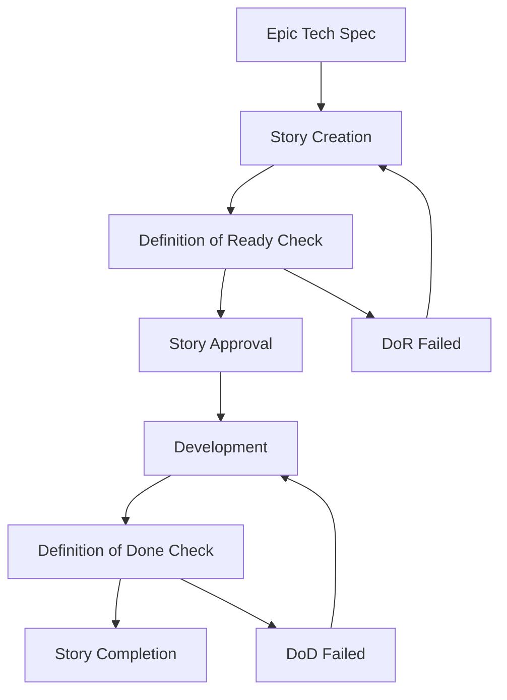
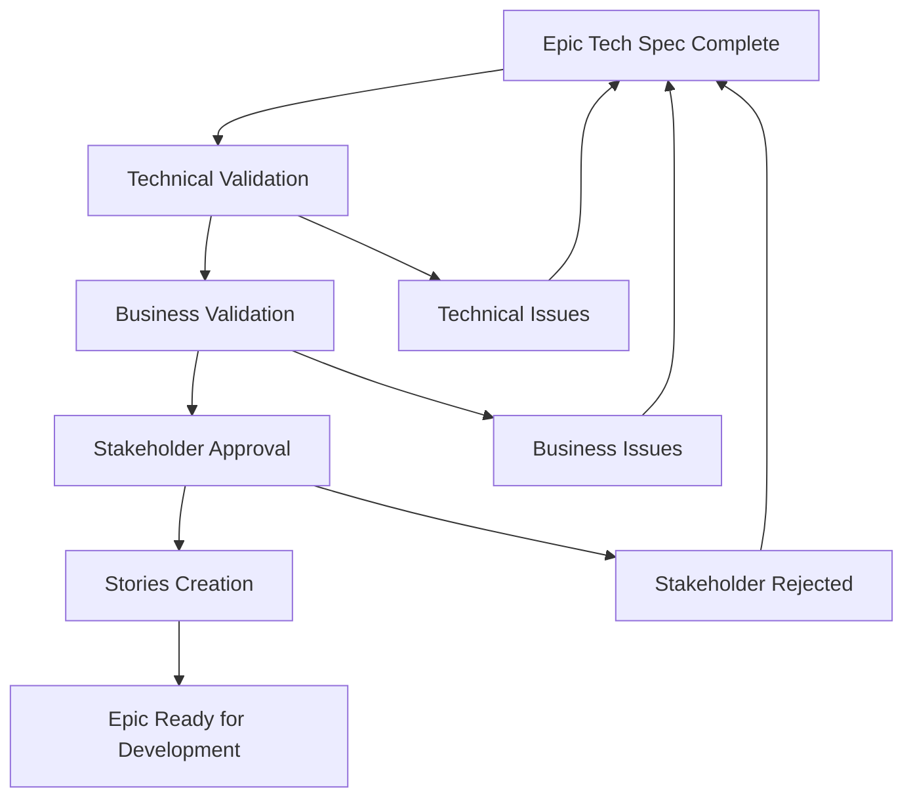

# Documentation Process README

**Last Updated:** 2025-10-30  
**Version:** 1.0  
**Purpose:** Central guide for all documentation processes and governance

## Quick Navigation

- [**Documentation Standards**](#documentation-standards) - Formatting, naming, approval requirements
- [**Process Documentation**](#process-documentation) - Governance, workflows, validation  
- [**Development Readiness**](#development-readiness) - What docs are needed before coding
- [**Epic & Story Management**](#epic--story-management) - Complete story lifecycle
- [**Validation Framework**](#validation-framework) - How we ensure quality
- [**Maintenance & Updates**](#maintenance--updates) - Keeping docs current

---

## Documentation Standards

### File Naming Conventions
```bash
# Process documents
docs/process/[process-name].md          # kebab-case, descriptive
docs/process/definition-of-ready.md     # ✅ Good
docs/process/validation-report-template.md # ✅ Good

# Epic technical specs  
docs/tech-spec-epic-[N].md              # Non-padded numbers for all epics
docs/tech-spec-epic-1.md                # ✅ Good - Foundation Epic 1
docs/tech-spec-epic-12.md               # ✅ Good - Feature Epic 12

# Validation reports
docs/validation-report-[TIMESTAMP].md   # ISO format timestamps
docs/validation-report-20251028T000900Z.md # ✅ Good

# Architecture documents
docs/architecture/[domain]-[type].md    # Domain-specific architecture
docs/architecture/bloc-implementation-guide.md # ✅ Good
```

### Markdown Standards
```markdown
# Document Title (H1 - Only One Per Document)

**Metadata Block:**
- **Created:** YYYY-MM-DD
- **Version:** X.Y (semantic versioning)
- **Purpose:** Single sentence purpose statement

## Major Sections (H2)

### Subsections (H3)

#### Details (H4 - Maximum depth)

**Bold for labels, definitions, emphasis**
*Italic for references, file paths, technical terms*

> **⚠️ WARNING:** Use callout blocks for critical information
> **✅ SUCCESS:** Use for positive confirmation
> **❌ ERROR:** Use for blocking issues
```

### Approval Requirements

| Document Type | Technical Review | Business Review | Stakeholder Sign-off |
|---------------|------------------|-----------------|---------------------|
| **Process Documentation** | Architecture | PM + PO | Required |
| **Epic Tech Specs** | Architecture + Dev Lead | PM + PO | Required |
| **Story Definitions** | Dev Lead | PM | Optional |
| **Validation Reports** | Test Lead | PM + PO | **MANDATORY** |
| **Architecture Decisions** | Architecture + Security | PM | Required |

---

## Process Documentation

### Core Governance Documents ✅

| Document | Purpose | Status | Last Updated |
|----------|---------|--------|--------------|
| [Definition of Ready](./definition-of-ready.md) | Story readiness criteria | ✅ Complete | 2025-10-30 |
| [Definition of Done](./definition-of-done.md) | Story completion criteria | ✅ Complete | 2025-10-30 |
| [Story Approval Workflow](./story-approval-workflow.md) | Complete story lifecycle | ✅ Complete | 2025-10-30 |
| [Epic Validation Backlog](./epic-validation-backlog.md) | Epic validation tracking | ✅ Complete | 2025-10-30 |

### Testing Framework ✅

| Document | Purpose | Status | Last Updated |
|----------|---------|--------|--------------|
| [Master Test Strategy](../testing/master-test-strategy.md) | Comprehensive testing approach | ✅ Complete | 2025-10-30 |

### Development Standards ✅

| Document | Purpose | Status | Last Updated |
|----------|---------|--------|--------------|
| [BLoC Implementation Guide](../architecture/bloc-implementation-guide.md) | State management patterns | ✅ Complete | Existing |
| [Coding Standards](../architecture/coding-standards.md) | Code quality requirements | ✅ Complete | Existing |
| [Data Flow Mapping](../architecture/data-flow-mapping.md) | Layer transformation rules | ✅ Complete | Existing |

---

## Development Readiness

### Prerequisites Checklist

Before any development work begins, confirm all items are ✅:

#### **Business Readiness**
- ✅ [PRD (Product Requirements Document)](../prd.md) - Complete business requirements
- ✅ [Brief](../brief.md) - Executive summary and business case
- ✅ Epic validation for target sprint scope (see [Epic Validation Backlog](./epic-validation-backlog.md))

#### **Technical Readiness**  
- ✅ [Tech specs](../tech-spec.md) for target epics
- ✅ Architecture decisions documented
- ✅ Environment setup guides (see [GitHub Copilot Instructions](../.github/copilot-instructions.md))

#### **Process Readiness**
- ✅ All governance documents in place
- ✅ Validation framework operational
- ✅ Test strategy approved
- ✅ Story approval workflow active

#### **Team Readiness**
- ✅ Stakeholder approval authority defined
- ✅ Validation team assignments confirmed
- ✅ Development team briefed on standards

### Current Status: **🟢 DEVELOPMENT READY**

All prerequisite documentation exists and governance frameworks are operational.

---

## Epic & Story Management

### Story Lifecycle



### Epic Validation Process



### Story Creation Guidelines

**From Epic Tech Specs:**
1. **Review Epic Breakdown:** Each epic tech spec contains story suggestions
2. **Follow Naming Convention:** Epic NN.X format (e.g., Story 12.1, 12.2)
3. **Use Story Template:** See `docs/stories/` for examples
4. **Apply DoR Check:** Use [Definition of Ready](./definition-of-ready.md) checklist
5. **Get Approval:** Follow [Story Approval Workflow](./story-approval-workflow.md)

---

## Validation Framework

### Validation Types

#### **Technical Validation**
- **Purpose:** Ensure technical feasibility and quality
- **Validator:** Test Lead (Murat) + Dev Lead (assigned)
- **Criteria:** See [Master Test Strategy](../testing/master-test-strategy.md)
- **Timeline:** 2-3 days per epic

#### **Business Validation**  
- **Purpose:** Confirm business value and requirements alignment
- **Validator:** PM (John) + Product Owner (assigned)
- **Criteria:** ROI analysis, user value, business case validation
- **Timeline:** 1-2 days per epic

#### **Stakeholder Approval**
- **Purpose:** Executive sign-off on implementation decisions
- **Approvers:** See [Epic Validation Backlog](./epic-validation-backlog.md)
- **Criteria:** Business impact, resource allocation, strategic alignment
- **Timeline:** 2-5 days depending on complexity

### Validation Commands

```bash
# Run validation checks
*validation-check epic-[NN]     # Validate specific epic
*validation-status              # Check all validation status
*stakeholder-review epic-[NN]   # Schedule stakeholder review

# View validation reports
*validation-report epic-[NN]    # Get latest validation report
*validation-history epic-[NN]   # View validation history
```

### Quality Gates

| Gate | Criteria | Blocking | Automation |
|------|----------|----------|------------|
| **Technical Feasibility** | ≥95% technical checklist pass | Yes | Automated validation |
| **Business Alignment** | Business case approved | Yes | Manual review required |
| **Stakeholder Sign-off** | All required approvals collected | Yes | Manual process |
| **Implementation Ready** | Dev team confirms feasibility | Yes | Manual confirmation |

---

## Maintenance & Updates

### Documentation Updates

#### **Trigger Events for Updates:**
- Epic/story changes require validation report updates
- Architecture decisions require tech spec updates  
- Process changes require governance document updates
- Release milestones require status updates

#### **Update Responsibility:**

| Document Type | Primary Owner | Review Required |
|---------------|---------------|-----------------|
| **Process Docs** | Mary (Business Analyst) | PM + Architecture |
| **Tech Specs** | Winston (Architect) | Dev Lead + PM |
| **Validation Reports** | Murat (Test Lead) | PM + PO |
| **Story Definitions** | Sofia (Dev Team Lead) | PM |

#### **Change Management Process:**

1. **Identify Change Need:** Document why update is needed
2. **Create Update Branch:** Use feature branch for major changes
3. **Draft Changes:** Make updates following standards above
4. **Review Cycle:** Get required reviews per approval matrix
5. **Stakeholder Approval:** Get sign-offs for governance changes
6. **Merge & Announce:** Update team on changes

### Version Management

- **Process Documents:** Semantic versioning (1.0, 1.1, 2.0)
- **Tech Specs:** Date-based versioning with change log
- **Validation Reports:** Immutable - create new reports, don't edit existing

### Staleness Detection

#### **Review Schedule:**
- **Process Documents:** Monthly review for currency
- **Tech Specs:** Review with each epic validation
- **Architecture Decisions:** Quarterly review
- **Validation Reports:** Real-time - updated with each validation

#### **Staleness Indicators:**
- Last updated >30 days ago
- Referenced process changed
- New team members unable to follow process
- Validation failures due to outdated information

---

## Common Workflows

### Starting New Epic Development

```bash
# 1. Validate epic readiness
*validation-check epic-[NN]

# 2. Check stakeholder approvals
*stakeholder-status epic-[NN]

# 3. Confirm stories exist
ls docs/stories/epic-[NN]/

# 4. Review Definition of Ready
cat docs/process/definition-of-ready.md

# 5. Begin story approval workflow
*story-approval-start epic-[NN]
```

### Creating New Epic

```bash
# 1. Create tech spec
cp docs/tech-spec-template.md docs/tech-spec-epic-[NN].md

# 2. Fill out epic details
# Edit tech spec with epic requirements

# 3. Run validation
*validation-check epic-[NN]

# 4. Schedule stakeholder review
*stakeholder-review epic-[NN]
```

### Emergency Documentation Updates

```bash
# For critical blocking issues

# 1. Create emergency branch
git checkout -b emergency/docs-update-$(date +%Y%m%d)

# 2. Make minimal required changes
# Focus only on unblocking immediate issue

# 3. Fast-track review
# Get verbal approval, document later

# 4. Merge and announce
git merge emergency/docs-update-$(date +%Y%m%d)
# Announce in team chat immediately
```

---

## Troubleshooting

### Common Issues

#### **"Story not ready for development"**
- **Solution:** Check [Definition of Ready](./definition-of-ready.md)
- **Common causes:** Missing acceptance criteria, no stakeholder approval, unclear requirements

#### **"Epic validation failed"**  
- **Solution:** Review validation report for specific failures
- **Common causes:** Technical infeasibility, business case unclear, missing stakeholders

#### **"Documentation out of sync"**
- **Solution:** Run documentation audit (see troubleshooting commands below)
- **Common causes:** Process changes not documented, recent architecture decisions

#### **"Stakeholder approval stuck"**
- **Solution:** Escalate through [Epic Validation Backlog](./epic-validation-backlog.md) escalation process
- **Common causes:** Unclear business impact, missing information, scheduling conflicts

### Troubleshooting Commands

```bash
# Documentation health check
*docs-audit                    # Full documentation audit
*docs-staleness-check         # Check for outdated documents
*docs-consistency-check       # Verify cross-reference accuracy

# Process health check  
*process-validation           # Validate all process documents
*governance-check             # Ensure governance framework operational
*approval-matrix-check        # Verify approval authority definitions

# Epic/story health check
*epic-readiness-check         # Check all epic validation status
*story-orphan-check          # Find stories without epics
*validation-backlog-status   # Check validation queue status
```

---

## Contact & Support

### Documentation Questions
- **Process Questions:** Mary Ramirez (Business Analyst) - mary@craft.video
- **Technical Questions:** Winston Chen (Architect) - winston@craft.video  
- **Validation Questions:** Murat Yilmaz (Test Lead) - murat@craft.video

### Escalation Path
1. **Team Lead:** Sofia Müller (Dev Team Lead)
2. **PM:** John Davis (Project Manager)
3. **Executive:** CEO (final escalation)

### Emergency Contacts
- **Urgent Documentation Issues:** #docs-emergency (Slack)
- **Validation Blocking Issues:** #validation-urgent (Slack)
- **Process Breakdown:** John Davis (PM) - Direct message

---

## Related Links

- [**Project README**](../../README.md) - Main project documentation
- [**GitHub Copilot Instructions**](../.github/copilot-instructions.md) - AI agent guidance
- [**PRD**](../prd.md) - Product Requirements Document
- [**Architecture Overview**](../architecture/greenfield-implementation-guide.md) - Technical architecture

---

## Change Log

| Date | Version | Changes | Author |
|------|---------|---------|--------|
| 2025-10-30 | 1.0 | Initial documentation process guide with complete governance framework | Mary (Business Analyst) |