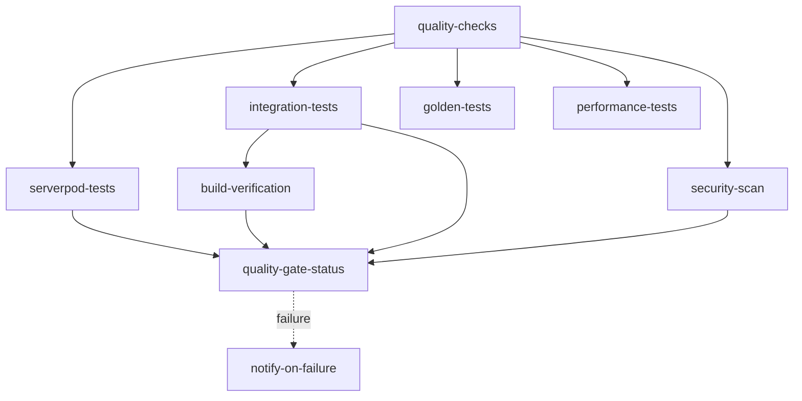

# CI/CD Pipeline Runbook

## Overview

The Craft Video Marketplace uses GitHub Actions for continuous integration and deployment. This runbook documents the CI/CD pipeline structure, quality gates, deployment processes, and troubleshooting procedures.

**Last Updated:** 2025-11-06  
**Owner:** Development Team  
**Related:** [Local Development Setup](./local-development-setup.md) | [Code Generation Workflow](./code-generation-workflow.md)

---

## Pipeline Architecture

### Workflow File

- **Location:** `.github/workflows/quality-gates.yml`
- **Triggers:**
  - Push to `develop`, `main`, or `release/*` branches
  - Pull requests targeting `develop` or `main`
  - Daily scheduled run at 2 AM UTC

### Job Dependencies



---

## Quality Gates

### 1. Quality Checks Job

**Purpose:** Pre-commit validation of code quality  
**Timeout:** 15 minutes  
**Required for merge:** Yes

**Steps:**
1. Code formatting check (`melos run format-check`)
2. Static analysis (`melos run analyze`)
3. Code generation validation (no stale generated code)
4. Unit tests with coverage (`melos run test:unit`)
5. Coverage threshold enforcement (≥80%)
6. Dependency audit
7. Documentation validation

**Common Failures:**
- **Formatting issues:** Run `melos run format` locally
- **Stale generated code:** Run `serverpod generate` and `melos run generate`
- **Coverage below threshold:** Add tests to bring coverage above 80%

### 2. Serverpod Backend Tests

**Purpose:** Validate backend with real database  
**Timeout:** 20 minutes  
**Required for merge:** Yes

**Infrastructure:**
- PostgreSQL 15 service container
- Redis 7.2.4 service container

**Steps:**
1. Install Serverpod CLI
2. Generate Serverpod code
3. Run backend test suite with database connectivity
4. Verify health endpoint (future enhancement)

**Environment Variables:**
```bash
POSTGRES_HOST=localhost
POSTGRES_PORT=5432
POSTGRES_DB=video_window_test
POSTGRES_USER=postgres
POSTGRES_PASSWORD=postgres
REDIS_HOST=localhost
REDIS_PORT=6379
```

**Common Failures:**
- **Database connection timeout:** Check service container health
- **Migration failures:** Verify migration scripts are compatible with PostgreSQL 15
- **Test failures:** Check logs for specific test errors

### 3. Integration Tests Job

**Purpose:** Widget and integration testing  
**Timeout:** 30 minutes  
**Required for merge:** Yes

**Steps:**
1. Run widget tests (`melos run test:widget`)
2. Run integration tests (`melos run test:integration`)
3. Upload test results as artifacts

**Common Failures:**
- **Widget test failures:** Check for UI regressions
- **Integration test timeouts:** May need to increase timeout or optimize tests

### 4. Golden Tests Job

**Purpose:** Visual regression testing  
**Timeout:** 20 minutes  
**Required for merge:** Yes (PR only)  
**Runs on:** Pull requests only

**Steps:**
1. Run golden tests (`melos run test:golden`)
2. Upload failed golden images if tests fail

**Common Failures:**
- **Golden file mismatches:** Review uploaded failure images
- **Intentional UI changes:** Regenerate golden files locally with `melos run test:golden:update`

### 5. Performance Tests Job

**Purpose:** Detect performance regressions  
**Timeout:** 25 minutes  
**Required for merge:** No (advisory only)  
**Runs on:** Pull requests and scheduled runs

**Metrics Tracked:**
- App startup time (threshold: 3000ms)
- Screen load time (threshold: 500ms)
- API response time (threshold: 1000ms)
- Memory usage (threshold: 200MB)

**Output:** PR comment with performance comparison

### 6. Security Scan Job

**Purpose:** Vulnerability detection  
**Timeout:** 15 minutes  
**Required for merge:** Advisory (warnings allowed)

**Tools:**
- Dependency audit (`melos run deps:audit`)
- CodeQL analysis (JavaScript/TypeScript)
- Trivy vulnerability scanner

**Common Warnings:**
- **Known vulnerabilities:** Assess severity and plan remediation
- **SARIF upload failures:** Non-blocking, check GitHub security tab

### 7. Build Verification Job

**Purpose:** Ensure builds succeed for target platforms  
**Timeout:** 30 minutes per platform  
**Required for merge:** Yes

**Platforms:**
- Android (APK build)
- Web (no CDN)

**Steps:**
1. Generate code
2. Build for target platform
3. Upload build artifacts

**Common Failures:**
- **Android build failures:** Check Gradle configuration and dependencies
- **Web build failures:** Verify web-specific dependencies and configuration

### 8. Cross-Platform Tests (Optional)

**Purpose:** iOS testing  
**Timeout:** 45 minutes  
**Required for merge:** No  
**Trigger:** Label `cross-platform-test` on PR

**Environment:** macOS runner with iOS simulator

---

## Branch Protection Rules

### Configuration Required

**Protected Branches:**
- `main`
- `develop`
- `release/*`

**Settings:**

#### Main Branch Protection
```yaml
Required status checks:
  - quality-checks
  - serverpod-tests
  - integration-tests
  - security-scan
  - build-verification
  - quality-gate-status

Require branches to be up to date: true
Require pull request reviews: 1 approval
Dismiss stale reviews: true
Require review from Code Owners: false
Restrict pushes: false (allow maintainers)
Allow force pushes: false
Allow deletions: false
```

#### Develop Branch Protection
```yaml
Required status checks:
  - quality-checks
  - serverpod-tests
  - integration-tests
  - security-scan
  - build-verification
  - quality-gate-status

Require branches to be up to date: true
Require pull request reviews: 0 (optional)
Allow force pushes: false
Allow deletions: false
```

#### Release/* Branch Protection
```yaml
Required status checks:
  - quality-checks
  - serverpod-tests
  - integration-tests
  - security-scan
  - build-verification
  - quality-gate-status

Require branches to be up to date: true
Require pull request reviews: 2 approvals
Require review from Code Owners: true
Restrict pushes: true (release managers only)
Allow force pushes: false
Allow deletions: false
```

### Applying Branch Protection

**GitHub UI Steps:**
1. Navigate to repository **Settings** → **Branches**
2. Click **Add branch protection rule**
3. Enter branch name pattern (e.g., `main`, `develop`, `release/*`)
4. Configure settings as documented above
5. Click **Create** or **Save changes**

**Verification:**
1. Create a test PR with failing checks
2. Verify merge button is disabled
3. Confirm status checks are required and displayed

---

## Deployment Process

### Staging Deployment (Future)

**Trigger:** Push to `develop` branch  
**Target:** Staging environment  
**Auto-deploy:** Yes (after quality gates pass)

**Process:**
1. Quality gates pass
2. Build artifacts created
3. Deploy to staging infrastructure
4. Run smoke tests
5. Notify team of deployment status

**Currently:** Manual deployment process (automated deployment TBD)

### Production Deployment (Future)

**Trigger:** Push to `main` branch or release tag  
**Target:** Production environment  
**Auto-deploy:** No (manual approval required)

**Process:**
1. Quality gates pass
2. Build release artifacts
3. Create GitHub release
4. Await manual approval
5. Deploy to production infrastructure
6. Run smoke tests
7. Notify stakeholders

**Currently:** Manual deployment process (automated deployment TBD)

---

## Environment Variables and Secrets

### Required Secrets

Configure in **Settings** → **Secrets and variables** → **Actions**:

| Secret Name | Purpose | Required For |
|-------------|---------|--------------|
| `CODECOV_TOKEN` | Coverage reporting | quality-checks |
| `SLACK_WEBHOOK_URL` | Failure notifications | notify-on-failure |
| `GOOGLE_SERVICES_JSON` | Android services config | build-verification (Android) |
| `FIREBASE_OPTIONS` | Firebase config | build-verification |
| `STRIPE_TEST_API_KEY` | Payment testing | integration-tests |

### Environment Variables

Defined in workflow file:

| Variable | Value | Purpose |
|----------|-------|---------|
| `FLUTTER_VERSION` | 3.35.0 | Flutter SDK version |
| `JAVA_VERSION` | 17 | Java version for Android builds |

---

## Troubleshooting Guide

### Common CI Failures

#### 1. Formatting Check Fails

**Symptoms:** `format-check` job fails  
**Cause:** Code not formatted per project standards

**Resolution:**
```bash
cd video_window_flutter
melos run format
git add .
git commit -m "chore: format code"
git push
```

#### 2. Stale Generated Code

**Symptoms:** "Generated code is stale" error  
**Cause:** Generated files not committed after schema changes

**Resolution:**
```bash
# Regenerate Serverpod code
cd video_window_server
serverpod generate
cd ..

# Regenerate Flutter code
cd video_window_flutter
melos run generate
cd ..

# Commit changes
git add .
git commit -m "chore: regenerate code"
git push
```

#### 3. Test Coverage Below Threshold

**Symptoms:** `test:coverage:check` fails  
**Cause:** New code lacks sufficient test coverage

**Resolution:**
1. Run `melos run test:coverage` to generate coverage report
2. Open `coverage/html/index.html` in browser
3. Identify uncovered code (red highlights)
4. Add tests for uncovered logic
5. Run `melos run test:coverage:check` to verify
6. Commit tests and push

#### 4. Serverpod Tests Fail

**Symptoms:** `serverpod-tests` job fails  
**Cause:** Backend test failures or database issues

**Resolution:**
```bash
# Test locally with Docker
cd video_window_server
docker-compose up -d postgres redis
dart test
docker-compose down

# Check specific test output
dart test --reporter=expanded
```

#### 5. Build Verification Fails

**Symptoms:** `build-verification` job fails for Android/Web  
**Cause:** Build configuration or dependency issues

**Android Resolution:**
```bash
cd video_window_flutter
flutter clean
flutter pub get
melos run generate
flutter build apk --debug
```

**Web Resolution:**
```bash
cd video_window_flutter
flutter clean
flutter pub get
melos run generate
flutter build web --no-web-resources-cdn
```

#### 6. Integration Tests Timeout

**Symptoms:** Tests exceed 30-minute timeout  
**Cause:** Long-running tests or infrastructure issues

**Resolution:**
1. Run tests locally: `melos run test:integration`
2. Identify slow tests (use `--reporter=expanded`)
3. Optimize or split slow test files
4. Consider parallel test execution
5. If issue persists, increase job timeout in workflow

#### 7. Golden Tests Fail

**Symptoms:** `golden-tests` job fails with image mismatches  
**Cause:** UI changes affecting visual regression tests

**Resolution:**
```bash
# Review differences
# Download failure artifacts from GitHub Actions
# Artifacts → golden-test-failures

# If changes are intentional, update golden files
cd video_window_flutter
melos run test:golden:update

# Commit updated golden files
git add test/goldens/
git commit -m "test: update golden files"
git push
```

### Performance Optimization

#### Workflow Too Slow

**Target:** < 20 minutes total workflow time  
**Current Bottlenecks:**
- Integration tests (30 min timeout)
- Build verification (30 min per platform)

**Optimization Strategies:**
1. **Enable Matrix Parallelization:**
   - Split tests into smaller parallel jobs
   - Use matrix strategy for package-specific tests

2. **Optimize Caching:**
   - Verify Flutter SDK cache is working
   - Cache pub dependencies between jobs
   - Cache build artifacts for reuse

3. **Reduce Test Scope on PRs:**
   - Run full test suite on `main` only
   - Run focused tests on PRs (smoke tests + changed files)

4. **Use Faster Runners:**
   - Consider GitHub Actions self-hosted runners
   - Use larger runner instances for intensive jobs

#### Cache Configuration

Already enabled:
```yaml
- uses: subosito/flutter-action@v2
  with:
    flutter-version: ${{ env.FLUTTER_VERSION }}
    cache: true  # Caches Flutter SDK and pub packages
```

Additional cache optimization (if needed):
```yaml
- name: Cache build artifacts
  uses: actions/cache@v3
  with:
    path: |
      ~/.pub-cache
      build/
    key: ${{ runner.os }}-build-${{ hashFiles('**/pubspec.lock') }}
    restore-keys: |
      ${{ runner.os }}-build-
```

---

## Monitoring and Alerts

### Quality Gate Dashboard

**Location:** GitHub Actions tab  
**View:** Recent workflow runs with status

**Metrics to Monitor:**
- Success rate of quality gates (target: >95%)
- Average workflow duration (target: <20 minutes)
- Test coverage trend (target: ≥80%)
- Frequency of failures by job type

### Notifications

**Slack Notifications (when configured):**
- Workflow failures on `main` branch
- Security vulnerabilities detected
- Performance regression warnings

**Email Notifications:**
- GitHub default notifications for failed workflows
- Codecov coverage reports

**Configuration:**
```yaml
# Add to repository settings
Notifications → Email notifications:
  ✓ Send notifications for failed workflows
  ✓ Send notifications for successful workflows (optional)
```

---

## Maintenance and Updates

### Updating Flutter Version

**Steps:**
1. Update `FLUTTER_VERSION` in `.github/workflows/quality-gates.yml`
2. Update `pubspec.yaml` constraints in all packages
3. Run full test suite locally
4. Create PR and monitor CI results
5. Update documentation with new version

### Updating Dependencies

**Steps:**
1. Run `melos run deps:update` locally
2. Run `melos run test` to verify
3. Review changelog for breaking changes
4. Create PR with updated `pubspec.lock` files
5. Monitor CI for dependency-related failures

### Adding New Quality Gates

**Steps:**
1. Define new job in `.github/workflows/quality-gates.yml`
2. Add job to `quality-gate-status` needs list
3. Update branch protection rules to require new check
4. Document in this runbook
5. Test on non-protected branch first

---

## Related Documentation

- **Architecture:** `docs/architecture/tech-stack.md`
- **Testing Strategy:** `docs/testing/master-test-strategy.md`
- **Local Development:** `docs/runbooks/local-development-setup.md`
- **Code Generation:** `docs/runbooks/code-generation-workflow.md`
- **Melos Configuration:** `video_window_flutter/melos.yaml`

---

## Appendix: Melos Commands

### Quality Commands

```bash
# Format all code
melos run format

# Check formatting without changes
melos run format-check

# Static analysis
melos run analyze

# Dependency audit
melos run deps:audit
```

### Test Commands

```bash
# Run all tests with coverage
melos run test

# Run specific test types
melos run test:unit
melos run test:widget
melos run test:integration
melos run test:golden
melos run test:performance

# Coverage operations
melos run test:coverage         # Generate coverage report
melos run test:coverage:check   # Enforce threshold
melos run test:golden:update    # Update golden files
```

### Build Commands

```bash
# Build Android APK
melos run build:apk

# Build iOS
melos run build:ios

# Build web
melos exec --flutter build web --no-web-resources-cdn
```

### Code Generation

```bash
# Generate all code
melos run generate

# Clean and regenerate
melos run clean
melos run deps
melos run generate
```

---

**Document Version:** 1.0  
**Last Reviewed:** 2025-11-06  
**Next Review:** 2025-12-06  
**Change Control:** Update this document when workflow changes are merged to `main`
