# Craft Video Marketplace Architecture Document

**Project:** Craft Video Marketplace (video_window)
**Date:** 2025-10-07
**Author:** dev

## Executive Summary

The Craft Video Marketplace is a mobile-first Flutter application backed by a Serverpod modular monolith, enabling independent makers to convert video content interest into purchases through transparent offer-to-auction mechanics. The architecture prioritizes MVP development velocity while maintaining PCI SAQ A compliance through Stripe Connect Express integration and comprehensive content protection via secure HLS streaming with watermarking.

The system serves a TikTok-style feed of maker-created shorts that transitions viewers to narrative Story pages where offers trigger structured 72-hour auctions. Real-time timers, optimistic UI updates, and comprehensive SLA enforcement ensure reliable marketplace operations. The modular monolith approach provides bounded context isolation (identity, content, payments, auctions) while simplifying operations for the pilot phase targeting 20+ concurrent auctions and 1000+ concurrent users.

Key architectural decisions include Flutter cross-platform development for consistent mobile experience, Serverpod for native Dart backend integration, PostgreSQL for ACID-compliant transaction handling, and Redis for real-time auction timer management. The design supports future microservice extraction while maintaining operational simplicity for the initial launch.

## 1. Technology Stack and Decisions

### 1.1 Technology and Library Decision Table

| Category | Technology | Version | Purpose | Rationale |
| --- | --- | --- | --- | --- |
| Language (Client) | Dart | 3.5.6 | Flutter application logic | Matches Version Policy (Flutter 3.19.6), native Serverpod integration |
| Framework (Client) | Flutter | 3.19.6 | Cross-platform mobile UI | Single codebase, excellent video support, hot reload development |
| Language (Backend) | Dart | 3.5.6 | Serverpod modules shared with client | Type safety across client/server boundary, code generation |
| Backend Framework | Serverpod | 2.9.2 | Modular monolith server | Native Dart, built-in RPC, scheduler, database migrations |
| Database | PostgreSQL | 15.4 | Primary relational store | Strong transactions, timer queries, JSONB for flexible schemas |
| Cache/Queues | Redis | 7.2.3 | Timer queue, caching, pub/sub | Serverpod integration, expires, pub/sub for real-time |
| Object Storage | Amazon S3 | Latest | Raw uploads + HLS renditions | Durable, lifecycle policies, CloudFront integration |
| CDN | CloudFront | Latest | Secure HLS delivery | Signed URL support, global edge distribution |
| Payment PSP | Stripe Connect Express | Latest API | Checkout, payouts, compliance | SAQ A scope, mature fraud detection, hosted checkout |
| Notification Push | Firebase Cloud Messaging | Latest | Real-time auction notifications | Platform standard, reliable delivery |
| Notification Push | APNs | Latest | iOS push notifications | Native iOS integration |
| Notification Email | SendGrid | Latest | Transactional email templates | Reliable deliverability, templating support |
| Notification SMS | Twilio | Latest | OTP + auction alerts | Global reach, proven reliability |
| Observability | OpenTelemetry | 1.21.0 | Metrics/traces/logs standard | Vendor-neutral, comprehensive instrumentation |
| Metrics Backend | Prometheus | 2.47.0 | Metrics collection and alerting | Cloud-native, extensive integrations |
| Visualization | Grafana | 10.2.0 | Dashboard and alerting | Rich visualization, SLO support |
| State Management | Flutter BLoC | 8.1.3 | Client state management | Testable, separation of concerns, flutter_bloc ecosystem |
| Navigation | Go Router | 12.1.3 | Type-safe client navigation | Declarative routing, deep links, guarded routes |
| Local Security | Flutter Secure Storage | 9.2.0 | Token and session storage | Encryption at rest, secure keychain integration |
| Video Processing | FFmpeg | 6.1.0 | HLS transcoding and watermarking | Industry standard, extensive codec support |
| Analytics Warehouse | BigQuery | Latest | KPI aggregation and reporting | SQL-based ETL, serverless scaling |
| BI / Dashboards | Looker Studio | Latest | Executive KPI dashboards | Quick iteration, BigQuery integration |
| CI/CD | GitHub Actions | Latest | Automated testing and deployment | Native GitHub integration, workflow marketplace |
| IaC | Terraform | 1.7.4 | AWS infrastructure provisioning | Declarative, state management, team collaboration |
| Secrets Management | AWS Secrets Manager | Latest | Secure credential storage | Automatic rotation, fine-grained access control |
| HTTP Client | Dio | 5.3.2 | HTTP networking with interceptors | Interceptors for auth, logging, error handling |
| Image Loading | cached_network_image | 3.3.0 | Optimized image caching and loading | Memory/disk caching, placeholder support |
| Video Player | video_player | 2.8.1 | Native video playback | Platform-native playback, controls customization |

## 2. Architecture Overview

### 2.1 High-Level Architecture

```mermaid
graph TD
    subgraph "Flutter Mobile App"
        Feed[Feed Module]
        Story[Story Module]
        Creator[Creator Studio]
        Offer[Offer/Bid Module]
        Payment[Payment Module]
        Orders[Order Module]
        Dashboard[Dashboard Module]
        Auth[Auth Module]
        Shared[Shared Components]
    end

    subgraph "Serverpod Backend (Modular Monolith)"
        Identity[Identity Service]
        StorySvc[Story Service]
        MediaPipeline[Media Pipeline]
        Offers[Offers Service]
        Auction[Auction Service]
        PaymentSvc[Payment Service]
        OrderSvc[Order Service]
        NotificationSvc[Notification Service]
        Admin[Admin Service]
        Analytics[Analytics Service]
    end

    subgraph "External Services"
        Stripe[Stripe Connect Express]
        S3[Amazon S3]
        CloudFront[CloudFront CDN]
        Redis[Redis Cluster]
        Postgres[(PostgreSQL 15)]
        FCM[Firebase Cloud Messaging]
        Twilio[Twilio SendGrid/SMS]
        BigQuery[BigQuery Warehouse]
    end

    Feed --> StorySvc
    Story --> StorySvc
    Creator --> MediaPipeline
    Offer --> Offers
    Offer --> Auction
    Payment --> PaymentSvc
    Payment --> Stripe
    Orders --> OrderSvc
    Dashboard --> Analytics
    Auth --> Identity

    StorySvc --> S3
    StorySvc --> CloudFront
    Auction --> Redis
    PaymentSvc --> Stripe
    NotificationSvc --> FCM
    NotificationSvc --> Twilio
    Analytics --> BigQuery

    Identity --> Postgres
    StorySvc --> Postgres
    Offers --> Postgres
    Auction --> Postgres
    PaymentSvc --> Postgres
    OrderSvc --> Postgres
```



### 2.2 Architectural Patterns

**Modular Monolith Pattern**: Serverpod backend organized into bounded context modules (identity, story, payments, etc.) within a single deployable unit. Each module maintains internal cohesion while minimizing cross-module dependencies through well-defined interfaces.

**Repository + Service Layer**: Data access abstracted through repository pattern with service layer orchestrators handling business logic. This enables comprehensive unit testing and clear separation between data persistence and business rules.

**Event-Driven Architecture**: Auction timers, payment expirations, and notifications handled through internal event bus with Redis pub/sub. State transitions are idempotent with at-least-once delivery semantics.

**CQRS Lite for Analytics**: Command operations modify operational data store while analytics service asynchronously syncs events to BigQuery for reporting without impacting OLTP performance.

## 3. Data Architecture

### 3.1 Database Schema (Conceptual)

**Users Table**
```sql
users (
  id UUID PRIMARY KEY,
  email VARCHAR(255) UNIQUE NOT NULL,
  phone VARCHAR(20),
  password_hash VARCHAR(255),
  roles JSONB DEFAULT '["viewer"]',
  auth_provider VARCHAR(50),
  is_active BOOLEAN DEFAULT true,
  created_at TIMESTAMP DEFAULT NOW(),
  updated_at TIMESTAMP DEFAULT NOW()
)
```

**Maker Profiles Table**
```sql
maker_profiles (
  id UUID PRIMARY KEY REFERENCES users(id),
  display_name VARCHAR(100) NOT NULL,
  hero_media_url TEXT,
  bio TEXT,
  city VARCHAR(100),
  country VARCHAR(2),
  offer_policy JSONB, -- {min_offer: 50, currency: "USD", auto_reject: true}
  is_verified BOOLEAN DEFAULT false,
  created_at TIMESTAMP DEFAULT NOW()
)
```

**Stories Table**
```sql
stories (
  id UUID PRIMARY KEY,
  maker_id UUID REFERENCES maker_profiles(id),
  title VARCHAR(200) NOT NULL,
  description TEXT,
  category VARCHAR(100),
  hero_media_url TEXT,
  gallery_urls JSONB DEFAULT '[]',
  process_steps JSONB DEFAULT '[]',
  materials JSONB DEFAULT '[]',
  notes TEXT,
  location JSONB, -- {city, country, coordinates}
  offer_policy JSONB,
  status VARCHAR(20) DEFAULT 'draft', -- draft, published, archived
  published_at TIMESTAMP,
  created_at TIMESTAMP DEFAULT NOW(),
  updated_at TIMESTAMP DEFAULT NOW()
)
```

**Auctions Table**
```sql
auctions (
  id UUID PRIMARY KEY,
  story_id UUID REFERENCES stories(id),
  starting_offer DECIMAL(10,2),
  current_high_bid DECIMAL(10,2),
  current_high_bidder_id UUID REFERENCES users(id),
  reserve_price DECIMAL(10,2),
  starts_at TIMESTAMP NOT NULL,
  ends_at TIMESTAMP NOT NULL,
  soft_close_until TIMESTAMP,
  status VARCHAR(20) DEFAULT 'pending', -- pending, active, ended, accepted
  ended_at TIMESTAMP,
  accepted_bid_id UUID,
  created_at TIMESTAMP DEFAULT NOW()
)
```

### 3.2 Data Flow Patterns

**Video Processing Pipeline**: Raw uploads → S3 → Serverpod media processor → FFmpeg transcoding → HLS renditions with watermark → S3 → CloudFront signed URLs

**Auction State Machine**: Offer submitted → Validate minimum → Start auction (72h timer) → Accept bids → Soft-close extensions → Maker accepts → 24h payment window → Order creation

**Payment Flow**: Auction accepted → Stripe Checkout session → Payment processing → Webhook confirmation → Order status update → Notification dispatch

## 4. Component and Integration Overview

### 4.1 Flutter App Components

**Feed Module**: Infinite scroll video feed with auto-play, reactions, and "View Story" navigation. Implements pagination caching and crash-safe resume.

**Story Module**: Narrative content display with sections (Overview, Process, Materials, Notes, Location). Includes video scrubber controls and offer/bid integration.

**Creator Studio**: Multi-step story creation with video capture/import, timeline editing, captioning, and publishing workflow. Draft auto-save and preview functionality.

**Offer/Auction Module**: Real-time bidding interface with WebSocket updates, timer management, and optimistic UI updates. Handles bid validation and auction state transitions.

**Payment Module**: Stripe Checkout integration with payment status tracking, countdown timers, and receipt generation.

**Order Management**: Order lifecycle tracking for buyers and sellers with shipping management, SLA monitoring, and status notifications.

**Dashboard Module**: Maker-focused analytics with active listings, auction performance, revenue tracking, and fulfillment task management.

### 4.2 Serverpod Service Integration

**Cross-Service Communication**: Services communicate through well-defined Serverpod endpoints with shared domain models. Authentication and authorization handled centrally by Identity service.

**External Service Integration Patterns**: Each external service (Stripe, Twilio, Firebase) abstracted through dedicated service classes with retry logic, circuit breakers, and comprehensive error handling.

**Event Bus Integration**: Redis pub/sub for real-time events (auction updates, notifications). Event sourcing for critical state transitions with audit trails.

## 5. Architecture Decision Records

### ADR-001: Flutter Cross-Platform Development
**Decision**: Use Flutter for mobile app development targeting iOS and Android
**Status**: Accepted
**Context**: Need consistent mobile experience across platforms with single codebase maintenance
**Consequences**: Faster development, unified design system, access to native performance, Dart backend type safety

### ADR-002: Serverpod Modular Monolith
**Decision**: Use Serverpod as modular monolith backend framework
**Status**: Accepted
**Context**: MVP requires bounded context isolation without operational complexity of microservices
**Consequences**: Simplified deployment, shared codebase with Flutter, easier debugging, can extract services later

### ADR-003: Stripe Connect Express for Payments
**Decision**: Use Stripe Connect Express for payment processing and payouts
**Status**: Accepted
**Context**: Need PCI SAQ A compliance while supporting marketplace payments and maker payouts
**Consequences**: Reduced compliance burden, mature fraud detection, hosted checkout experience

### ADR-004: Secure HLS with Watermarking
**Decision**: Implement HLS streaming with per-session watermarking and signed URLs
**Status**: Accepted
**Context**: Protect maker content while enabling mobile playback
**Consequences**: Content protection, no offline downloads, requires CDN integration

### ADR-005: Redis for Real-time Auction Logic
**Decision**: Use Redis for auction timer management and real-time event distribution
**Status**: Accepted
**Context**: Need reliable timer execution with sub-minute precision and real-time updates
**Consequences**: Precise timer management, real-time bidding experience, requires Redis expertise

## 6. Implementation Guidance

### 6.1 Development Phases

**Phase 1: Foundation (Weeks 1-2)**
- Set up Flutter + Serverpod monorepo structure
- Implement authentication system (email/SMS/social login)
- Create basic UI navigation and design tokens
- Set up CI/CD pipeline with automated testing

**Phase 2: Core Features (Weeks 3-6)**
- Implement feed browsing and story display
- Build creator studio with video upload/editing
- Create offer submission and auction mechanics
- Integrate Stripe Checkout payment flow

**Phase 3: Marketplace Features (Weeks 7-8)**
- Implement order management and shipping tracking
- Add notifications and real-time updates
- Build maker dashboard with analytics
- Complete content protection implementation

**Phase 4: Polish & Testing (Weeks 9-10)**
- Performance optimization and load testing
- Security audit and compliance verification
- User acceptance testing and bug fixes
- Production deployment and monitoring setup

### 6.2 Key Implementation Considerations

**State Management**: Use BLoC pattern with separate BLoCs for each major feature area. Implement proper disposal and error handling to prevent memory leaks.

**Video Processing**: Implement background processing queue for video transcoding. Use progress tracking and notification system for long-running operations.

**Auction Timer Precision**: Use Serverpod's built-in scheduler with Redis persistence for timer state. Implement idempotent timer execution to handle retries and failures.

**Error Handling**: Implement comprehensive error boundaries in Flutter app with graceful degradation. Use structured logging with correlation IDs across client and server.

**Testing Strategy**: Unit tests for business logic, integration tests for API endpoints, and end-to-end tests for critical user flows (auction lifecycle, payment processing).

## 7. Proposed Source Tree

```
video_window/
├── lib/
│   ├── main.dart
│   ├── app/
│   │   ├── app.dart
│   │   ├── router/
│   │   │   ├── app_router.dart
│   │   │   └── routes/
│   │   │       ├── feed_route.dart
│   │   │       ├── story_route.dart
│   │   │       ├── creator_route.dart
│   │   │       ├── offer_route.dart
│   │   │       ├── payment_route.dart
│   │   │       ├── order_route.dart
│   │   │       └── dashboard_route.dart
│   │   ├── theme/
│   │   │   ├── app_theme.dart
│   │   │   ├── colors.dart
│   │   │   ├── typography.dart
│   │   │   └── spacing.dart
│   │   └── widgets/
│   │       ├── common/
│   │       │   ├── loading_widget.dart
│   │       │   ├── error_widget.dart
│   │       │   └── cached_image.dart
│   │       ├── video/
│   │       │   ├── video_player_widget.dart
│   │       │   ├── feed_video_widget.dart
│   │       │   └── story_video_widget.dart
│   │       └── forms/
│   │           ├── offer_form.dart
│   │           ├── bid_form.dart
│   │           └── shipping_form.dart
│   ├── features/
│   │   ├── auth/
│   │   │   ├── data/
│   │   │   │   ├── datasources/
│   │   │   │   │   ├── auth_local_datasource.dart
│   │   │   │   │   └── auth_remote_datasource.dart
│   │   │   │   ├── models/
│   │   │   │   │   ├── user_model.dart
│   │   │   │   │   └── session_model.dart
│   │   │   │   └── repositories/
│   │   │   │       └── auth_repository_impl.dart
│   │   │   ├── domain/
│   │   │   │   ├── entities/
│   │   │   │   │   ├── user_entity.dart
│   │   │   │   │   └── session_entity.dart
│   │   │   │   ├── repositories/
│   │   │   │   │   └── auth_repository.dart
│   │   │   │   └── usecases/
│   │   │   │       ├── login_usecase.dart
│   │   │   │       ├── logout_usecase.dart
│   │   │   │       └── refresh_session_usecase.dart
│   │   │   └── presentation/
│   │   │       ├── bloc/
│   │   │       │   ├── auth_bloc.dart
│   │   │       │   ├── auth_event.dart
│   │   │       │   └── auth_state.dart
│   │   │       ├── pages/
│   │   │       │   ├── login_page.dart
│   │   │       │   ├── register_page.dart
│   │   │       │   └── profile_page.dart
│   │   │       └── widgets/
│   │   │           ├── login_form.dart
│   │   │           └── profile_widget.dart
│   │   ├── feed/
│   │   │   ├── data/
│   │   │   │   ├── datasources/
│   │   │   │   │   └── feed_remote_datasource.dart
│   │   │   │   ├── models/
│   │   │   │   │   └── story_preview_model.dart
│   │   │   │   └── repositories/
│   │   │   │       └── feed_repository_impl.dart
│   │   │   ├── domain/
│   │   │   │   ├── entities/
│   │   │   │   │   └── story_preview_entity.dart
│   │   │   │   ├── repositories/
│   │   │   │   │   └── feed_repository.dart
│   │   │   │   └── usecases/
│   │   │   │       ├── get_feed_stories_usecase.dart
│   │   │   │       └── like_story_usecase.dart
│   │   │   └── presentation/
│   │   │       ├── bloc/
│   │   │       │   ├── feed_bloc.dart
│   │   │       │   ├── feed_event.dart
│   │   │       │   └── feed_state.dart
│   │   │       ├── pages/
│   │   │       │   └── feed_page.dart
│   │   │       └── widgets/
│   │   │           ├── story_card.dart
│   │   │           ├── feed_video_player.dart
│   │   │           └── reaction_buttons.dart
│   │   ├── story/
│   │   │   ├── data/
│   │   │   │   ├── datasources/
│   │   │   │   │   └── story_remote_datasource.dart
│   │   │   │   ├── models/
│   │   │   │   │   ├── story_model.dart
│   │   │   │   │   └── auction_model.dart
│   │   │   │   └── repositories/
│   │   │   │       └── story_repository_impl.dart
│   │   │   ├── domain/
│   │   │   │   ├── entities/
│   │   │   │   │   ├── story_entity.dart
│   │   │   │   │   └── auction_entity.dart
│   │   │   │   ├── repositories/
│   │   │   │   │   └── story_repository.dart
│   │   │   │   └── usecases/
│   │   │   │       ├── get_story_usecase.dart
│   │   │   │       ├── submit_offer_usecase.dart
│   │   │       │       └── place_bid_usecase.dart
│   │   │   └── presentation/
│   │   │       ├── bloc/
│   │   │       │   ├── story_bloc.dart
│   │   │       │   ├── story_event.dart
│   │   │       │   └── story_state.dart
│   │   │       ├── pages/
│   │   │       │   └── story_page.dart
│   │   │       └── widgets/
│   │   │           ├── story_header.dart
│   │   │           ├── story_sections.dart
│   │   │           ├── offer_section.dart
│   │   │           └── auction_widget.dart
│   │   ├── creator/
│   │   │   ├── data/
│   │   │   │   ├── datasources/
│   │   │   │   │   └── creator_remote_datasource.dart
│   │   │   │   ├── models/
│   │   │   │   │   └── story_draft_model.dart
│   │   │   │   └── repositories/
│   │   │   │       └── creator_repository_impl.dart
│   │   │   ├── domain/
│   │   │   │   ├── entities/
│   │   │   │   │   └── story_draft_entity.dart
│   │   │   │   ├── repositories/
│   │   │   │   │   └── creator_repository.dart
│   │   │   │   └── usecases/
│   │   │   │       ├── create_story_draft_usecase.dart
│   │   │   │       ├── upload_media_usecase.dart
│   │   │   │       └── publish_story_usecase.dart
│   │   │   └── presentation/
│   │   │       ├── bloc/
│   │   │       │   ├── creator_bloc.dart
│   │   │       │   ├── creator_event.dart
│   │   │       │   └── creator_state.dart
│   │   │       ├── pages/
│   │   │       │   ├── creator_studio_page.dart
│   │   │       │   └── story_edit_page.dart
│   │   │       └── widgets/
│   │   │           ├── media_upload_widget.dart
│   │   │           ├── story_form.dart
│   │   │           └── preview_widget.dart
│   │   ├── payment/
│   │   │   ├── data/
│   │   │   │   ├── datasources/
│   │   │   │   │   └── payment_remote_datasource.dart
│   │   │   │   ├── models/
│   │   │   │   │   └── payment_session_model.dart
│   │   │   │   └── repositories/
│   │   │   │       └── payment_repository_impl.dart
│   │   │   ├── domain/
│   │   │   │   ├── entities/
│   │   │   │   │   └── payment_session_entity.dart
│   │   │   │   ├── repositories/
│   │   │   │   │   └── payment_repository.dart
│   │   │   │   └── usecases/
│   │   │   │       ├── create_payment_session_usecase.dart
│   │   │   │       └── check_payment_status_usecase.dart
│   │   │   └── presentation/
│   │   │       ├── bloc/
│   │   │       │   ├── payment_bloc.dart
│   │   │       │   ├── payment_event.dart
│   │   │       │   └── payment_state.dart
│   │   │       ├── pages/
│   │   │       │   └── payment_page.dart
│   │   │       └── widgets/
│   │   │           ├── payment_countdown.dart
│   │   │           └── stripe_checkout_widget.dart
│   │   ├── orders/
│   │   │   ├── data/
│   │   │   │   ├── datasources/
│   │   │   │   │   └── order_remote_datasource.dart
│   │   │   │   ├── models/
│   │   │   │   │   └── order_model.dart
│   │   │   │   └── repositories/
│   │   │   │       └── order_repository_impl.dart
│   │   │   ├── domain/
│   │   │   │   ├── entities/
│   │   │   │   │   └── order_entity.dart
│   │   │   │   ├── repositories/
│   │   │   │   │   └── order_repository.dart
│   │   │   │   └── usecases/
│   │   │   │       ├── get_orders_usecase.dart
│   │   │   │       ├── add_tracking_usecase.dart
│   │   │   │       └── confirm_delivery_usecase.dart
│   │   │   └── presentation/
│   │   │       ├── bloc/
│   │   │       │   ├── orders_bloc.dart
│   │   │       │   ├── orders_event.dart
│   │   │       │   └── orders_state.dart
│   │   │       ├── pages/
│   │   │       │   └── orders_page.dart
│   │   │       └── widgets/
│   │   │           ├── order_card.dart
│   │   │           ├── tracking_widget.dart
│   │   │           └── shipping_form.dart
│   │   └── dashboard/
│   │       ├── data/
│   │       │   ├── datasources/
│   │       │   │   └── dashboard_remote_datasource.dart
│   │       │   ├── models/
│   │       │   │   └── dashboard_stats_model.dart
│   │       │   └── repositories/
│   │       │       └── dashboard_repository_impl.dart
│   │       ├── domain/
│   │       │   ├── entities/
│   │       │   │   └── dashboard_stats_entity.dart
│   │       │   ├── repositories/
│   │       │   │   └── dashboard_repository.dart
│   │       │   └── usecases/
│   │       │       ├── get_dashboard_stats_usecase.dart
│   │       │       └── get_recent_activity_usecase.dart
│   │       └── presentation/
│   │           ├── bloc/
│   │           │   ├── dashboard_bloc.dart
│   │           │   ├── dashboard_event.dart
│   │           │   └── dashboard_state.dart
│   │           ├── pages/
│   │           │   └── dashboard_page.dart
│   │           └── widgets/
│   │               ├── stats_cards.dart
│   │               ├── activity_feed.dart
│   │               └── quick_actions.dart
│   └── core/
│       ├── constants/
│       │   ├── api_constants.dart
│       │   ├── app_constants.dart
│       │   └── storage_constants.dart
│       ├── errors/
│       │   ├── exceptions.dart
│       │   └── failures.dart
│       ├── network/
│       │   ├── dio_client.dart
│       │   ├── interceptors.dart
│       │   └── network_info.dart
│       ├── storage/
│       │   └── secure_storage_service.dart
│       ├── utils/
│       │   ├── date_utils.dart
│       │   ├── formatters.dart
│       │   └── validators.dart
│       └── extensions/
│           ├── string_extensions.dart
│           └── datetime_extensions.dart
├── test/
│   ├── unit/
│   ├── widget/
│   └── integration/
├── assets/
│   ├── images/
│   ├── fonts/
│   └── videos/
├── pubspec.yaml
├── analysis_options.yaml
└── README.md

serverpod/
├── lib/
│   ├── main.dart
│   ├── src/
│   │   ├── endpoints/
│   │   │   ├── auth_endpoint.dart
│   │   │   ├── story_endpoint.dart
│   │   │   ├── offer_endpoint.dart
│   │   │   ├── auction_endpoint.dart
│   │   │   ├── payment_endpoint.dart
│   │   │   ├── order_endpoint.dart
│   │   │   ├── notification_endpoint.dart
│   │   │   └── admin_endpoint.dart
│   │   ├── models/
│   │   │   ├── user.dart
│   │   │   ├── story.dart
│   │   │   ├── offer.dart
│   │   │   ├── auction.dart
│   │   │   ├── payment.dart
│   │   │   └── order.dart
│   │   ├── services/
│   │   │   ├── auth/
│   │   │   │   ├── auth_service.dart
│   │   │   │   ├── session_service.dart
│   │   │   │   └── token_service.dart
│   │   │   ├── story/
│   │   │   │   ├── story_service.dart
│   │   │   │   ├── media_service.dart
│   │   │   │   └── content_moderation_service.dart
│   │   │   ├── auction/
│   │   │   │   ├── auction_service.dart
│   │   │   │   ├── timer_service.dart
│   │   │   │   └── bid_validation_service.dart
│   │   │   ├── payment/
│   │   │   │   ├── stripe_service.dart
│   │   │   │   ├── webhook_service.dart
│   │   │   │   └── checkout_service.dart
│   │   │   ├── notification/
│   │   │   │   ├── push_service.dart
│   │   │   │   ├── email_service.dart
│   │   │   │   └── sms_service.dart
│   │   │   └── analytics/
│   │   │       ├── event_service.dart
│   │   │       └── reporting_service.dart
│   │   ├── generated/
│   │   │   └── protocol.dart
│   │   └── config/
│   │       ├── database.dart
│   │       ├── redis.dart
│   │       └── secrets.dart
│   └── test/
├── migrations/
│   ├── 001_initial_schema.sql
│   ├── 002_add_auction_tables.sql
│   └── 003_add_analytics_tables.sql
├── config/
│   ├── development.yaml
│   ├── staging.yaml
│   └── production.yaml
└── pubspec.yaml

shared/
├── lib/
│   ├── models/
│   │   ├── user_models.dart
│   │   ├── story_models.dart
│   │   ├── auction_models.dart
│   │   ├── payment_models.dart
│   │   └── order_models.dart
│   ├── constants/
│   │   └── shared_constants.dart
│   └── utils/
│       └── shared_utils.dart
└── pubspec.yaml

terraform/
├── main.tf
├── variables.tf
├── outputs.tf
├── modules/
│   ├── vpc/
│   ├── ecs/
│   ├── rds/
│   ├── redis/
│   ├── s3/
│   └── cloudfront/
├── environments/
│   ├── dev/
│   ├── staging/
│   └── prod/
└── scripts/

docs/
├── architecture.md
├── solution-architecture.md
├── api-documentation.md
├── deployment-guide.md
├── monitoring-guide.md
└── wireframes/
    ├── mvp-feed-and-story.md
    ├── mvp-offer-auction-flow.md
    ├── mvp-checkout-and-payment.md
    ├── mvp-orders-and-tracking.md
    └── mvp-maker-dashboard.md

.github/
├── workflows/
│   ├── flutter-ci.yml
│   ├── serverpod-ci.yml
│   ├── security-scan.yml
│   └── deploy.yml
└── CODEOWNERS

scripts/
├── setup.sh
├── test.sh
├── build.sh
├── deploy.sh
└── backup.sh
```

## 8. Testing Strategy

### 8.1 Test Pyramid

**Unit Tests (70%)**
- Domain layer business logic (auction rules, payment calculations)
- BLoC state transitions and event handling
- Repository data transformation logic
- Utility functions and formatters
- Service layer with mocked dependencies

**Integration Tests (20%)**
- API endpoint testing with test database
- Authentication flows end-to-end
- Payment processing with Stripe test environment
- Database migration and rollback testing
- File upload and media processing workflows

**End-to-End Tests (10%)**
- Critical user journeys (auction lifecycle, checkout flow)
- Cross-platform compatibility testing
- Performance testing under load
- Accessibility testing with screen readers

### 8.2 Testing Tools and Framework

**Flutter Testing**
- `flutter_test` for unit and widget tests
- `integration_test` for end-to-end testing
- `mockito` for mocking dependencies
- `golden_toolkit` for visual regression testing
- `bloc_test` for BLoC state testing

**Serverpod Testing**
- Serverpod's built-in testing framework
- `test` package for Dart backend testing
- Database test fixtures with transaction rollback
- Stripe test mode for payment testing

**Infrastructure Testing**
- `terraform validate` and `plan` for IaC testing
- `localstack` for AWS service mocking
- Load testing with custom Dart scripts

## 9. Deployment and Operations

### 9.1 Infrastructure Strategy

**AWS Hosting Architecture**
- ECS Fargate for Serverpod container deployment
- RDS Postgres 15 with Multi-AZ configuration
- ElastiCache Redis cluster for session and timer storage
- S3 for media storage with lifecycle policies
- CloudFront CDN for content delivery
- Application Load Balancer with SSL termination
- CloudWatch for logging and monitoring

**CI/CD Pipeline**
- GitHub Actions for automated testing and deployment
- Environment-specific configurations (dev, staging, prod)
- Automated security scanning and dependency checks
- Blue-green deployment strategy for zero-downtime releases
- Automated rollback on deployment failures

**Monitoring and Observability**
- OpenTelemetry instrumentation across Flutter app and Serverpod
- Prometheus metrics collection with Grafana dashboards
- Structured JSON logging with correlation IDs
- Distributed tracing for request flow analysis
- SLO monitoring with alerting on threshold breaches

### 9.2 Operational Procedures

**Incident Response**
- Sev1 incidents: 15-minute acknowledgement target
- Runbooks for common failure scenarios
- On-call rotation with escalation procedures
- Post-incident reviews and blameless retrospectives

**Backup and Disaster Recovery**
- Automated daily database backups with 30-day retention
- Point-in-time recovery capability with 15-minute RPO
- Cross-region backup replication for critical data
- Quarterly disaster recovery testing

**Security Operations**
- Regular security patching within 30 days of availability
- Secret rotation every 90 days
- Quarterly penetration testing
- Compliance audit preparation (PCI SAQ A)

## 10. Security

### 10.1 Security Architecture

**Authentication and Authorization**
- JWT tokens with 15-minute expiration and refresh token rotation
- Role-based access control (viewer, maker, admin)
- Multi-factor authentication for maker accounts
- Session management with secure storage

**Data Protection**
- TLS 1.3 for all data in transit
- AES-256 encryption for data at rest
- PII data encryption with application-level keys
- GDPR and CCPA compliance for data handling

**Content Protection**
- Signed HLS URLs with 5-minute expiration
- Per-session watermarking for video content
- Prevent screen recording and capture on mobile devices
- No persistent video storage on client devices

**Payment Security**
- PCI SAQ A compliance through Stripe Connect Express
- Idempotency keys for all payment operations
- 3D Secure authentication for high-risk transactions
- Webhook signature verification for payment events

---

## Specialist Sections

### Security Specialist Assessment: COMPLEX
**Recommendation:** Engage security specialist agent for comprehensive security architecture including:
- Detailed threat modeling and risk assessment
- Security testing strategy (penetration testing, vulnerability scanning)
- Compliance documentation and audit preparation
- Incident response procedures and security monitoring
- Data privacy impact assessment and GDPR compliance measures

### DevOps Specialist Assessment: MODERATE
**Current Coverage:** Basic infrastructure and deployment strategy covered inline
**Additional Needs:** Specialist agent should address:
- Advanced observability and SRE practices
- Infrastructure as Code best practices and modularization
- Cost optimization strategies for AWS services
- Advanced CI/CD patterns including feature flag integration
- Capacity planning and auto-scaling configurations

### Testing Specialist Assessment: MODERATE
**Current Coverage:** Test pyramid and tooling covered inline
**Additional Needs:** Specialist agent should address:
- Comprehensive test automation strategy
- Performance testing methodologies and tools
- Accessibility testing framework and compliance verification
- Mobile device testing matrix and compatibility
- Test data management and environment provisioning

---

_Generated using BMad Method Solution Architecture workflow_